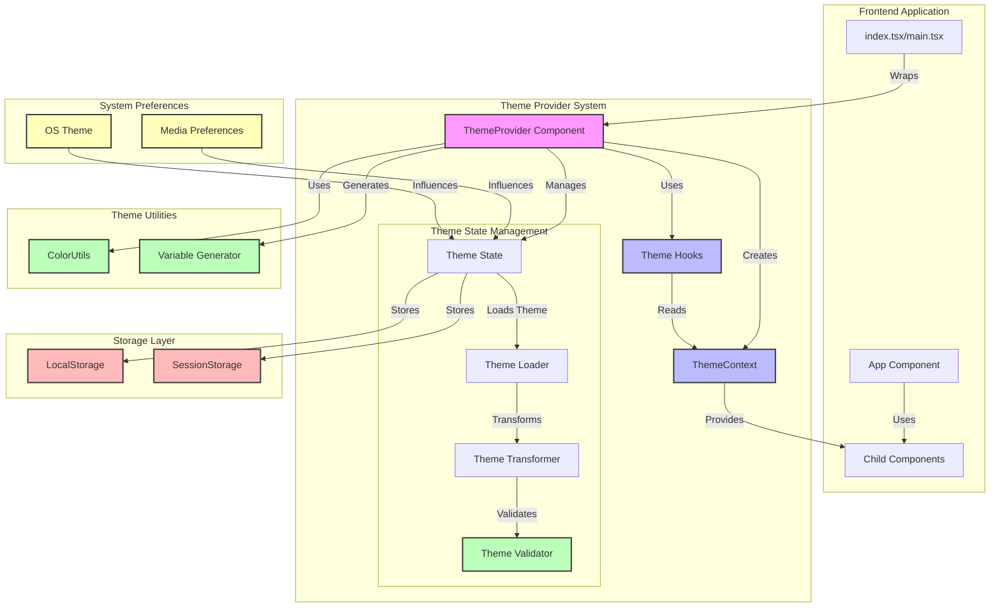
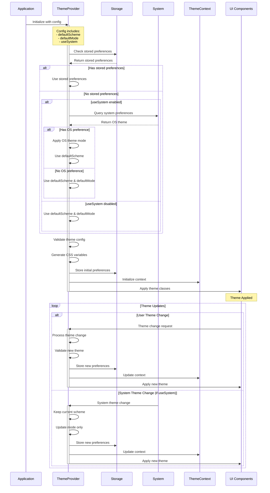

# React Theme Provider System

A powerful, flexible, and type-safe theming system for React applications with support for dynamic theme switching, system preferences, and persistent storage.

## Table of Contents
- [React Theme Provider System](#react-theme-provider-system)
  - [Table of Contents](#table-of-contents)
  - [Features](#features)
  - [Architecture](#architecture)
    - [Key Components](#key-components)
    - [Theme Decision Flow](#theme-decision-flow)
    - [Theme Decision Process](#theme-decision-process)
    - [Example Configuration](#example-configuration)
    - [Theme Resolution Examples](#theme-resolution-examples)
    - [File Structure](#file-structure)
  - [Installation](#installation)
  - [Quick Start](#quick-start)
  - [Configuration](#configuration)
  - [Theme Structure](#theme-structure)
  - [Usage Examples](#usage-examples)
    - [Basic Theme Switching](#basic-theme-switching)
    - [System Theme Detection](#system-theme-detection)
    - [Theme CSS Variables](#theme-css-variables)
  - [API Reference](#api-reference)
    - [ThemeProvider Props](#themeprovider-props)
    - [useTheme Hook](#usetheme-hook)
  - [Advanced Usage](#advanced-usage)
    - [Custom Theme Validation](#custom-theme-validation)
    - [Theme Subscription](#theme-subscription)
  - [Troubleshooting](#troubleshooting)
    - [Common Issues](#common-issues)
    - [Debug Mode](#debug-mode)
  - [Contributing](#contributing)
  - [License](#license)

## Features

- 🎨 Dynamic theme switching
- 🌓 Light/Dark mode support
- 🖥️ System preference detection
- 💾 Theme persistence
- 📦 TypeScript support
- ⚡ Runtime theme validation
- 🎯 CSS variable generation
- 🔄 Smooth theme transitions
- 🛡️ Error boundary protection

## Architecture

Below is the system architecture showing how different components interact:



### Key Components

1. **Frontend Application**
 - Entry point (`index.tsx/main.tsx`)
 - Main application component
 - Child components consuming theme

2. **Theme Provider System**
 - ThemeProvider Component: Main state management
 - ThemeContext: React context for theme values
 - Theme Hooks: Custom hooks for theme manipulation
 - State Management:
   - Theme State: Current configuration
   - Theme Loader: Loads definitions
   - Theme Transformer: Processes theme data
   - Theme Validator: Ensures valid structure

3. **Theme Utilities**
 - ColorUtils: Color manipulation
 - Variable Generator: CSS variable generation
 - Theme Validator: Validation utilities

4. **Storage Layer**
 - LocalStorage: Persistent storage
 - SessionStorage: Session storage

5. **System Preferences**
 - Media Preferences: System color scheme
 - OS Theme: Operating system settings

### Theme Decision Flow
The following sequence diagram illustrates how the theme is initialized and updated:



### Theme Decision Process

1. **Initial Configuration**
 - ThemeProvider receives configuration with:
   - `defaultScheme` (e.g., "base", "classic")
   - `defaultMode` ("light" or "dark")
   - `useSystem` (boolean)
   - Other optional settings

2. **Theme Resolution Priority**
 ```typescript
 // Pseudo-code for theme resolution
 const resolveTheme = () => {
   if (hasStoredPreferences()) {
     return getStoredPreferences();
   }

   if (config.useSystem) {
     const osTheme = getSystemPreference();
     return {
       scheme: config.defaultScheme, // Always use configured scheme
       mode: osTheme ?? config.defaultMode // Fallback to default mode
     };
   }

   return {
     scheme: config.defaultScheme,
     mode: config.defaultMode
   };
 };
 ```

3. **Resolution Steps**
 1. Check for stored preferences
    - If found, use stored theme configuration
    - If not found, continue to next step

 2. Check system preference (if useSystem enabled)
    - If system preference exists:
      - Use defaultScheme with system mode
    - If no system preference:
      - Use defaultScheme with defaultMode

 3. Fallback to defaults
    - Use defaultScheme
    - Use defaultMode

4. **Theme Application**
 - Validate resolved theme configuration
 - Generate CSS variables
 - Store initial preferences
 - Initialize React context
 - Apply theme classes to components

5. **Theme Updates**
 - User-initiated changes:
   - Update both scheme and mode
   - Store new preferences
 - System theme changes:
   - Update only mode
   - Maintain current scheme
   - Store updated preferences

### Example Configuration

```typescript
const themeConfig = {
defaultScheme: "classic",
defaultMode: "light",
useSystem: true,
storage: {
  type: "localStorage",
  prefix: "my-app-theme"
}
};
```

### Theme Resolution Examples

```typescript
// Scenario 1: First visit, useSystem: true, system prefers dark
result = { scheme: "classic", mode: "dark" }

// Scenario 2: First visit, useSystem: true, no system preference
result = { scheme: "classic", mode: "light" }

// Scenario 3: First visit, useSystem: false
result = { scheme: "classic", mode: "light" }

// Scenario 4: Has stored preferences
result = { scheme: "stored-scheme", mode: "stored-mode" }
```

### File Structure

```
src/
├── theme/
│   ├── index.ts                 # Barrel file
│   ├── ThemeProvider.tsx        # Main provider component
│   ├── theme-loader.ts         # Theme loading logic
│   ├── theme-transformer.ts    # Theme transformation
│   ├── theme-variables.ts      # CSS variable generation
│   ├── validation.ts           # Theme validation
│   ├── types/
│   │   ├── index.ts           # Type definitions
│   │   ├── context.ts         # Context types
│   │   └── state.ts           # State types
│   ├── utils/
│   │   └── color-utils.ts     # Color manipulation
│   └── components/
│       └── theme-error-boundary.tsx
└── index.tsx                   # Application entry
```

## Installation

```bash
npm install @your-org/theme-provider
# or
yarn add @your-org/theme-provider
```

## Quick Start

1. Wrap your application with ThemeProvider:

```tsx
import { ThemeProvider } from "@/theme";

const root = createRoot(document.getElementById("root")!);
root.render(
<StrictMode>
  <ThemeProvider
    config={{
      defaultScheme: "classic",
      defaultMode: "dark",
      useSystem: true,
      storage: {
        type: "localStorage",
        prefix: "my-app-theme"
      }
    }}
  >
    <App />
  </ThemeProvider>
</StrictMode>
);
```

2. Use the theme in your components:

```tsx
import { useTheme } from "@/theme";

const MyComponent = () => {
const { mode, toggleMode } = useTheme();

return (
  <button onClick={toggleMode}>
    Current mode: {mode}
  </button>
);
};
```

## Configuration

The ThemeProvider accepts the following configuration options:

```typescript
interface ThemeConfig {
defaultScheme?: ThemeColorScheme;
defaultMode?: ThemeMode;
useSystem?: boolean;
storage?: {
  type: "localStorage" | "sessionStorage";
  prefix: string;
  version?: string;
};
transition?: {
  duration: number;
  timing: string;
};
debug?: boolean;
disableTransitionsOnLoad?: boolean;
forceColorScheme?: ThemeColorScheme;
}
```

## Theme Structure

Themes are structured using TypeScript interfaces:

```typescript
interface ThemeScheme {
base: ProcessedBaseColors;
light: ModeColors;
dark: ModeColors;
}

interface ProcessedBaseColors {
primary: ColorShades;
secondary: ColorShades;
accent: ColorShades;
// ... other color definitions
}
```

## Usage Examples

### Basic Theme Switching

```tsx
const ThemeSwitcher = () => {
const { setColorScheme, colorScheme } = useTheme();

return (
  <select
    value={colorScheme}
    onChange={(e) => setColorScheme(e.target.value as ThemeColorScheme)}
  >
    <option value="classic">Classic</option>
    <option value="modern">Modern</option>
  </select>
);
};
```

### System Theme Detection

```tsx
const SystemThemeToggle = () => {
const { useSystemMode, setUseSystemMode } = useTheme();

return (
  <label>
    <input
      type="checkbox"
      checked={useSystemMode}
      onChange={(e) => setUseSystemMode(e.target.checked)}
    />
    Use system theme
  </label>
);
};
```

### Theme CSS Variables

```tsx
const ThemedComponent = () => {
const { getCssVariable } = useTheme();

return (
  <div style={{
    backgroundColor: getCssVariable('background'),
    color: getCssVariable('text')
  }}>
    Themed content
  </div>
);
};
```

## API Reference

### ThemeProvider Props

| Prop | Type | Description |
|------|------|-------------|
| config | `ThemeConfig` | Theme configuration options |
| className | `string` | Additional classes for the provider wrapper |
| onThemeChange | `(event: ThemeChangeEvent) => void` | Theme change callback |

### useTheme Hook

```typescript
const {
colorScheme,          // Current color scheme
mode,                 // Current mode (light/dark)
systemMode,          // System preference mode
useSystemMode,       // System preference enabled
setColorScheme,      // Change color scheme
setMode,             // Change mode
toggleMode,          // Toggle between light/dark
setUseSystemMode,    // Enable/disable system preference
getCssVariable,      // Get theme CSS variable
// ... other utilities
} = useTheme();
```

## Advanced Usage

### Custom Theme Validation

```typescript
import { validateTheme } from "@/theme/validation";

const customTheme = {
// ... your theme definition
};

try {
validateTheme(customTheme);
console.log("Theme is valid");
} catch (error) {
console.error("Theme validation failed:", error);
}
```

### Theme Subscription

```typescript
const ThemeObserver = () => {
const { subscribeToThemeChanges } = useTheme();

useEffect(() => {
  const unsubscribe = subscribeToThemeChanges((state) => {
    console.log("Theme changed:", state);
  });

  return () => unsubscribe();
}, []);

return null;
};
```

## Troubleshooting

### Common Issues

1. **Theme not persisting:**
 - Check storage configuration
 - Verify browser storage permissions

2. **System preference not detected:**
 - Ensure `useSystem` is enabled
 - Check browser support for `prefers-color-scheme`

3. **Theme validation errors:**
 - Verify theme structure matches interfaces
 - Check for missing required properties

### Debug Mode

Enable debug mode for detailed logging:

```tsx
<ThemeProvider
config={{
  debug: true,
  // ... other config
}}
>
<App />
</ThemeProvider>
```

## Contributing

Please read [CONTRIBUTING.md](CONTRIBUTING.md) for details on our code of conduct and the process for submitting pull requests.

## License

This project is licensed under the MIT License - see the [LICENSE.md](LICENSE.md) file for details.
