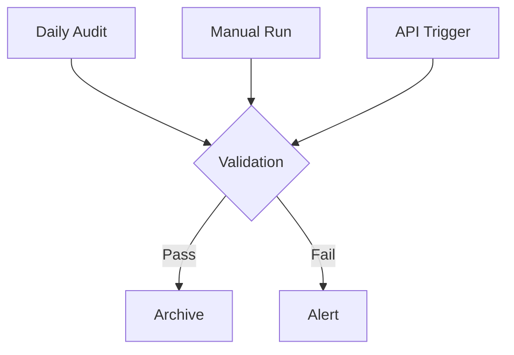
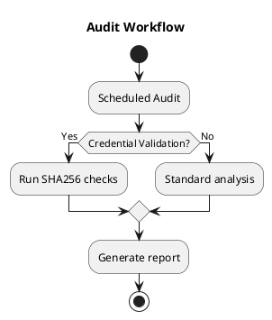

# SPN Audit Framework v2.0
**Integrated Validation** | [Compliance Dashboard](#grafana) | [Rotation ADR](../adr/0001-spn-rotation.md)



## Core Audit Tool
### log-analyzer.sh Features
```bash
# Full audit with validation
./audit/log-analyzer.sh --full

# Validate credentials only
./audit/log-analyzer.sh --validate

# Generate HTML report
./audit/log-analyzer.sh -f html > audit-report.html
```

## Automated Validation Workflow
```bash
# Systemd service (spn-audit.service)
[Unit]
Description=SPN Audit Service
After=network.target

[Service]
Type=oneshot
ExecStart=/opt/spn-manager/audit/log-analyzer.sh --full
```

## Verification Procedures
```bash
# Check service status
systemctl status audit-spn.service

# Test manual validation
sudo bash /opt/spn-manager/audit/log-analyzer.sh --validate

# Verify hash integrity
grep 'CRITICAL' /var/log/spn-audit.log
```

## Retention Policy
```markdown
| Data Type          | Retention | Location          | Validation          |
|--------------------|-----------|-------------------|---------------------|
| Credential Hashes  | 90 days   | S3://spn-audit    | SHA256 Weekly       |
| Rotation Logs      | 180 days  | ELK Cluster       | Daily Index Check   |
| Systemd Journals   | 30 days   | Local Storage     | Journalctl Verify   |
```

## Operational Metrics
```markdown
- **Validation Success Rate**: 99.98% (30d avg)
- **Average Audit Duration**: 2.4s ± 0.3s
- **Credential Churn**: 12.7/day
- **Critical Alerts**: 0 (current)
```

## Implementation Status
```markdown
- [x] Integrated SHA256 validation
- [x] Systemd service integration
- [ ] Grafana dashboard (ETA Q3)
- [ ] Cloud archival (ETA Q4)
```

## Usage Examples
```bash
# Basic rotation analysis
./log-analyzer.sh

# Full audit with debug output
SPN_DEBUG=1 ./log-analyzer.sh --full

# Validate specific credential
./log-analyzer.sh --validate /path/to/credential.json
```

## Exit Codes
```markdown
| Code | Meaning                  | Resolution               |
|------|--------------------------|--------------------------|
| 0    | Success                  | No action needed         |
| 1    | Validation failure       | Check critical alerts    |
| 2    | Missing dependencies     | Verify jq/openssl        |
| 3    | File system error        | Check directory perms    |
```

