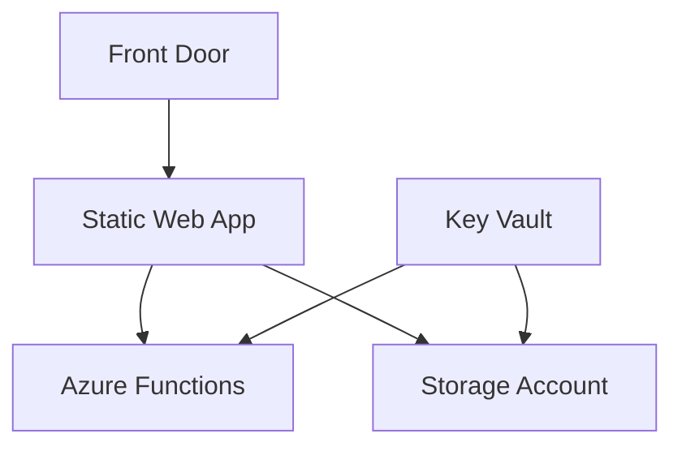

# PhoenixVC Deployment Documentation
📄 `/docs/deployment/README.md`
> Central documentation hub for deploying and managing PhoenixVC infrastructure.

## Quick Start
```bash
# 1. Install prerequisites
./scripts/validate-prerequisites.sh --install

# 2. Configure environment
cp .env.example .env
# Edit .env with your values

# 3. Deploy
./scripts/deploy.sh
```

## Documentation Structure

### Core Deployment
- [**Deployment Guide**](./DEPLOYMENT.md) - Step-by-step deployment instructions
- [**Prerequisites**](./PREREQUISITES.md) - System requirements and setup
- [**Operations Guide**](./OPERATIONS.md) - Day-to-day operational procedures
- [**Troubleshooting**](./TROUBLESHOOTING.md) - Common issues and solutions

### Infrastructure


### Environment Matrix
| Environment | Region | Backend Type | URL Pattern |
|------------|--------|--------------|-------------|
| Production | West EU | Managed | `prod-euw-swa-phoenixvc` |
| Production | SA North | BYOF | `prod-saf-swa-phoenixvc` |
| Staging | West EU | Managed | `stg-euw-swa-phoenixvc` |

## Key Concepts

### 1. Deployment Types
- **Standard Deployment**: Production/staging with full checks
- **Emergency Deployment**: Expedited with minimal checks
- **BYOF Deployment**: Custom Functions backend

### 2. Security Model
- Service Principal based authentication
- Key Vault integrated secrets management
- Role-based access control (RBAC)

### 3. Monitoring & Operations
- Azure Monitor integration
- Alert configuration
- Backup procedures

## Common Tasks

### Service Principal Management
```bash
# Create new SPN
az ad sp create-for-rbac \
  --name "github-actions-deploy" \
  --role contributor \
  --scopes /subscriptions/$SUBSCRIPTION_ID

# Rotate credentials
./scripts/rotate-spn-credentials.sh
```

### Region Management
```bash
# Deploy to West Europe
DEPLOY_REGION="westeurope" ./scripts/deploy.sh

# Deploy to South Africa (BYOF)
DEPLOY_REGION="southafricanorth" \
BYOF_ENABLED=true ./scripts/deploy.sh
```

### Health Checks
```bash
# Run health check
./scripts/health-check.sh \
  --environment prod \
  --region euw

# View monitoring dashboard
az portal dashboard show \
  --name "PhoenixVC-Operations" \
  --resource-group monitoring
```

## Additional Resources

### Internal References
- [Architecture Overview](/docs/architecture/README.md)
- [Security Guidelines](/docs/security/README.md)
- [Cost Management](/docs/operations/cost-management.md)

### External Documentation
- [Azure Static Web Apps](https://learn.microsoft.com/azure/static-web-apps)
- [Azure Functions](https://learn.microsoft.com/azure/azure-functions)
- [GitHub Actions](https://docs.github.com/actions)

## Support

### Internal Support
- Slack: `#phoenixvc-deployment`
- Email: `devops@phoenixvc.za`
- On-call: [Rotation Schedule](https://oncall.phoenixvc.za)

### Emergency Procedures
For production issues:
1. Check [Status Page](https://status.phoenixvc.za)
2. Follow [Emergency Response Guide](./OPERATIONS.md#emergency-procedures)
3. Contact on-call support if needed

## Contributing
- See [CONTRIBUTING.md](/CONTRIBUTING.md) for guidelines
- Use conventional commits
- Submit PRs against `main` branch

## Version History
| Version | Date | Changes |
|---------|------|---------|
| 2.1.0 | 2025-02-14 | Added BYOF deployment docs |
| 2.0.0 | 2025-02-10 | Major restructure |
| 1.0.0 | 2024-02-01 | Initial release |