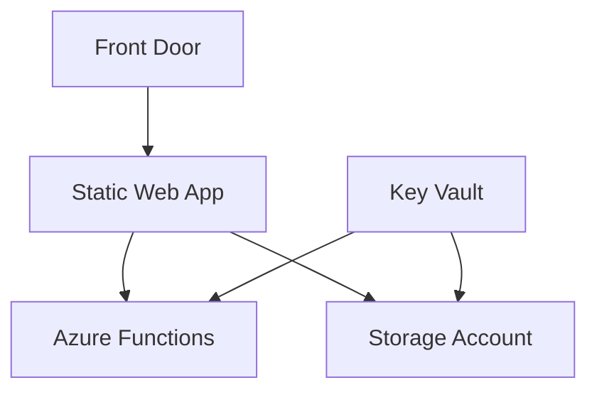

# PhoenixVC Deployment Documentation
📄 `/docs/deployment/README.md`

> Central documentation hub for deploying and managing PhoenixVC infrastructure.

## Quick Start

```bash
# 1. Install prerequisites
./scripts/validate-prerequisites.sh --install

# 2. Configure environment
cp .env.example .env
# Edit .env with your values

# 3. Deploy
./scripts/deploy.sh
```

## Manual Approval Step

Our **manual_approval** job requires an environment variable named `APPROVAL_STATE` to be set to `true`. By default, the job exits with an error (`exit 1`) so the pipeline fails after staging. To continue the workflow:

1. **Re-run** the failed job or workflow.
2. **Set `APPROVAL_STATE=true`** (for example, by adding it as an environment variable in the re-run interface if available, or by editing the workflow dispatch inputs, etc.).
3. Once the job sees `APPROVAL_STATE=true`, it skips the `exit 1` and proceeds to the production deployment.

> **Note:** If our GitHub plan supports [Environment Protection Rules](https://docs.github.com/en/actions/deployment/targeting-different-environments/using-environments-for-deployment), the fail/re-run hack can entirely be avoided and a proper **“Require reviewers”** gate for production can be used.

## Documentation Structure

Below is an overview of the core deployment files. Each document focuses on a specific aspect of the deployment process:

1. **[Prerequisites](./prerequisites.md)**
   - System requirements (e.g., Azure CLI, Node.js, Bicep)
   - Permission details and validation script

2. **[Configuration](./configuration.md)**
   - Environment variables and resource naming
   - Key Vault policies, monitoring, and validation procedures

3. **[Deployment Guide](./deployment-guide.md)** *(Optional)*
   - Step-by-step instructions for running the deployment  
   - Use this if you prefer a concise bullet-style guide separate from configuration details

4. **[Operations](./operations.md)**
   - Day-to-day operational tasks (health checks, backups, maintenance)

5. **[Troubleshooting](./troubleshooting.md)**
   - Common issues, error codes, quick fixes, and rollback procedures

6. **[Azure Environment Setup](./azure-environment-setup.md)** *(Placeholder)*
   - Advanced steps (e.g., private endpoints, custom domain config)
   - Currently a placeholder to be expanded or merged if not needed

7. **[Deploy Script Reference](./deploy-script-reference.md)** *(Placeholder)*
   - Usage and parameters for scripts like `deploy.sh`, `health-check.sh`, etc.
   - To be filled in as needed

8. **[Service Principals](./service-principals.md)** *(Placeholder)*
   - Guidelines for creating and managing SPNs (see ADR 001 for rotation details)

### ADRs

The `adrs` folder contains Architectural Decision Records:
- **[ADR 001: Credential Rotation](./adrs/adr-001-credential-rotation.md)**
- **[ADR 002: Disaster Recovery](./adrs/adr-002-disaster-recovery.md)** *(Placeholder)*

## Infrastructure Overview



_For more details, see the [Infrastructure Overview](../infrastructure/README.md)._

## Environment Matrix

| Environment | Region   | Backend Type | URL Pattern                   |
|-------------|----------|--------------|-------------------------------|
| Production  | West EU  | Managed      | `prod-euw-swa-phoenixvc`      |
| Production  | SA North | BYOF         | `prod-saf-swa-phoenixvc`      |
| Staging     | West EU  | Managed      | `stg-euw-swa-phoenixvc`       |

## Key Concepts

### 1. Deployment Types
- **Standard Deployment:** Full checks for production or staging  
- **Emergency Deployment:** Expedited deployment with minimal checks  
- **BYOF Deployment:** Custom Functions backend

### 2. Security Model
- Service Principal–based authentication  
- Key Vault–integrated secrets management  
- Role-based access control (RBAC)

### 3. Monitoring & Operations
- Azure Monitor integration  
- Alerts configuration  
- Backup and disaster recovery procedures

## Additional Resources

### Internal References
- [Architecture Overview](../infrastructure/README.md)
- [Security Guidelines](../../compliance/azure-security-baseline.md) *(if applicable)*
- [Cost Management](../../operations/cost-management.md) *(if applicable)*

### External Documentation
- [Azure Static Web Apps](https://learn.microsoft.com/azure/static-web-apps)
- [Azure Functions](https://learn.microsoft.com/azure/azure-functions)
- [GitHub Actions](https://docs.github.com/actions)

## Support

### Internal Support
- **Slack:** `#phoenixvc-deployment`
- **Email:** `devops@phoenixvc.za`
- **On-call:** [Rotation Schedule](https://oncall.phoenixvc.za)

### Emergency Procedures
For production issues:
1. Check the [Status Page](https://status.phoenixvc.za).
2. Follow the [Emergency Response Guide](./operations.md#emergency-procedures).
3. Contact on-call support if needed.

## Contributing
- See [CONTRIBUTING.md](../../contributing.md) for guidelines
- Use [Conventional Commits](https://www.conventionalcommits.org/)
- **Staging Deployments:** Note that deployments to staging are triggered on 
  PRs to branches matching our naming conventions (e.g., staging/*, feat/*, bug/*, etc.).
- **Production Deployments:** Note that deployments to prod are triggered on 
  PRs to branches matching our naming conventions (main/*, release/*).

## Version History

| Version | Date       | Changes                                |
|---------|------------|----------------------------------------|
| 2.2.0   | 2025-02-15 | Added notes to refer to contributing   |
| 2.1.0   | 2025-02-14 | Added BYOF deployment docs             |
| 2.0.0   | 2025-02-10 | Major restructure                      |
| 1.0.0   | 2024-02-01 | Initial release                        |
