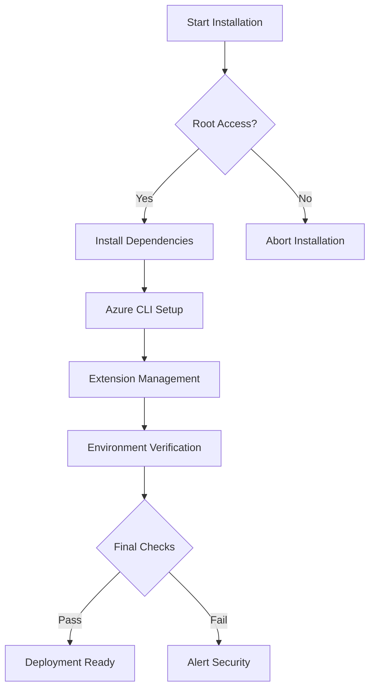
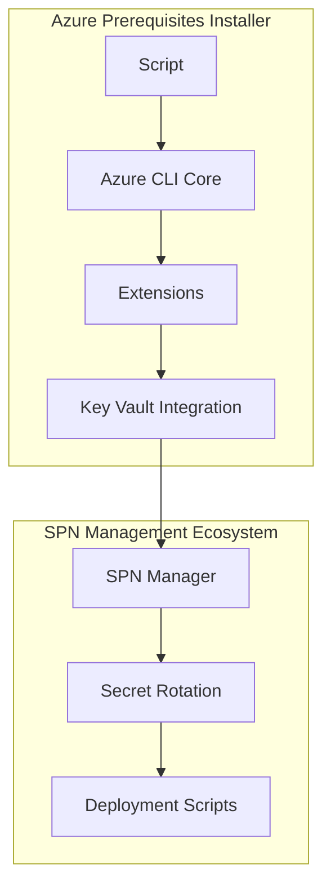
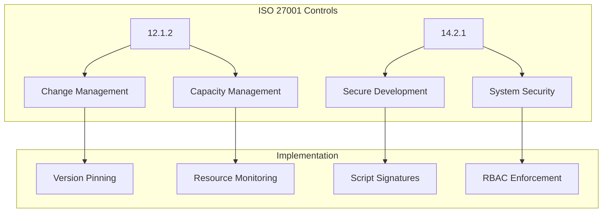
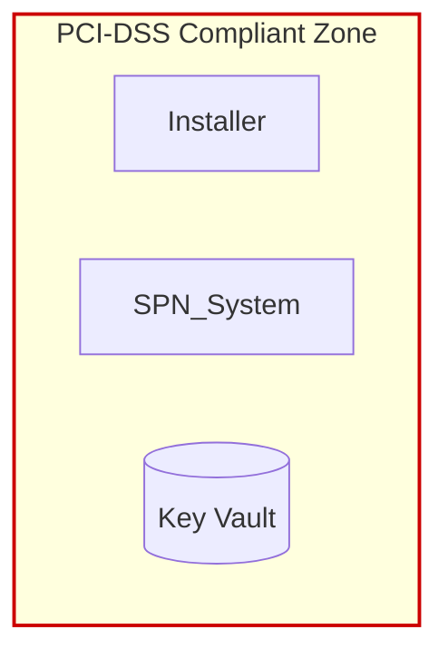
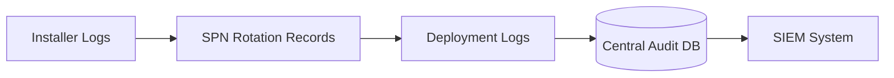

# Azure Prerequisites Installation Guide
**Version 2.0** | [SPN Management](./spn-management.md) | [Audit Procedures](./audit.md)



## Installation Workflow

### Phase 1: Preparation
```bash
# Download package (internal repo)
curl -O https://tools.phoenixvc.za/azure-prereqs/install-azure-prereqs.sh

# Verify checksum
echo "e3b0c44298fc1c149afbf4c8996fb92427ae41e4649b934ca495991b7852b855  install-azure-prereqs.sh" | sha256sum -c
```

### Phase 2: Execution
```bash
# Standard deployment
sudo ./install-azure-prereqs.sh

# Automated deployment (CI/CD)
sudo DEBIAN_FRONTEND=noninteractive ./install-azure-prereqs.sh > /dev/null 2>&1
```

### Phase 3: Post-Installation
```bash
# Verify installation
az version --output json | jq '{"cli": ."azure-cli", "extensions": [.extensions[].name]}'

# Check audit log
tail -n 50 /var/log/azure-prereqs-*.log
```

## Key Features
```markdown
- **Security**  
  ✓ Root permission enforcement  
  ✓ Script integrity checks  
  ✓ Secure temporary file handling

- **Observability**  
  ✓ Structured JSON output  
  ✓ Persistent installation logs  
  ✓ Version tracking

- **Compliance**  
  ✓ CIS Benchmark alignment  
  ✓ Version pinning  
  ✓ Audit-ready trails
```

## System Architecture


## Compliance Framework


## Installation Matrix
```markdown
| Component         | Version     | Verification Command               | CIS Control |
|--------------------|-------------|-------------------------------------|-------------|
| Azure CLI Core     | ≥2.58.0     | `az version --query '"azure-cli"'`  | 3.5         |
| Cost Management    | 1.1.0       | `az extension show --name cost-management` | 16.8        |
| Container Apps     | 1.3.0       | `az extension list --query "[?name=='containerapp'].version"` | 16.11       |
```

## Security Boundaries


## Audit Trail Flow


## Troubleshooting

### Common Issues
```bash
# Permission denied errors
sudo chmod +x install-azure-prereqs.sh
journalctl -u docker --since "10 minutes ago"

# Version conflicts
az extension remove --name containerapp
az extension add --name containerapp --version 1.3.0

# Log analysis
grep -i 'error\|warning' /var/log/azure-prereqs-*.log
```

### Recovery Procedures
```bash
# Full environment reset
az extension list --query "[].name" -o tsv | xargs -n1 az extension remove --name
sudo apt purge azure-cli -y

# Post-cleanup validation
[ ! -f /usr/bin/az ] && echo "Azure CLI removed" || echo "Removal failed"
```

## Compliance & Auditing
```markdown
1. **Log Retention**  
   All installations create immutable logs in `/var/log/azure-prereqs-YYYYMMDD.log`

2. **Version Control**  
   ```bash
   # Export environment snapshot
   az version --output json > azure-versions-$(date +%Y%m%d).json
   ```

3. **Security Validation**  
   ```bash
   # Verify script signatures
   gpg --verify install-azure-prereqs.sig install-azure-prereqs.sh
   ```
```

## Version History
```markdown
| Version | Date       | Changes                     | Compliance Level |
|---------|------------|-----------------------------|------------------|
| 2.0     | 2025-02-14 | Enterprise security features| CIS L2           |
| 1.2     | 2025-01-20 | Extension management        | CIS L1           |
| 1.0     | 2024-12-01 | Initial release             | N/A              |
```

> **Enterprise Support**: Contact `infra@phoenixvc.za` for version conflicts or security exceptions.
