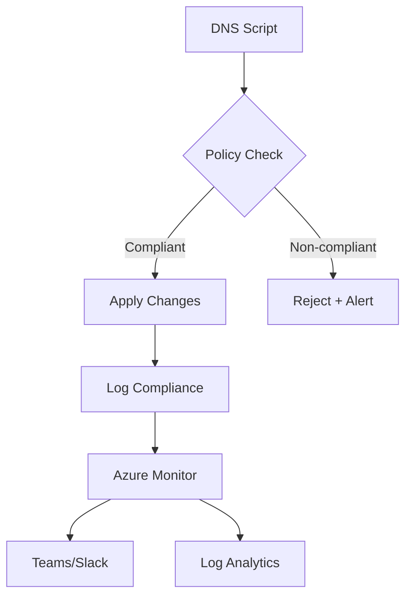
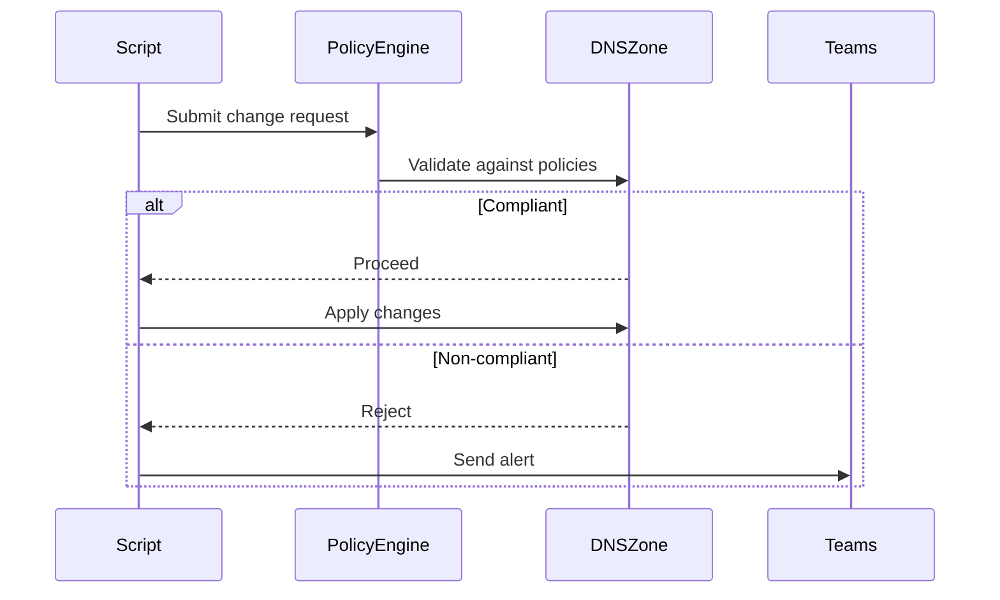

# DNS Compliance Framework Design
**Integration with PhoenixVC DNS Configuration Script**  
*Version 0.1 - Draft for Review*

## Architecture Overview


## Core Policy Definitions

### 1. DNS Record Type Restriction
```json
{
  "if": {
    "allOf": [
      {
        "field": "type",
        "equals": "Microsoft.Network/dnszones"
      },
      {
        "not": {
          "field": "Microsoft.Network/dnszones/*.type",
          "in": ["CNAME", "A", "TXT"]
        }
      }
    ]
  },
  "then": {
    "effect": "deny"
  }
}
```

### 2. TTL Enforcement Policy
```json
{
  "parameters": {
    "maxTTL": {
      "type": "Integer",
      "defaultValue": 300,
      "metadata": { "description": "Maximum allowed TTL in seconds" }
    }
  },
  "if": {
    "allOf": [
      { "field": "type", "equals": "Microsoft.Network/dnszones" },
      { "field": "Microsoft.Network/dnszones/*.TTL", "greater": "[parameters('maxTTL')]" }
    ]
  },
  "then": { "effect": "modify", "details": { "existenceCondition": { "field": "Microsoft.Network/dnszones/*.TTL", "lessOrEquals": "[parameters('maxTTL')]" } } }
}
```

## Implementation Roadmap

### Phase 1: Pre-Deployment Checks
```gantt
gantt
  title Policy Integration Timeline
  dateFormat  YYYY-MM-DD
  section Validation
  Policy Engine Integration     :active, des1, 2025-03-01, 14d
  Script Compliance Checks      :         des2, after des1, 10d
  section Monitoring
  Alert Pipeline Setup          :         des3, 2025-03-15, 7d
  Compliance Dashboard          :         des4, after des3, 14d
```

### Phase 2: Runtime Enforcement
| Component | Technology | Purpose |
|---|---|---|
| Policy Evaluation | Azure Policy Service | Real-time validation |
| Secret Management | Azure Key Vault | Certificate storage |
| Audit Trail | Log Analytics | Immutable logging |

## Script Modifications Required

1. **Pre-Flight Policy Check**
```bash
function check_policy_compliance() {
  local operation=$1
  local payload=$2
  
  az policy state trigger-scan \
    --resource-group $DNS_ZONE \
    --no-wait
  
  compliance=$(az policy state list \
    --resource-group $DNS_ZONE \
    --query "[?complianceState == 'NonCompliant']" \
    --output tsv)
  
  [ -z "$compliance" ] || return 1
}
```

2. **Error Handling Flow**


## Testing Scenarios

### Test Case 1: Disallowed Record Type
```bash
# Attempt to create MX record
./configure-dns.sh -a -c mx

# Expected: 
# Error: Policy violation - MX records not permitted
# Alert: Teams channel notification
```

### Test Case 2: TTL Override
```bash
# Try setting TTL=600
./configure-dns.sh -a --ttl 600

# Expected:
# Auto-correct to TTL=300
# Log entry: "TTL override attempted"
```

## Cost Considerations
```table
| Component | Cost Factor | Estimated Monthly |
|---|---|---|
| Policy Evaluations | $2 per 1k policy evaluations | $45 |
| Log Analytics | $2.76/GB ingested | $120 |
| Alert Rules | $0.10 per alert | $15 |
```

## Rollback Strategy
1. Policy version tagging
2. Gradual rollout using Azure Deployment Slots
3. Emergency bypass mode in script:
```bash
./configure-dns.sh --emergency-override CODE_RED
```

## Maintenance Plan
- Quarterly policy reviews
- Automated policy testing pipeline
- Compliance officer dashboards
- Policy-as-Code repository integration

---
**Next Steps**  
[ ] Security review  
[ ] Test environment deployment  
[ ] Compliance team workshop