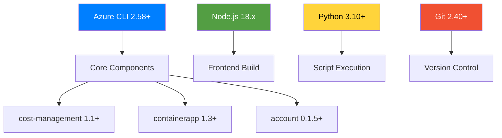
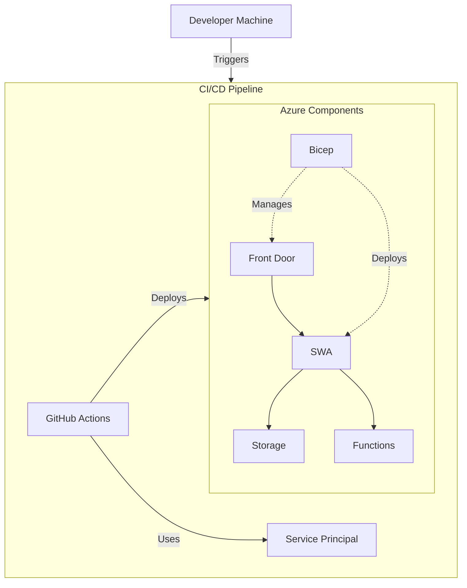

# Deployment Guide for Phoenix VC - Modernized

This document outlines how to deploy the Phoenix VC project to Azure Static Web Apps, covering both local deployment and our automated CI/CD process via GitHub Actions.



## Table of Contents
- [Version Compatibility](#version-compatibility)
- [Prerequisites](#prerequisites)
- [Service Principal Creation](#service-principal-creation)
- [Local Deployment](#local-deployment)
- [Automated Deployment (CI/CD)](#automated-deployment-cicd)
- [Region Considerations](#region-considerations)
- [Custom Domain Configuration](#custom-domain-configuration)
- [Troubleshooting](#troubleshooting)
- [Dependency Chain](#dependency-chain)
- [Additional Resources](#additional-resources)
- [FAQ](#faq)

---

## Version Compatibility

### Component Versions
| Component | Minimum Version | Recommended Version | Verification Command |
|-----------|-----------------|---------------------|----------------------|
| Azure CLI | 2.58.0 | 2.58.0 | `az version --query '"azure-cli"'` |
| cost-management | 1.1.0 | 1.1.0 | `az extension show --name cost-management --query version` |
| containerapp | 1.3.0 | 1.3.0 | `az extension show --name containerapp --query version` |
| account | 0.1.5 | 0.1.5 | `az extension show --name account --query version` |
| Node.js | 18.x | 20.x | `node --version` |
| Python | 3.10 | 3.11 | `python --version` |

---

## Prerequisites

1. [Node.js](https://nodejs.org/) v14+
2. [Git](https://git-scm.com/)
3. [Azure CLI](https://docs.microsoft.com/en-us/cli/azure/install-azure-cli)
4. [Python 3](https://www.python.org/downloads/) (for git_tree.py)



---

## Service Principal Creation

To enable deployment, you need to create an Azure Service Principal that GitHub Actions will use for authentication.

```bash
#!/bin/bash

#1. Login
az login --use-device-code 

#2 Set subscription
az account set --subscription 22f9eb18-6553-4b7d-9451-47d0195085fe

#3 **Create the Service Principal:**  
az ad sp create-for-rbac \
  --name "http://github-actions-phoenixvc.phoenixvc.tech" \
  --role "contributer" \
  --scopes "/subscriptions/22f9eb18-6553-4b7d-9451-47d0195085fe/resourceGroups" \
  --sdk-auth
```

This command outputs a JSON object containing your Azure credentials (e.g., `clientId`, `clientSecret`, `tenantId`, and `subscriptionId`).

**Important:**  
If you receive an error such as:
```
The client 'xxx@phoenixvc.tech' with object id '...' does not have authorization to perform action 'Microsoft.Authorization/roleAssignments/write' over scope '...' or the scope is invalid.
```
it indicates that your account does not have the required permissions to create role assignments. In that case, please contact the admin.

4. **Store in GitHub Secrets:**  
   Copy the output JSON and add it to your GitHub repository's secrets as `AZURE_CREDENTIALS`.  
   You can add secrets by navigating to [GitHub Secrets](https://github.com/JustAGhosT/PhoenixVC-Modernized/settings/secrets/actions).

*Note:* Ensure you replace any placeholders with your actual values to avoid errors.

---

## Local Deployment

1. **Clone the Repository:**
   ```bash
   git clone https://github.com/JustAGhosT/PhoenixVC-Modernized.git
   cd PhoenixVC-Modernized
   ```
2. **Install Dependencies:**
   ```bash
   npm install
   ```
3. **Configure Azure Credentials:**  
   Follow the instructions in the [Service Principal Creation](#service-principal-creation) section above.
4. **Run the Deployment Script:**
   ```bash
   ./scripts/deploy.sh
   ```
   This script creates the resource group (e.g., `prod-euw-rg-phoenixvc` or `prod-saf-rg-phoenixvc`) and deploys the Bicep template (`infra/bicep/main.bicep`) using parameters from `infra/bicep/parameters.json`.

---

## Automated Deployment (CI/CD)

Our GitHub Actions workflow is defined in `.github/workflows/deploy.yml`. When changes are pushed to the `main` branch:
- The workflow logs into Azure using the `AZURE_CREDENTIALS` secret.
- It creates (or verifies) the resource group and deploys the Bicep template.

No additional manual steps are required for automated deployments.

> Note: The budget resource is optional. Due to our current subscription's offer type not supporting cost management budgets (only available for Enterprise Agreement, Web Direct, or Microsoft Customer Agreement), the deployBudget parameter is set to false by default. Enable it (set it to true) only if your subscription supports cost management budgets.

---

## Region Considerations

Azure Static Web Apps distribute your static assets globally via a CDN, but the managed backend (Azure Functions) is deployed to a specific region. Our deployment strategy supports two scenarios:

- **West Europe (euw):**  
  - **Managed Deployment:** Use the managed backend provided by Azure Static Web Apps in "westeurope".  
  - **Resource Naming:** Follow our naming convention: `[env]-[region]-[resourcetype]-projectname` (e.g., `prod-euw-swa-phoenixvc`).

- **South Africa North (saf):**  
  - **Bring Your Own Functions App (BYOF):** Managed Azure Static Web Apps do not support South Africa North for the managed backend.  
  - **Alternative Deployment:** If you require your backend in South Africa North, you must deploy your own Azure Functions app (using BYOF) and link it to your static web app.  
  - **Resource Naming:** Use the region identifier `saf` (e.g., `prod-saf-swa-phoenixvc`) when deploying via BYOF.

Choose the deployment option that best fits your performance, compliance, and geographic requirements. For more details, refer to the [Functions: Bring Your Own Functions App documentation](https://learn.microsoft.com/en-us/azure/static-web-apps/functions-bring-your-own).

For additional region-related questions, please see our [FAQ](../docs/FAQ.md#region-deployment-questions).

---

## Custom Domain Configuration

```bash
az staticwebapp hostname add \
  --name <app-name> \
  --resource-group <rg-name> \
  --hostname <your-custom-domain>
```
Replace placeholders with:
- `<app-name>`: Your Static Web App name (e.g., `prod-euw-swa-phoenixvc`)
- `<rg-name>`: Resource group name (e.g., `prod-euw-rg-phoenixvc`)
- `<your-custom-domain>`: Domain to configure (e.g., `www.phoenixvc.tech`)

**DNS Requirements**:
- Create CNAME record pointing to `<app-name>.azurestaticapps.net`
- For apex domains: Create A and TXT records as per [Azure documentation](https://learn.microsoft.com/en-us/azure/static-web-apps/custom-domain)

## Automated DNS Configuration (Azure DNS)

### Prerequisites
1. Azure DNS zone resource following naming convention:  
   `prod-<loc>-dnsz-phoenixvc`  
   Example: `prod-euw-dnsz-phoenixvc` (West Europe)
2. Contributor access to DNS zone resource group

### Automation Commands

```bash
# Pre-check existing records
az network dns record-set list \
  --resource-group prod-${LOC_CODE}-dnsz-phoenixvc \
  --zone-name phoenixvc.tech \
  --query "[?name=='www' || name=='@']" \
  -o table

# CNAME for subdomain (www)
az network dns record-set cname set-record \
  --resource-group prod-${LOC_CODE}-dnsz-phoenixvc \
  --zone-name phoenixvc.tech \
  --record-set-name www \
  --cname ${SWA_NAME}.azurestaticapps.net
  # Example: --cname prod-euw-swa-phoenixvc.azurestaticapps.net

# A + TXT for apex domain (@)
az network dns record-set a add-record \
  --resource-group prod-${LOC_CODE}-dnsz-phoenixvc \
  --zone-name phoenixvc.tech \
  --record-set-name @ \
  --ipv4-address $(az staticwebapp show \
      --name ${SWA_NAME} \
      --resource-group prod-${LOC_CODE}-rg-phoenixvc \
      --query "defaultHostname" -o tsv | dig +short)

az network dns record-set txt add-record \
  --resource-group prod-${LOC_CODE}-dnsz-phoenixvc \
  --zone-name phoenixvc.tech \
  --record-set-name @ \
  --value "asuid=$(az staticwebapp show \
      --name ${SWA_NAME} \
      --resource-group prod-${LOC_CODE}-rg-phoenixvc \
      --query "id" -o tsv | cut -d'/' -f9)"
```

### Environment Variables Reference
| Variable | Convention Example | Purpose |
|----------|--------------------|---------|
| `LOC_CODE` | `euw` (West Europe)<br>`saf` (South Africa North) | Azure region code |
| `SWA_NAME` | `prod-${LOC_CODE}-swa-phoenixvc` | Static Web App resource name |

### Validation
```bash
# Verify DNS propagation
dig +short www.phoenixvc.tech
dig +short phoenixvc.tech
```

## External DNS Providers
For Cloudflare/GoDaddy/Route53, use provider-specific CLI tools maintaining:
- CNAME: `www -> ${SWA_NAME}.azurestaticapps.net`
- A Record: `@ -> <SWA_IP>`
- TXT Record: `@ -> asuid=<SWA_UID>`

For external DNS providers, consult their API documentation for automation options.
For more detailed instructions, please refer to the [official documentation on custom domains in Azure Static Web Apps](https://learn.microsoft.com/en-us/azure/static-web-apps/custom-domain).


---

## Troubleshooting

For common deployment issues, please refer to our [TROUBLESHOOTING.md](docs/TROUBLESHOOTING.md) file, which covers error resolution steps (including issues related to Service Principal creation, Azure login errors, and more).

---

## Additional Resources

- [Azure Static Web Apps Documentation](https://docs.microsoft.com/en-us/azure/static-web-apps/)
- [Bicep Documentation](https://docs.microsoft.com/en-us/azure/azure-resource-manager/bicep/)
- [GitHub Actions Documentation](https://docs.github.com/en/actions)
- [Tailwind CSS Documentation](https://tailwindcss.com/docs)

---

## FAQ

For answers to common questions about deployment, authentication, and regional availability for Azure Static Web Apps, please refer to our [FAQ](docs/FAQ.md).

---
