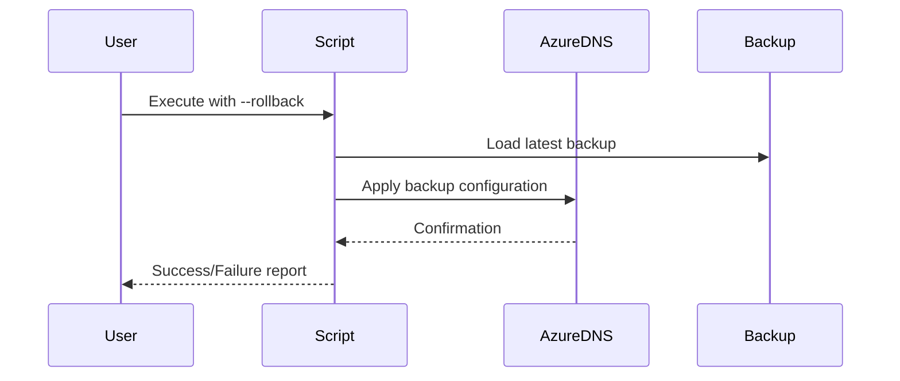

# **📖 PhoenixVC DNS Configuration Script Documentation**
**Version 3.2.2** | [View Script](#) | [Installation](#installation) | [Usage](#usage)

## 📋 Table of Contents
- [Purpose](#-purpose)
- [Prerequisites](#️-prerequisites)
- [Installation](#-installation)
- [Configuration](#️-configuration)
- [CI/CD Integration](#-cicd-integration)
- [Usage](#-usage)
- [Security](#️-security)
- [Monitoring](#-monitoring)
- [Troubleshooting](#️-troubleshooting)
- [Recovery Procedures](#-recovery-procedures)
- [Future Enhancements](#-future-enhancements)
- [Azure DNS vs. External DNS Providers](#azure-dns-vs-external-dns-providers)
- [Changing GoDaddy Nameservers](#changing-godaddy-nameservers)
- [Version History](#-version-history)

## **🌟 Purpose**
This script automates **DNS management for Azure Static Web Apps**, including:
- **Automated CI/CD integration** (GitHub Actions, Azure DevOps)
- **Rollback support** for DNS changes
- **Component-based isolation** (CNAME, TXT, APEX)
- **Auditable logs** for compliance tracking
- **Multi-environment support** (Production, Staging, Development)

## **🛠️ Prerequisites**

### Required Software
```bash
Azure CLI 2.58.0+
jq 1.6+
Bash 5.0+
dig command-line tool
```

### Required Permissions
- Azure subscription with DNS zone access
- Resource Group contributor access
- Static Web Apps configuration permissions

## **🚀 Quickstart Guide**
Follow these steps to configure DNS for your main domain, www subdomain, and docs subdomain.

### 1. Basic Domain Setup (15 minutes)
```bash
# Download and setup
curl -O https://phoenixvc.tech/scripts/deployment/configure-dns.sh
chmod +x configure-dns.sh

# Configure main domain (apex) to point to Azure Static Web App
az network dns record-set cname set-record \
  -g YourResourceGroup \
  -z phoenixvc.tech \
  -n @ \
  -c your-swa-name.azurestaticapps.net

# Configure www subdomain to point to Azure Static Web App
az network dns record-set cname set-record \
  -g YourResourceGroup \
  -z phoenixvc.tech \
  -n www \
  -c your-swa-name.azurestaticapps.net
```

### 2. Docs Subdomain Setup (10 minutes)
```bash
# Add GitHub Pages A records for docs subdomain
az network dns record-set a add-record \
  -g YourResourceGroup \
  -z phoenixvc.tech \
  -n docs \
  -a 185.199.108.153 185.199.109.153 185.199.110.153 185.199.111.153
```

### Expected DNS Records
```yaml
# Final DNS Configuration
Apex (@):
  - Type: CNAME
  - Value: your-swa-name.azurestaticapps.net
  - TTL: 3600

www:
  - Type: CNAME
  - Value: your-swa-name.azurestaticapps.net
  - TTL: 3600

docs:
  - Type: A
  - Values: [185.199.108.153, 185.199.109.153, 185.199.110.153, 185.199.111.153]
  - TTL: 3600
```

### Additional Required Records
```bash
# Add TXT record for Azure custom domain verification
az network dns record-set txt add-record \
  -g YourResourceGroup \
  -z phoenixvc.tech \
  -n asuid \
  -v "YOUR_AZURE_VERIFICATION_ID"

# Add TXT record for GitHub Pages verification (if needed)
az network dns record-set txt add-record \
  -g YourResourceGroup \
  -z phoenixvc.tech \
  -n @ \
  -v "github-pages-verification=your-code"
```

### Common Issues and Solutions
| Issue               | Solution                                             |
|---------------------|------------------------------------------------------|
| Domain not resolving | Wait for DNS propagation (up to 24 hours)           |
| HTTPS not working   | Ensure correct A records and wait for GitHub SSL provision |
| Docs 404 error      | Verify '/docs' folder exists in repository root      |

### Important Notes
- DNS propagation can take up to 24 hours.
- GitHub automatically enables HTTPS once the domain is verified.
- For docs subdomain:
  - Ensure documentation is in the `/docs` folder.
  - Wait for GitHub Pages build to complete.
  - Monitor GitHub Actions for deployment status.

## **📥 Installation**
### Local Development Setup
```bash
# Download the script
curl -O https://phoenixvc.tech/scripts/deployment/configure-dns.sh
chmod +x configure-dns.sh

# Create required directories
mkdir -p .env dns_backups
```

### Directory Structure
```
.
├── configure-dns.sh
├── .env
├── dns_backups/
│   └── backup-{date}.json
└── .dns-config.json
```

## **⚙️ Configuration**
### Environment Configuration
Create an `.env` file for local execution:
```ini
LOCATION_CODE=za  # Location code (e.g., euw, saf)
SWA_NAME=phoenixvc-prod
AZURE_SUBSCRIPTION_ID=xxxxxxxx-xxxx-xxxx-xxxx-xxxxxxxxxxxx
RESOURCE_GROUP=prod-${LOCATION_CODE}-rg-phoenixvc-website
```

### DNS Configuration File (.dns-config.json)
```json
{
  "domain": "phoenixvc.tech",
  "environments": {
    "production": {
      "ttl": 3600,
      "records": {
        "apex": {
          "type": "A",
          "values": ["23.100.x.x"]
        },
        "www": {
          "type": "CNAME",
          "value": "phoenixvc-prod.azurestaticapps.net"
        }
      }
    }
  }
}
```

## **🚀 CI/CD Integration**
### GitHub Actions Example
```yaml
name: DNS Configuration
on:
  workflow_dispatch:
  push:
    branches: [main]
    paths: ['dns/**']

jobs:
  configure_dns:
    runs-on: ubuntu-latest
    steps:
      - uses: actions/checkout@v4
      - name: Azure Login
        uses: azure/login@v1
        with:
          creds: ${{ secrets.AZURE_CREDENTIALS }}
      - name: Configure DNS
        run: ./configure-dns.sh --apply --components "cname,apex"
        env:
          AZURE_SUBSCRIPTION_ID: ${{ secrets.AZURE_SUBSCRIPTION_ID }}
          SWA_NAME: phoenixvc-prod
          RESOURCE_GROUP: prod-euw-rg-phoenixvc-website
```

### Azure DevOps Pipeline
```yaml
trigger:
  branches:
    include:
      - main
  paths:
    include:
      - dns/**

steps:
- task: AzureCLI@2
  inputs:
    azureSubscription: 'Your-Azure-Connection'
    scriptType: 'bash'
    scriptPath: './configure-dns.sh'
    arguments: '--apply --components "cname,apex"'
```

## **🔒 Security**
### Safety Features
1. **Pre-flight validation checks**
2. **Immutable backups** before every change
3. **Component-level isolation**
4. **Forced overwrites require explicit `--force` flag**
5. **Automatic rollback on failure**

### Access Control
```bash
# Minimum required role assignments
az role assignment create \
    --role "DNS Zone Contributor" \
    --assignee-object-id $USER_OR_SP_ID \
    --scope $DNS_ZONE_ID
```

## **📊 Monitoring**
### Health Checks
```bash
# Verify DNS configuration
./configure-dns.sh --verify

# Check propagation
for ns in 8.8.8.8 1.1.1.1; do
    dig @$ns phoenixvc.tech
done
```

### Logging
```bash
# Enable detailed logging
export DNS_LOG_LEVEL=DEBUG
export DNS_LOG_FILE=/var/log/dns-config.log
```

## **🔄 Recovery Procedures**


### Rollback Commands
```bash
# List available backups
ls -l dns_backups/

# Restore specific backup
./configure-dns.sh --rollback --backup-file dns_backups/backup-20240215.json
```

## **🛠️ Troubleshooting Guide**
| Error                   | Solution                                      | Prevention                      |
|-------------------------|-----------------------------------------------|---------------------------------|
| `Missing .env file`      | Create .env with required variables            | Use CI/CD secrets               |
| `Record already exists`  | Use --force flag                               | Check existing records first    |
| `Permission denied`      | Check Azure role assignments                   | Use managed identities          |
| `Invalid hostname`       | Verify SWA deployment                          | Add pre-flight checks           |

## **📌 Future Enhancements**
```markdown
- [ ] **Azure Policy Integration**
  - DNS naming conventions
  - TTL enforcement
  - Record type restrictions
  
- [ ] **Monitoring Enhancements**
  - Azure Monitor integration
  - Slack/Teams notifications
  - Cost analysis
  
- [ ] **Multi-Cloud Support**
  - AWS Route53
  - GCP Cloud DNS
  
- [ ] **Infrastructure as Code**
  - Terraform integration
  - Pulumi support
  
- [ ] **AI/ML Features**
  - Intelligent error detection
  - Auto-remediation
  - Performance optimization
```

## **Azure DNS vs. External DNS Providers**
If you create an **Azure DNS zone** for your domain, you must also **update your domain’s nameservers** at your registrar to point to Azure’s nameservers (e.g., `ns1-01.azure-dns.com`, `ns2-01.azure-dns.net`, etc.).
Otherwise, **the zone in Azure won’t be used**, and your domain will continue to resolve via your existing DNS provider.

### Common Scenario: GoDaddy Domain, Amazon IP Addresses
It’s entirely possible for a domain registered at **GoDaddy** to resolve to **Amazon** IP addresses if you’ve updated your domain’s nameservers to point to an external provider (such as Amazon’s Route53 or CloudFront). In this case, even if you create an Azure DNS zone, it will remain inactive until you change the nameservers at GoDaddy to Azure’s.

**Key Points**:
1. **Domain Registrar** – The service where you registered your domain (e.g., GoDaddy, Namecheap) controls which nameservers your domain uses.
2. **Azure DNS** – If you want to host DNS in Azure, you must switch your domain’s nameservers to Azure.
3. **External DNS** – If your domain points to an external provider (like Amazon or Cloudflare), any Azure DNS zone you create is effectively inactive until you change nameservers.

## **Changing GoDaddy Nameservers**
To switch your domain to use Azure DNS, follow these steps:

1. **Retrieve Azure Nameservers**:
   - In the Azure Portal, navigate to **DNS zones** and select your zone (e.g., `phoenixvc.tech`).
   - The Azure DNS nameservers typically are:
     - `ns1-01.azure-dns.com`
     - `ns2-01.azure-dns.net`
     - `ns3-01.azure-dns.org`
     - `ns4-01.azure-dns.info`
   - Note these values for later use.

2. **Log in to GoDaddy**:
   - Visit [GoDaddy's website](https://www.godaddy.com) and sign in to your account.

3. **Access Domain Settings**:
   - Navigate to your **My Products** page.
   - Locate your domain (e.g., `phoenixvc.tech`) and click **DNS** or **Manage DNS**.

4. **Update Nameservers**:
   - In the **Nameservers** section, click **Change**.
   - Select **Custom** nameservers.
   - Enter the Azure nameservers you retrieved:
     - `ns1-01.azure-dns.com`
     - `ns2-01.azure-dns.net`
     - `ns3-01.azure-dns.org`
     - `ns4-01.azure-dns.info`
   - Save your changes.

5. **Wait for Propagation**:
   - DNS changes can take up to 48 hours to propagate globally.
   - Use tools like `nslookup` or `dig` to verify that the new nameservers are in effect.

## **📜 Version History**
| Version | Date       | Changes                                                             |
|---------|------------|---------------------------------------------------------------------|
| 3.2.2   | 2024-02-17 | Added definitions for missing functions and updated docs accordingly. |
| 3.2.0   | 2024-02-15 | Added AI-assisted troubleshooting, Enhanced backup system           |
| 3.1.0   | 2024-01-20 | Improved CI/CD compatibility, Structured error handling             |
| 3.0.0   | 2023-12-15 | Initial rollback system, Component isolation                        |
| 2.1.0   | 2023-11-01 | Added interactive & auto modes                                      |
| 1.0.0   | 2023-10-01 | Initial release                                                     |
