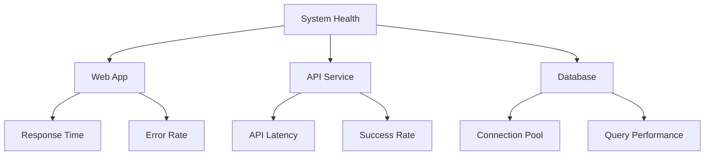

# Operational Procedures Guide
📄 `/docs/deployment/OPERATIONS.md`
**Version 1.4.0** | Last Updated: 2025-02-14

## Overview

This guide covers day-to-day operational procedures for managing Phoenix VC infrastructure, including routine maintenance, monitoring, and emergency procedures.

## Routine Operations

### 1. Health Checks

```bash
# Daily health check script
./scripts/health-check.sh \
  --environment prod \
  --components "webapp,api,database"
```

#### Monitoring Dashboard


### 2. Backup Procedures

#### Automated Backups
```bash
# Verify backup status
az backup job list \
  --vault-name $VAULT_NAME \
  --resource-group $RESOURCE_GROUP \
  --output table

# Manual backup trigger
az backup protection backup-now \
  --item-name $ITEM_NAME \
  --vault-name $VAULT_NAME \
  --resource-group $RESOURCE_GROUP \
  --container-name $CONTAINER_NAME
```

#### Backup Schedule
| Type | Frequency | Retention |
|------|-----------|-----------|
| Full | Weekly | 12 weeks |
| Differential | Daily | 30 days |
| Transaction Logs | Hourly | 7 days |

### 3. Security Operations

#### Regular Security Tasks
```bash
# Rotate service principal credentials
./scripts/rotate-credentials.sh \
  --service-principal $SP_NAME \
  --notify-team true

# Security scan
./scripts/security-scan.sh \
  --scope full \
  --report-format json
```

#### Access Review
```bash
# List role assignments
az role assignment list \
  --resource-group $RESOURCE_GROUP \
  --output table

# Review Key Vault access
az keyvault list-deleted \
  --resource-group $RESOURCE_GROUP
```

## Maintenance Procedures

### 1. Planned Maintenance

```bash
# Start maintenance window
./scripts/maintenance.sh start \
  --notification true \
  --window-duration 120

# Perform updates
az webapp deployment slot swap \
  --name $APP_NAME \
  --resource-group $RESOURCE_GROUP \
  --slot staging \
  --target-slot production

# End maintenance
./scripts/maintenance.sh end \
  --verification true
```

### 2. Emergency Procedures

#### Quick Recovery
```bash
# Rollback to last known good state
./scripts/emergency-rollback.sh \
  --version $LAST_GOOD_VERSION \
  --skip-validation true

# Emergency scaling
az webapp scale \
  --name $APP_NAME \
  --resource-group $RESOURCE_GROUP \
  --plan-size P2V2
```

#### Incident Response
```bash
# Activate incident response
./scripts/incident-response.sh \
  --severity high \
  --notify-team true

# Collect diagnostic data
az webapp log download \
  --name $APP_NAME \
  --resource-group $RESOURCE_GROUP
```

## Monitoring and Alerts

### 1. Alert Configuration

```json
{
  "alertRules": [
    {
      "name": "high-cpu-usage",
      "threshold": 80,
      "window": "PT5M",
      "action": {
        "type": "email",
        "recipients": ["ops@phoenixvc.tech"]
      }
    }
  ]
}
```

### 2. Performance Monitoring

```bash
# Check performance metrics
az monitor metrics list \
  --resource $RESOURCE_ID \
  --metric "CpuPercentage" \
  --interval PT1H

# Query logs
az monitor log-analytics query \
  --workspace-name $WORKSPACE \
  --query "requests | where timestamp > ago(1h)"
```

## Compliance and Auditing

### 1. Audit Procedures

```bash
# Generate audit report
./scripts/audit-report.sh \
  --period monthly \
  --format pdf \
  --include-security true

# Review policy compliance
az policy state summarize \
  --resource-group $RESOURCE_GROUP
```

### 2. Compliance Checks

```bash
# Verify compliance status
./scripts/compliance-check.sh \
  --framework iso27001 \
  --generate-report true

# Review security posture
az security assessment list \
  --resource-group $RESOURCE_GROUP
```

## Version History

| Version | Date | Changes |
|---------|------|---------|
| 1.4.0 | 2025-02-14 | Added emergency procedures |
| 1.3.0 | 2025-02-14 | Updated monitoring configuration |
| 1.2.0 | 2025-02-14 | Added compliance procedures |
| 1.1.0 | 2025-02-14 | Added backup procedures |
| 1.0.0 | 2025-02-14 | Initial release |