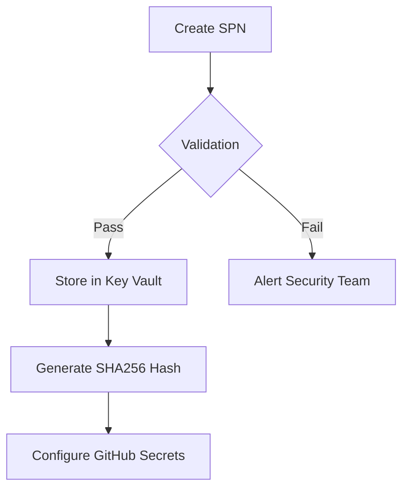

# SPN Management Guide
**Version 2.1.0** | [Technical Reference](../scripts/deployment/spn-manager/README.md) | [Audit Procedures](./audit.md)



## Prerequisites
```bash
# Install core toolchain
curl -sL https://aka.ms/InstallAzureCLIDeb | sudo bash
sudo apt install jq openssl gh -y  # Added GitHub CLI
npm install husky -g  # For pre-commit hooks
```

## Core Workflows
### SPN Creation & Rotation
```bash
# Interactive creation with audit logging
./scripts/deployment/spn-manager/create-service-principal.sh \
  --rotate "web-prod-spn" \  # Enforced naming pattern
  "Static Web Apps Contributor" \
  "/subscriptions/.../resourceGroups/prod-*" \
  PhoenixVC-Modernized

# Output structure (versioned credentials):
# - web-prod-spn-credentials-20250214.json (chmod 600)
# - web-prod-spn.sha256 (Key Vault stored hash)
```

### Automated Rotation
```bash
# Environment-aware rotation (prod/staging)
AZURE_ENV=staging \
./scripts/deployment/spn-manager/rotate-credentials.sh <app-id>

# Post-rotation validation
audit/spn-analyzer.sh --validate <app-id>
```

## Key Vault Integration
```bash
# Automatic secret storage pattern:
# phoenixvc-${ENVIRONMENT}-secrets ➔ {spn-name}-credentials-YYYYMMDD.json

# Retrieve production credentials (latest version):
az keyvault secret show \
  --vault-name phoenixvc-prod-secrets \
  --name web-prod-spn \
  --query "value" -o tsv | jq
```

## Validation & Compliance
```bash
# Pre-commit checks (Husky):
# 1. SPN naming: ^web-(prod|staging)-spn$
# 2. Date format: YYYY-MM-DD in credential files

# Manual audit trigger:
./scripts/deployment/spn-manager/audit/log-analyzer.sh \
  --full-report \
  --output compliance-$(date +%Y%m%d).pdf
```

## Operational Dashboard
```markdown
| Category              | Command                                  | Output Sample               |
|-----------------------|------------------------------------------|-----------------------------|
| Active SPNs           | `az ad sp list --query "[].displayName"` | web-prod-spn, web-staging-spn|
| Key Vault Health      | `az keyvault secret list --vault ...`    | Expiry dates, versions      |
| GitHub Secret Sync    | `gh secret list -R PhoenixVC-Modernized` | Last updated timestamps     |
```

## Emergency Procedures
```bash
# Full credential purge (incident response):
az keyvault secret delete --vault-name phoenixvc-prod-secrets --name web-prod-spn
az ad app delete --id <app-id>

# Forensic analysis:
audit/spn-analyzer.sh --investigate <app-id> --timeframe 72h
```

## Roadmap
```markdown
- [x] Key Vault Auto-rotation (v2.1)
- [ ] Grafana Dashboard Integration (Q2 2025)
- [ ] Cross-tenant SPN Templates
- [ ] Azure Policy Enforcement
```

## Version History
```markdown
| Version | Date       | Changes                              |
|---------|------------|--------------------------------------|
| 2.1.0   | 2025-02-14 | Husky pre-commit hooks, SHA256 audit |
| 2.0.0   | 2025-02-13 | Key Vault lifecycle integration      |
| 1.2.0   | 2024-11-30 | Regional deployment enforcement      |
```

> **Security Note**: All credential files get automatic `chmod 600` protection and OpenSSL-based password generation with full special character support.
