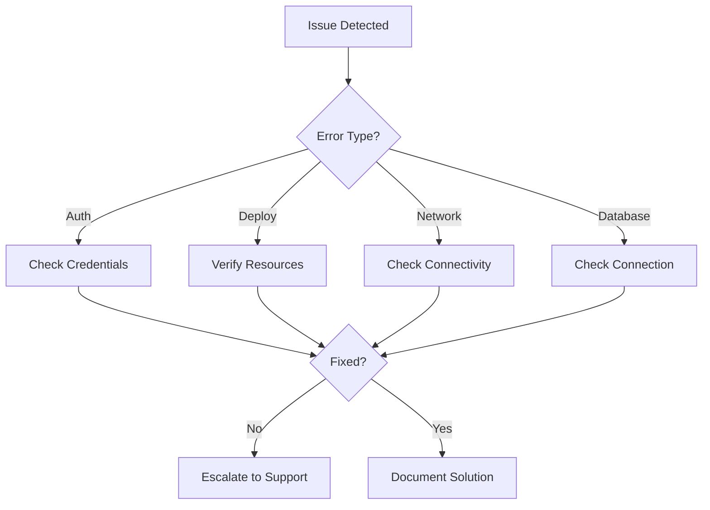

# Phoenix VC - Comprehensive Troubleshooting Guide
📄 `/docs/deployment/TROUBLESHOOTING.md`  
**Version:** 1.4.0 | Last Updated: 2025-02-14

> A comprehensive guide for resolving common issues in development and deployment, organized by issue type with quick solutions and detailed explanations.

## 📋 Quick Reference

### Error Code Index
| Code | Severity | Description | Quick Solution |
|------|----------|-------------|----------------|
| AUTH001 | High | Authentication Failed | [Check credentials](#authentication-issues) |
| DEP001 | High | Deployment Failed | [Verify parameters](#deployment-issues) |
| NET001 | Medium | Network Connectivity | [Check NSG rules](#network-configuration) |
| PERM001 | High | Insufficient Permissions | [Verify RBAC](#permissions) |
| DB001 | High | Database Connection | [Check firewall](#database-issues) |
| CI001 | Medium | Pipeline Failure | [Check workflow](#cicd-pipeline-issues) |

## 🔧 Environment Setup

### Linux Environment (Default)
```bash
# One-line prerequisites check/install
for cmd in node git az python3; do command -v $cmd >/dev/null 2>&1 || { 
  echo "Installing $cmd...";
  case $cmd in
    node) curl -fsSL https://deb.nodesource.com/setup_18.x | sudo -E bash - && sudo apt-get install -y nodejs;;
    git) sudo apt-get install -y git;;
    az) curl -sL https://aka.ms/InstallAzureCLIDeb | sudo bash;;
    python3) sudo apt-get install -y python3;;
  esac
}; done
```

### Windows Environment
```powershell
# Check/Install Chocolatey
if (!(Get-Command choco -ErrorAction SilentlyContinue)) {
  Set-ExecutionPolicy Bypass -Scope Process -Force
  [System.Net.ServicePointManager]::SecurityProtocol = [System.Net.ServicePointManager]::SecurityProtocol -bor 3072
  iex ((New-Object System.Net.WebClient).DownloadString('https://community.chocolatey.org/install.ps1'))
}

# Install prerequisites
choco install nodejs git azure-cli python -y
```

## 🔐 Authentication Issues

### Quick Solutions
1. **No subscriptions found**: `az account set --subscription $SUBSCRIPTION_ID`
2. **Invalid credentials**: Regenerate service principal
3. **Token expired**: Re-authenticate

### Detailed Troubleshooting

#### Service Principal Setup
```bash
# Create new service principal
az ad sp create-for-rbac \
  --name "github-actions-deploy" \
  --role contributor \
  --scopes /subscriptions/$SUBSCRIPTION_ID \
  --sdk-auth

# Verify setup
az login --service-principal \
  -u $CLIENT_ID \
  -p $CLIENT_SECRET \
  --tenant $TENANT_ID
```

#### Credential Reset
```bash
# Reset credentials
az ad sp credential reset \
  --name $SP_NAME \
  --append

# Update GitHub Secrets
# Settings > Secrets > Actions > AZURE_CREDENTIALS
```

## 🚀 Deployment Issues

### Quick Solutions
1. **Resource group missing**: Create with correct location
2. **Quota exceeded**: Request increase
3. **Network issues**: Check NSG rules

### Detailed Commands

#### Resource Management
```bash
# Resource group operations
az group create \
  --name $RESOURCE_GROUP \
  --location "South Africa North"

# Check deployment status
az deployment group list \
  --resource-group $RESOURCE_GROUP \
  --query "[?provisioningState=='Failed']"
```

## 💾 Database Issues

### Quick Solutions
1. **Connection timeout**: Check firewall rules
2. **Performance issues**: Update statistics
3. **Deadlocks**: Check blocking queries

### Detailed Diagnostics
```bash
# Firewall rules
az sql server firewall-rule list \
  --server $SERVER_NAME \
  --resource-group $RESOURCE_GROUP

# Performance analysis
az sql db query-performance list \
  --name $DB_NAME \
  --resource-group $RESOURCE_GROUP \
  --server $SERVER_NAME
```

## 📊 Monitoring & Performance

### CPU & Memory
```bash
# Get all metrics
az monitor metrics list \
  --resource $RESOURCE_ID \
  --interval PT5M \
  --metrics "CpuPercentage,MemoryPercentage"

# Auto-scale settings
az monitor autoscale-settings list \
  --resource-group $RESOURCE_GROUP
```

### Log Analysis
```bash
# Download all logs
az webapp log download \
  --name $APP_NAME \
  --resource-group $RESOURCE_GROUP

# Live log streaming
az webapp log tail \
  --name $APP_NAME \
  --resource-group $RESOURCE_GROUP
```

## 🔄 Recovery Procedures

### Quick Recovery Steps
1. **Application issue**: Restart service
2. **Deployment failure**: Rollback
3. **Data corruption**: Restore backup

### Detailed Procedures
```bash
# Rollback deployment
az webapp deployment source rollback \
  --name $APP_NAME \
  --resource-group $RESOURCE_GROUP \
  --slot production

# Restore from backup
az backup restore restore-disks \
  --vault-name $VAULT_NAME \
  --resource-group $RESOURCE_GROUP \
  --recovery-point-id $RECOVERY_POINT
```

## 🔍 Troubleshooting Flowchart



## 📝 Version History

| Version | Date | Changes |
|---------|------|---------|
| 1.4.0 | 2025-02-14 | Added flowchart, improved organization |
| 1.3.0 | 2025-02-14 | Added CI/CD troubleshooting |
| 1.2.0 | 2025-01-20 | Updated recovery procedures |
| 1.1.0 | 2024-12-15 | Added database section |

## 📚 Additional Resources
- [Azure CLI Documentation](https://docs.microsoft.com/en-us/cli/azure/)
- [GitHub Actions Guide](https://docs.github.com/en/actions)
- [Internal Wiki](https://wiki.phoenixvc.za)
- [Monitoring Best Practices](https://docs.microsoft.com/en-us/azure/azure-monitor/best-practices)

---
Need immediate assistance? Contact support@phoenixvc.za or join our [Slack channel](https://phoenixvc.slack.com/troubleshooting)