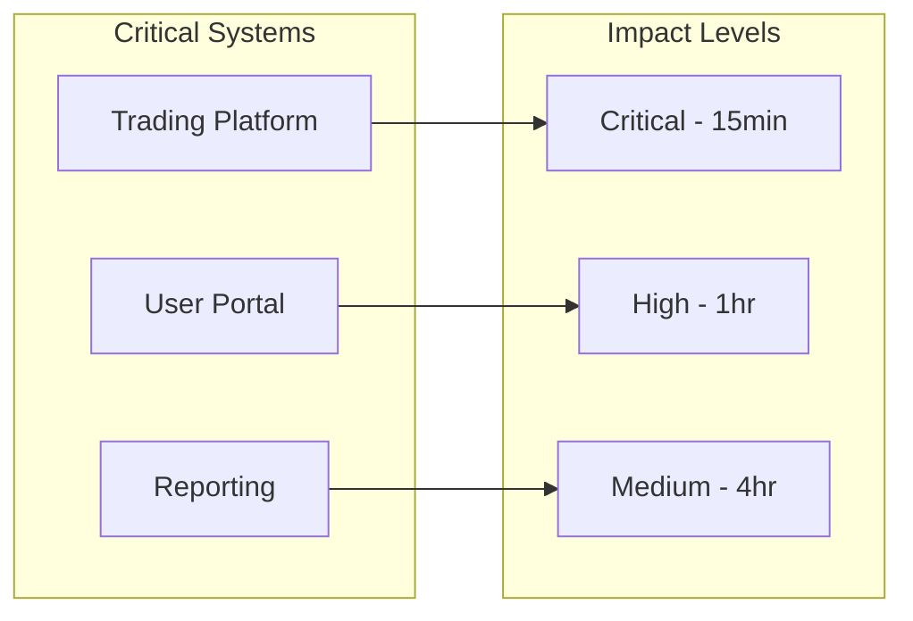
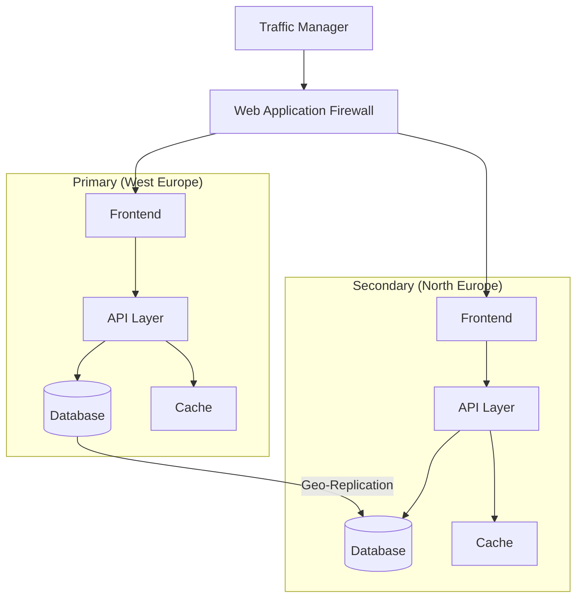
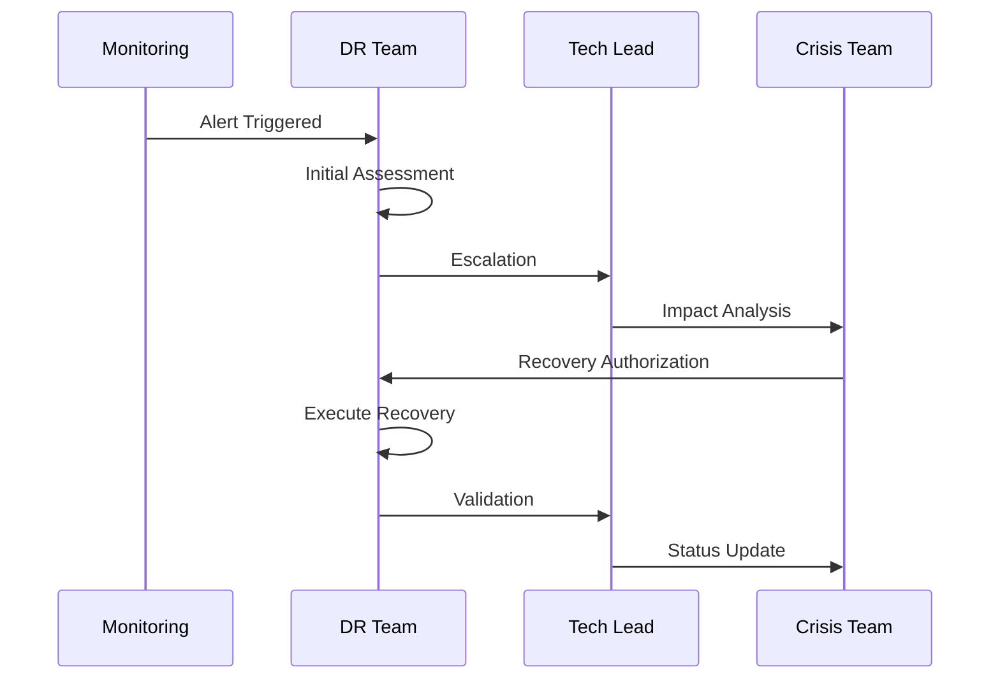
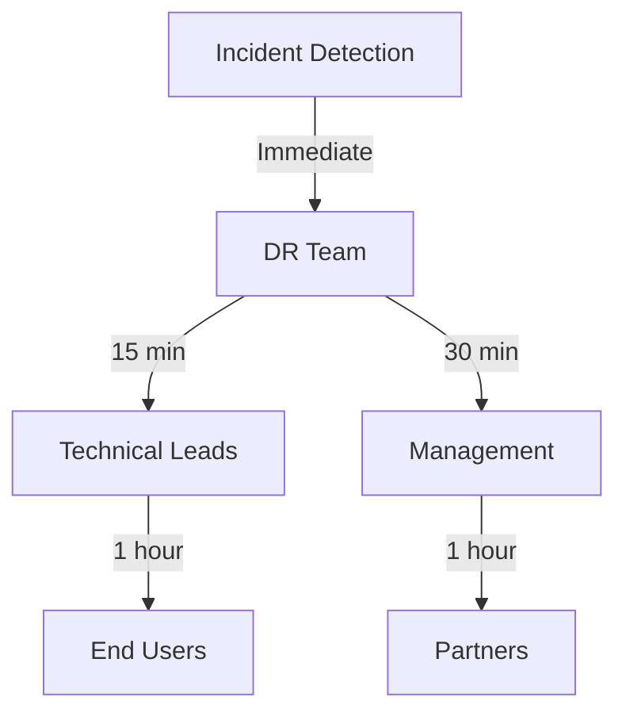

# Disaster Recovery and Business Continuity Plan
📄 /docs/infrastructure/DISASTER_RECOVERY.md

## Overview

This document outlines Phoenix VC's comprehensive disaster recovery (DR) and business continuity plan. It provides detailed procedures for system backup, recovery operations, and maintaining business continuity during various failure scenarios.

## Table of Contents
- [Recovery Objectives](#recovery-objectives)
- [Risk Assessment](#risk-assessment)
- [Backup Strategy](#backup-strategy)
- [Failover Architecture](#failover-architecture)
- [Recovery Procedures](#recovery-procedures)
- [Communication Plan](#communication-plan)
- [Testing and Validation](#testing-and-validation)
- [Recovery Runbooks](#recovery-runbooks)

## Recovery Objectives

### Business Impact Analysis



### Target Metrics

| Metric | Target | Description | Monitoring |
|--------|--------|-------------|------------|
| RTO (Recovery Time Objective) | 4 hours | Maximum acceptable downtime | Azure Monitor |
| RPO (Recovery Point Objective) | 15 minutes | Maximum acceptable data loss | Backup Reports |
| MTTR (Mean Time to Recovery) | 2 hours | Average recovery time | Incident Metrics |
| Availability SLA | 99.95% | System uptime target | SLA Dashboard |

## Risk Assessment

### Threat Matrix

| Threat | Likelihood | Impact | Mitigation |
|--------|------------|--------|------------|
| Region Failure | Medium | Critical | Multi-region deployment |
| Data Corruption | Low | Critical | Point-in-time recovery |
| Cyber Attack | High | Critical | Security controls, WAF |
| Network Outage | Medium | High | Redundant connectivity |

## Backup Strategy

### Backup Configuration

```bicep
resource backupPolicy 'Microsoft.RecoveryServices/vaults/backupPolicies@2021-06-01' = {
  name: '${environment}-backup-policy'
  parent: recoveryServicesVault
  properties: {
    backupManagementType: 'AzureWorkload'
    schedulePolicy: {
      schedulePolicyType: 'SimpleSchedulePolicy'
      scheduleRunFrequency: 'Hourly'
      scheduleRunTimes: ['2025-02-14T00:00:00Z']
      scheduleWeeklyFrequency: 7
    }
    retentionPolicy: {
      retentionPolicyType: 'LongTermRetentionPolicy'
      dailySchedule: {
        retentionTimes: ['2025-02-14T00:00:00Z']
        retentionDuration: {
          count: 30
          durationType: 'Days'
        }
      }
    }
  }
}
```

### Backup Schedule

| Resource Type | Frequency | Retention | Storage Type | Validation |
|---------------|-----------|-----------|--------------|------------|
| Database | 15 min | 30 days | Geo-redundant | Daily |
| File Storage | Daily | 90 days | Zone-redundant | Weekly |
| Configuration | Weekly | 1 year | Cool storage | Monthly |
| User Data | Hourly | 45 days | Geo-redundant | Weekly |

## Failover Architecture

### High Availability Design



### Regional Failover Components

```bicep
resource trafficManager 'Microsoft.Network/trafficManagerProfiles@2021-02-01' = {
  name: '${environment}-tm-phoenixvc'
  location: 'global'
  properties: {
    profileStatus: 'Enabled'
    trafficRoutingMethod: 'Priority'
    dnsConfig: {
      relativeName: '${environment}-phoenixvc'
      ttl: 30
    }
    monitorConfig: {
      protocol: 'HTTPS'
      port: 443
      path: '/health'
      intervalInSeconds: 30
      timeoutInSeconds: 10
      toleratedNumberOfFailures: 3
    }
  }
}
```

## Recovery Procedures

### Incident Response Flow



### Recovery Steps

1. **Initial Response**
   - Incident detection and classification
   - Team notification and escalation
   - Initial impact assessment

2. **Recovery Execution**
   - Activate DR procedures
   - Execute failover if required
   - Restore from backups if needed
   - Verify system integrity

3. **Service Restoration**
   - Validate functionality
   - Verify data consistency
   - Resume normal operations
   - Post-incident review

## Communication Plan

### Notification Matrix



### Contact Information

| Role | Primary Contact | Secondary Contact | Response Time |
|------|----------------|-------------------|---------------|
| DR Coordinator | dr@phoenixvc.com | +1-555-0123 | 15 min |
| Technical Lead | tech@phoenixvc.com | +1-555-0124 | 30 min |
| Communications | comms@phoenixvc.com | +1-555-0125 | 1 hour |

## Testing and Validation

### Test Schedule

| Test Type | Frequency | Duration | Scope | Last Test |
|-----------|-----------|----------|-------|----------|
| Backup Restore | Monthly | 4 hours | Database | 2025-01-15 |
| Failover | Quarterly | 8 hours | Full System | 2025-01-01 |
| Table Top | Semi-annual | 2 hours | Procedures | 2024-12-15 |

### Test Scenarios

```yaml
test_scenarios:
  - name: Database Failover
    steps:
      - simulate_primary_failure
      - activate_secondary
      - verify_data_sync
      - validate_applications
  
  - name: Region Failover
    steps:
      - trigger_failover
      - verify_traffic_routing
      - check_data_consistency
      - validate_security_configs
```

## Recovery Runbooks

### Database Recovery

```powershell
# Restore database from point-in-time backup
$timestamp = (Get-Date).AddHours(-1)
Restore-AzSqlDatabase `
  -ResourceGroupName "rg-phoenixvc" `
  -ServerName "sql-phoenixvc" `
  -DatabaseName "db-phoenixvc" `
  -PointInTime $timestamp `
  -Edition "Standard" `
  -ServiceObjectiveName "S1"
```

### Application Recovery Checklist

1. **Assessment Phase**
   - [ ] Identify failure scope
   - [ ] Validate backup integrity
   - [ ] Check dependencies

2. **Recovery Phase**
   - [ ] Activate secondary region
   - [ ] Restore data from backups
   - [ ] Update DNS/Traffic Manager
   - [ ] Verify application health

3. **Validation Phase**
   - [ ] Run health checks
   - [ ] Verify data consistency
   - [ ] Test critical functions
   - [ ] Confirm security controls

## Document History

| Version | Date | Author | Changes |
|---------|------|--------|---------|
| 1.0 | 2025-02-14 | DR Team | Initial version |
| 1.1 | 2025-02-14 | DR Team | Added runbooks |