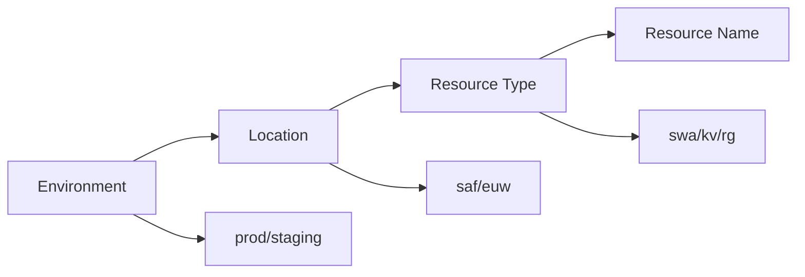

# Deployment Configuration
📄 `/docs/deployment/configuration.md`  
**Version:** 1.3.0  
**Last Updated:** 2025-02-14

## Environment Configuration

### Core Settings
```bash
# .env file structure
ENVIRONMENT="prod|staging"     # Deployment environment
LOCATION="South Africa North"  # Azure region
RESOURCE_PREFIX="phoenixvc"    # Resource naming prefix

# Authentication
AZURE_SUBSCRIPTION_ID="sub-id"      # Azure subscription ID
AZURE_TENANT_ID="tenant-id"         # Azure tenant ID
AZURE_CLIENT_ID="client-id"         # Service Principal ID
AZURE_CLIENT_SECRET="client-secret" # Service Principal secret

# Feature Flags
ENABLE_MONITORING=true    # Enable monitoring
ENABLE_BACKUP=true        # Enable backup
POLICY_MODE="audit|enforce"  # Policy enforcement mode
```

### Environment-Specific Parameters
```json
// parameters-prod.json
{
  "environment": { "value": "prod" },
  "location": { "value": "South Africa North" },
  "resourceTags": {
    "value": {
      "Environment": "Production",
      "Owner": "Phoenix VC",
      "CostCenter": "IT-001"
    }
  }
}
```

## Resource Naming Convention


### Naming Pattern
```
{env}-{loc}-{type}-{name}

Examples:
- prod-saf-rg-phoenixvc
- staging-euw-kv-secrets
```

## Security Configuration

### Network Security Groups
```json
{
  "securityRules": [
    {
      "name": "allow-https",
      "properties": {
        "priority": 100,
        "direction": "Inbound",
        "access": "Allow",
        "protocol": "Tcp",
        "sourcePortRange": "*",
        "destinationPortRange": "443"
      }
    }
  ]
}
```

### Key Vault Access Policies
```json
{
  "accessPolicies": [
    {
      "tenantId": "${AZURE_TENANT_ID}",
      "objectId": "${SERVICE_PRINCIPAL_ID}",
      "permissions": {
        "secrets": ["get", "list"],
        "certificates": ["get", "list"]
      }
    }
  ]
}
```

## Monitoring Configuration

### Alert Rules
```json
{
  "alertRules": [
    {
      "name": "high-cpu",
      "severity": 2,
      "threshold": 90,
      "windowSize": "PT5M"
    }
  ]
}
```

### Log Analytics
```json
{
  "workspaceSettings": {
    "retentionInDays": 30,
    "dailyQuotaGb": 5,
    "publicNetworkAccessForIngestion": "Enabled",
    "publicNetworkAccessForQuery": "Enabled"
  }
}
```

## Validation Procedures

### Configuration Validation
```bash
# Validate environment variables
./scripts/validate-env.sh

# Validate parameters using Bicep
az deployment group validate \
  --resource-group $RESOURCE_GROUP \
  --template-file main.bicep \
  --parameters @parameters-prod.json
```

### Security Validation
```bash
# Check Key Vault access
az keyvault show \
  --name $KEYVAULT_NAME \
  --resource-group $RESOURCE_GROUP

# Verify NSG rules
az network nsg rule list \
  --nsg-name $NSG_NAME \
  --resource-group $RESOURCE_GROUP
```

## Version History

| Version | Date       | Changes                       |
|---------|------------|-------------------------------|
| 1.3.0   | 2025-02-14 | Added monitoring configuration|
| 1.2.0   | 2025-01-20 | Updated naming convention     |
| 1.1.0   | 2024-12-15 | Added security configuration  |
| 1.0.0   | 2024-12-01 | Initial release               |
