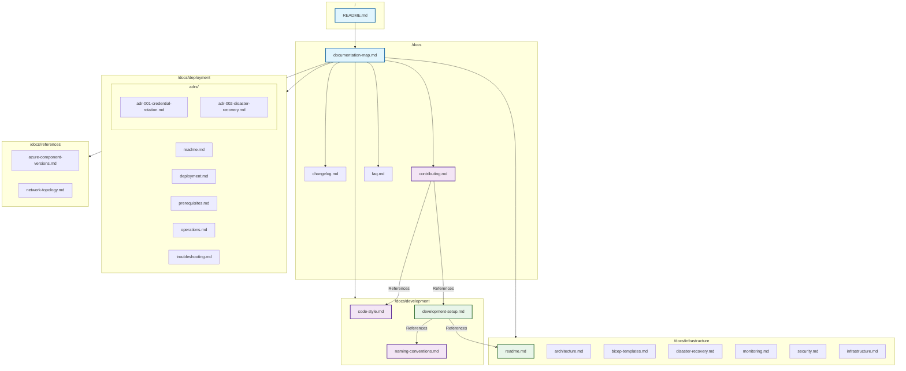

📄 /docs/documentation-map.md

# Documentation Map

## Overview

This map provides a high-level visual guide to our documentation structure and shows how different documents and folders relate to each other. Note that each major folder (e.g., development, deployment, infrastructure, references) contains multiple documents. The diagram is a simplified overview; for full details, please refer to the Directory Structure section below.

> **Legend:**  
> - All files (except README.md) use kebab-case.  
> - README.md files remain in their conventional format.  
> - Subgraphs represent groups of documents within a folder.



## Document Purposes

### Core Documentation

| Document               | Purpose                                      | Primary Audience      |
|------------------------|----------------------------------------------|-----------------------|
| `README.md` (root)     | Overall project overview and entry point     | All users             |
| `documentation-map.md` | Visual guide and navigation of docs          | All users             |

### Development Guidelines

| Document                  | Purpose                                                       | Primary Audience       |
|---------------------------|---------------------------------------------------------------|------------------------|
| `code-style.md`           | Code formatting and best practices (minus naming conventions) | Developers             |
| `development-setup.md`    | Environment setup and workflow instructions                   | New developers         |
| `naming-conventions.md`   | Dedicated naming conventions for documentation and code       | Developers, DevOps     |

### Deployment Documentation

| Document                      | Purpose                                               | Primary Audience       |
|-------------------------------|-------------------------------------------------------|------------------------|
| `deployment/readme.md`        | Deployment hub overview                               | DevOps, Operations     |
| `deployment/deployment.md`    | Step-by-step deployment instructions                  | DevOps, Engineers      |
| `deployment/prerequisites.md` | Software, permission, and system requirements         | DevOps, Engineers      |
| `deployment/operations.md`    | Day-to-day operational procedures                     | Operations, Support    |
| `deployment/troubleshooting.md` | Deployment troubleshooting guide                     | DevOps, Engineers      |
| `deployment/adrs/`            | Architectural decision records (e.g., SPN rotation, DR) | Architects, Engineers  |

### Infrastructure Documentation

| Document                         | Purpose                                                | Primary Audience       |
|----------------------------------|--------------------------------------------------------|------------------------|
| `infrastructure/readme.md`       | Overview of infrastructure documentation               | DevOps, Architects     |
| `architecture.md`                | System architecture and diagrams                       | Architects, Engineers  |
| `bicep-templates.md`             | IaC templates and deployment instructions              | DevOps, Engineers      |
| `disaster-recovery.md`           | Detailed disaster recovery plan                        | Operations, DevOps     |
| `monitoring.md`                  | Monitoring and logging configuration                   | Operations, Support    |
| `security.md`                    | Security configurations and best practices             | Security Teams         |
| `infrastructure.md`              | General infrastructure documentation                   | DevOps, Architects     |

### References

| Document                                  | Purpose                                  | Primary Audience       |
|-------------------------------------------|------------------------------------------|------------------------|
| `azure-component-versions.md`             | API and component version references       | DevOps, Developers     |
| `network-topology.md`                       | Network topology diagrams and details      | Network Engineers      |

## Document Updates

| Document                    | Update Frequency | Trigger                             |
|-----------------------------|------------------|-------------------------------------|
| `README.md`                 | As needed        | Major project changes               |
| `documentation-map.md`      | When docs change | New/modified documents              |
| `code-style.md`             | Quarterly        | Style revisions                     |
| `contributing.md`           | Monthly          | Process updates                     |
| `development-setup.md`      | Monthly          | Tool/workflow updates               |
| *Each document in infrastructure* | Varies    | As needed based on changes          |

## Documentation Best Practices

1. **Keep It Current**  
   - Regular reviews and updates  
   - Use version control for changes

2. **Maintain Consistency**  
   - Follow templates and naming conventions  
   - Use consistent formatting and interlinking

3. **Ensure Accessibility**  
   - Clear navigation and logical structure  
   - Use search-friendly headings and summaries

## Directory Structure

```plaintext
📁 /
├── 📄 README.md
└── 📁 docs/
    ├── 📄 documentation-map.md
    ├── 📄 changelog.md
    ├── 📄 contributing.md
    ├── 📄 faq.md
    ├── 📄 naming-conventions.md
    ├── 📁 development/
    │   ├── 📄 code-style.md
    │   └── 📄 development-setup.md
    ├── 📁 deployment/
    │   ├── 📄 readme.md
    │   ├── 📄 deployment.md
    │   ├── 📄 prerequisites.md
    │   ├── 📄 operations.md
    │   ├── 📄 troubleshooting.md
    │   └── 📁 adrs/
    │       ├── 📄 adr-001-credential-rotation.md
    │       └── 📄 adr-002-disaster-recovery.md
    ├── 📁 infrastructure/
    │   ├── 📄 readme.md
    │   ├── 📄 architecture.md
    │   ├── 📄 bicep-templates.md
    │   ├── 📄 disaster-recovery.md
    │   ├── 📄 monitoring.md
    │   ├── 📄 security.md
    │   └── 📄 infrastructure.md
    └── 📁 references/
        ├── 📄 azure-component-versions.md
        └── 📄 network-topology.md
```

## Quick Reference

### For New Developers
1. Start with `README.md`
2. Review `documentation-map.md`
3. Follow `development-setup.md`
4. Read `contributing.md`

### For Contributors
1. Review `code-style.md`
2. Follow `contributing.md`
3. Reference `naming-conventions.md` for naming rules

### For Maintainers
1. Keep `documentation-map.md` updated
2. Review all documents regularly
3. Ensure cross-references remain valid
