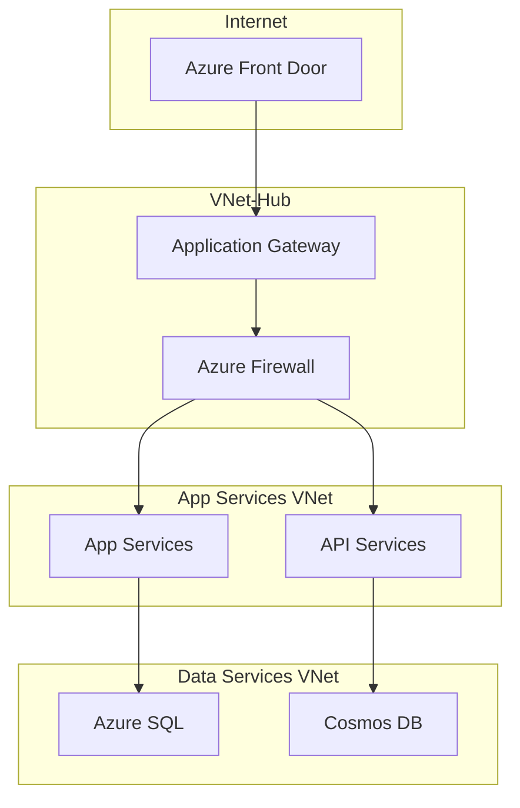

# Network Topology Reference
**Environment:** Production | **Last Updated:** 2025-02-14

## Overview


## Network Segments

### Hub VNet (10.0.0.0/16)
| Subnet | CIDR | Purpose | NSG Rules |
|--------|------|---------|-----------|
| GatewaySubnet | 10.0.0.0/24 | VPN Gateway | System Managed |
| AzureFirewallSubnet | 10.0.1.0/24 | Firewall | System Managed |
| AppGatewaySubnet | 10.0.2.0/24 | WAF/Gateway | Inbound 443 |

### App Services VNet (10.1.0.0/16)
| Subnet | CIDR | Purpose | NSG Rules |
|--------|------|---------|-----------|
| app-prod | 10.1.0.0/24 | Production Apps | Inbound 443 |
| app-staging | 10.1.1.0/24 | Staging Apps | Inbound 443 |
| api-prod | 10.1.2.0/24 | Production APIs | Inbound 443 |

### Data Services VNet (10.2.0.0/16)
| Subnet | CIDR | Purpose | NSG Rules |
|--------|------|---------|-----------|
| sql-prod | 10.2.0.0/24 | SQL Servers | TCP 1433 |
| cosmos-prod | 10.2.1.0/24 | Cosmos DB | TCP 443 |
| redis-prod | 10.2.2.0/24 | Redis Cache | TCP 6380 |

## Peering Configuration
```bash
# Hub to Spoke1
az network vnet peering create \
  --name Hub-to-Spoke1 \
  --resource-group $RG_HUB \
  --vnet-name vnet-hub \
  --remote-vnet $SPOKE1_ID \
  --allow-vnet-access

# Hub to Spoke2
az network vnet peering create \
  --name Hub-to-Spoke2 \
  --resource-group $RG_HUB \
  --vnet-name vnet-hub \
  --remote-vnet $SPOKE2_ID \
  --allow-vnet-access
```

## Route Tables
| Name | Route | Next Hop | Purpose |
|------|-------|----------|---------|
| rt-spoke1 | 0.0.0.0/0 | Azure Firewall | Force tunnel to hub |
| rt-spoke2 | 0.0.0.0/0 | Azure Firewall | Force tunnel to hub |
| rt-hub | 10.0.0.0/8 | Virtual network | Internal routing |

## Security Groups
```json
{
  "defaultRules": {
    "inbound": "deny",
    "outbound": "allow"
  },
  "customRules": {
    "allowHttps": {
      "priority": 100,
      "direction": "Inbound",
      "protocol": "Tcp",
      "port": 443
    }
  }
}
```

## Monitoring
- Network Watcher enabled for all VNets
- Flow logs stored in Log Analytics
- NSG flow logs retention: 30 days
- Metrics collected every 1 minute