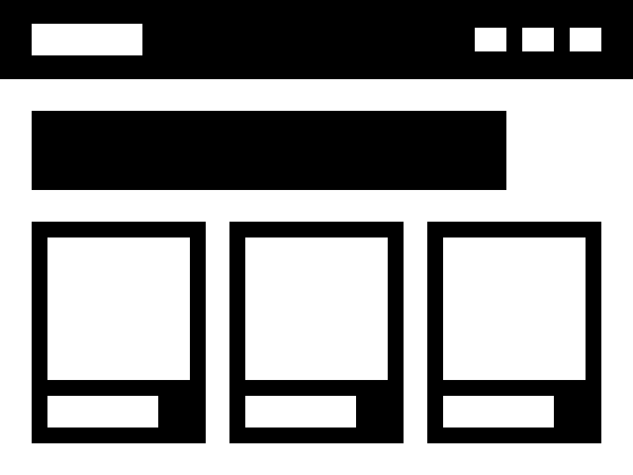

# PhoenixVC Modernized Documentation Hub

Welcome to the PhoenixVC Modernized documentation hub. This comprehensive resource provides detailed information about our design system, development guidelines, infrastructure setup, and deployment processes.

## 🚀 Getting Started

| Section | Description |
|---------|-------------|
| [Design System](./design/README.md) | UI components, tokens, and design guidelines |
| [Development Guides](./main/guides/development/README.md) | Setup, coding standards, and best practices |
| [Deployment](./main/guides/deployment/README.md) | Environment setup, configuration, and operations |
| [Infrastructure](./main/guides/infrastructure/README.md) | Architecture, security, and monitoring |

## 📚 Key Documentation Areas

### Design & UI

Our design system provides a unified approach to creating consistent, accessible, and beautiful user interfaces:

- [Components](./design/components/index.md) - Buttons, cards, inputs, and more
- [Design Tokens](./design/tokens/colors.md) - Colors, typography, spacing
- [Accessibility Guidelines](./design/guidelines/accessibility.md)
- [Design System Implementation](./design-system/implementation-guide.md)

### Development

Resources for developers to efficiently build and maintain our applications:

- [Development Setup](./main/guides/development/development-setup.md)
- [Code Style & Conventions](./main/guides/development/code-style.md)
- [Contributing Guidelines](./main/guides/development/contributing.md)
- [Docker Workflow](./main/guides/development/infrastructure/docker-workflow.md)

### Deployment & Operations

Information on deploying and managing our applications:

- [Azure Environment Setup](./main/guides/deployment/azure-environment-setup.md)
- [Deployment Guide](./main/guides/deployment/deployment-guide.md)
- [DNS Configuration](./main/guides/deployment/dns-configuration.md)
- [Troubleshooting](./main/guides/deployment/troubleshooting.md)

### Infrastructure

Details about our infrastructure architecture and management:

- [Architecture Overview](./main/guides/infrastructure/architecture.md)
- [Security](./main/guides/infrastructure/SECURITY.md)
- [Monitoring](./main/guides/infrastructure/monitoring.md)
- [Disaster Recovery](./main/guides/infrastructure/disaster-recovery.md)

### Compliance & Policies

Information on our compliance framework and policies:

- [Policy Framework](./main/policies/compliance/policy-framework.md)
- [Azure Security Baseline](./main/policies/compliance/azure-security-baseline.md)
- [Controls Checklist](./main/policies/compliance/controls-checklist.md)

## 📋 Reference Materials

- [Azure Component Versions](./main/reference/azure-component-versions.md)
- [Network Topology](./main/reference/network-topology.md)
- [Naming Conventions](./main/reference/naming-conventions.md)

## 🔍 Quick Links

- [FAQ](./main/FAQ.md)
- [Search Documentation](./main/search.md)
- [Changelog](./main/meta/CHANGELOG.md)
- [Documentation Roadmap](./main/meta/documentation-roadmap.md)

## 🛠 Tools & Resources

- [Design System Executive Summary](./design-system/executive-summary.md)
- [Component Mapping](./design-system/component-mapping.md)
- [Technical Guide](./design-system/technical-guide.md)

## 📊 Visual Examples

Our design system includes several layout options to showcase your content:

| Layout Style | Preview |
|--------------|---------|
| Modern Brutalism |  |
| Enterprise Elegance |  |
| Dynamic Minimalism |  |
| Subtle Minimalism |  |

## 📞 Support

If you need assistance with this documentation or have questions about PhoenixVC Modernized:

- Technical Support: [support@phoenixvc.za](mailto:support@phoenixvc.za)
- Documentation Issues: Please submit an issue in our repository

---

© 2025 PhoenixVC. All rights reserved.
