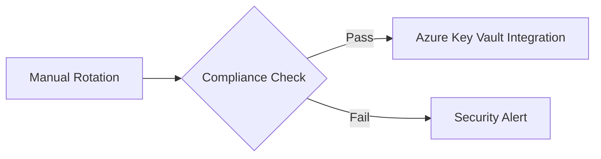

# ADR 0001: Manual Credential Rotation {: #adr-0001-manual-credential-rotation}
**Status**: `ACCEPTED` | Effective: 2025-03-01 | Review Cycle: 6 months

## Context {: #context}
```markdown
- Current SPN management relies on Azure Portal/CLI manual operations
- Audit requirements mandate traceable rotation process
- Security policy enforces 90-day credential rotation for service accounts
- Existing automation gaps in secret distribution to deployment systems
```

## Decision {: #decision}


## Implementation {: #implementation}
```bash
# Rotation workflow {: #rotation-workflow}
./create-service-principal.sh --rotate <SPN_NAME>
./rotate-credentials.sh <APP_ID>
./audit/log-analyzer.sh > rotation-report-$(date +%Y%m%d).md
```

## Consequences {: #consequences}
```markdown
### Positive {: #positive}
- ✅ Immediate implementation with existing tooling
- ✅ Clear audit trail via script-generated logs
- ✅ Compatible with current Azure RBAC setup

### Negative {: #negative}
- ❌ Requires manual execution every 90 days
- ❌ No native integration with Azure Policy
- ❌ Single point of failure (rotation script)

### Risks {: #risks}
- ⚠️ Human error in manual execution
- ⚠️ Timezone mismatch in expiration dates
- ⚠️ Potential secret leakage during rotation
```

## Validation Metrics {: #validation-metrics}
```markdown
| Metric                  | Target            | Measurement Method         |
|-------------------------|-------------------|----------------------------|
| Rotation Frequency      | ≤90 days          | Audit log analysis         |
| Secret Propagation Time | ≤15 minutes       | Deployment pipeline checks |
| Audit Completeness      | 100% of rotations | log-analyzer.sh reports    |
```

## Sunset Clause {: #sunset-clause}
```markdown
This manual process will be deprecated when:
- Azure implements native rotation webhooks
- 75% of deployment targets support managed identities
- Audit system integrates with Azure AD logs
```

## Revision History {: #revision-history}
```markdown
| Version | Date       | Author       | Changes                        |
|---------|------------|--------------|--------------------------------|
| 1.1     | 2025-02-14 | H. Smit      | Added validation metrics       |
| 1.0     | 2025-02-14 | H. Smit      | Initial accepted version       |
```