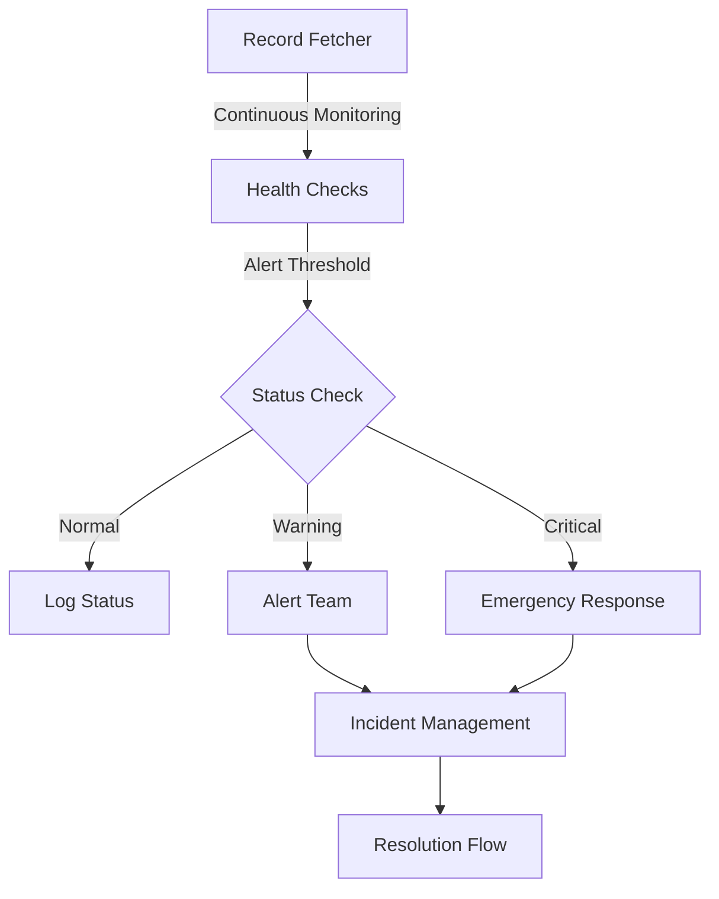
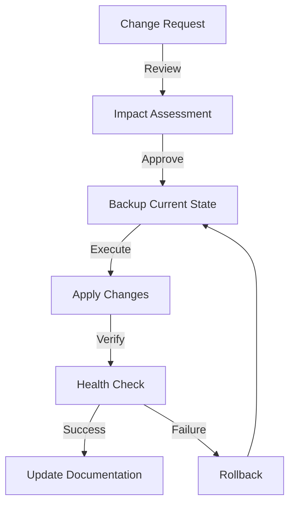

# DNS Management Best Practices
**File Path:** 📄 `/docs/dns/best-practices/README.md`
**Version:** 3.2.0
**Last Updated:** 2025-02-18
**Authored By:** Jurie Smit (assisted by Claude-3 Sonnet)
**Status:** 🟢 Active
**Tags:** `#dns` `#best-practices` `#security` `#operations`

| 📚 Documentation               | 🛠️ Implementation          | 🔍 Resources                         |
|--------------------------------|----------------------------|--------------------------------------|
| [Record Fetcher](../record-fetcher.md) | [Security Guide](../security/README.md) | [RFC Standards](https://www.ietf.org/standards/rfcs/) |
| [Operations Guide](../operations/README.md) | [Monitoring](../monitoring/README.md) | [DNSSEC Guide](../security/dnssec.md) |
| [Configuration](../config/README.md) | [Automation](../automation/README.md) | [Troubleshooting](../troubleshooting/README.md) |

---

## Overview

This document outlines comprehensive best practices for managing DNS within PhoenixVC’s Azure infrastructure. The guidelines are structured around three core principles:

- **Security First:** Prioritize DNSSEC implementation, strict access controls, and regular audits.
- **Reliability:** Ensure high availability through redundancy, automated health checks, and robust backup procedures.
- **Performance:** Optimize TTL values, caching, and load balancing to achieve efficient DNS resolution.

---

## Core Principles

### 1. Security First
```yaml
security_principles:
  - Enable DNSSEC for all production domains.
  - Implement strict access controls (RBAC).
  - Conduct regular security audits.
  - Configure secure resolvers.
  - Monitor for suspicious activities.
```

### 2. Reliability
```yaml
reliability_practices:
  - Utilize multiple DNS providers.
  - Ensure geographic distribution of nameservers.
  - Implement automated health checks.
  - Maintain regular backup systems.
  - Configure failover mechanisms.
```

### 3. Performance
```yaml
performance_optimization:
  - Set optimal TTL values.
  - Manage caching effectively.
  - Use load balancing where applicable.
  - Optimize query processing.
  - Monitor response times continuously.
```

---

## Implementation Guidelines

### Record Management

#### TTL Configuration
```yaml
ttl_guidelines:
  standard_records:
    min: 3600    # 1 hour
    max: 86400   # 24 hours

  critical_services:
    min: 300     # 5 minutes
    max: 3600    # 1 hour

  maintenance_window:
    recommended: 300  # 5 minutes
```

#### Naming Conventions
```yaml
naming_standards:
  format: "<service>-<environment>-<region>"
  examples:
    - api-prod-za
    - web-staging-eu
    - db-dev-us
  restrictions:
    - Use lowercase only.
    - Use hyphens as separators.
    - No underscores allowed.
    - Maximum 63 characters.
```

### Monitoring Setup



### Security Implementation

#### Access Control Matrix
```yaml
access_levels:
  read_only:
    - View DNS records
    - Export configurations
    - Generate reports

  operator:
    - All read_only permissions
    - Modify non-critical records
    - Update TTL values

  administrator:
    - All operator permissions
    - Modify critical records
    - Configure DNSSEC
    - Manage access control
```

#### DNSSEC Configuration Example
```bash
# Enable DNSSEC for the zone
./record-fetcher.sh --enable-dnssec \
  --domain phoenixvc.tech \
  --algorithm "ECDSAP256SHA256" \
  --key-rollover-days 90

# Validate the DNSSEC chain thoroughly
./record-fetcher.sh --verify-dnssec \
  --domain phoenixvc.tech \
  --thorough
```

---

## Operational Procedures

### Daily Operations

#### Health Checks
```bash
# Morning health check: Generate a report for all production domains
./record-fetcher.sh --health-check \
  --domains-file production.txt \
  --alert-threshold warning \
  --output morning-report.json

# Evening validation: Compare against baseline configuration
./record-fetcher.sh --validate \
  --domains-file production.txt \
  --compare-baseline \
  --output evening-report.json
```

#### Monitoring Schedule
```yaml
monitoring_schedule:
  health_checks:
    frequency: 5m
    timeout: 30s
    retries: 3

  full_validation:
    frequency: 1h
    timeout: 2m
    comprehensive: true

  security_audit:
    frequency: 24h
    include_dnssec: true
    validate_caa: true
```

### Change Management

#### Change Process Flow


#### Backup Procedures for Change Management
```bash
# Create a pre-change backup
./record-fetcher.sh --backup \
  --domain phoenixvc.tech \
  --tag "pre-change-$(date +%Y%m%d)" \
  --format json

# Verify backup integrity thoroughly
./record-fetcher.sh --verify-backup \
  --latest \
  --thorough
```

---

## Documentation Standards

### Record Documentation Requirements
```yaml
record_documentation:
  required_fields:
    - Purpose
    - Owner
    - Last Modified Date
    - TTL Justification
    - Security Requirements

  change_log:
    - Date
    - Modifier
    - Description of Change
    - Approval Reference
```

### Incident Documentation Template
```yaml
incident_template:
  header:
    - Incident ID
    - Date/Time
    - Severity
    - Impact

  body:
    - Description
    - Root Cause
    - Resolution Steps
    - Prevention Measures

  follow_up:
    - Action Items
    - Timeline
    - Stakeholder Communication
```

---

## Automation Guidelines

### Script Standards
```python
# Example: Standard structure for DNS automation scripts
def dns_operation():
    """
    Standard structure for DNS operations.
    """
    try:
        # Validate inputs
        validate_parameters()

        # Backup current state
        create_backup()

        # Apply DNS changes
        apply_changes()

        # Verify changes
        verify_changes()

        # Update documentation
        update_docs()

    except Exception as e:
        handle_error(e)
        rollback_changes()
```

### Best Practices for Automation
```yaml
automation_guidelines:
  - Use version control for scripts.
  - Implement robust error handling.
  - Include comprehensive logging.
  - Validate all inputs.
  - Create audit trails for changes.
  - Test thoroughly in staging environments.
  - Document all dependencies.
```

---

## Compliance and Auditing

### Audit Requirements
```yaml
audit_checklist:
  daily:
    - Verify record integrity
    - Check DNSSEC status
    - Monitor response times

  weekly:
    - Review security configurations
    - Audit access logs
    - Update change history

  monthly:
    - Conduct full security audits
    - Perform performance reviews
    - Update documentation as needed
```

### Compliance Monitoring Procedures
```bash
# Generate a compliance report based on ISO27001 and GDPR standards
./record-fetcher.sh --compliance-check \
  --standards "iso27001,gdpr" \
  --domain phoenixvc.tech \
  --output compliance-report.pdf

# Export an audit trail of changes over the past 30 days
./record-fetcher.sh --audit-log \
  --period "30d" \
  --format csv \
  --include-changes
```

---

## Support and Maintenance

### Support Levels
```yaml
support_tiers:
  standard:
    response_time: 4h
    coverage: "8x5"

  premium:
    response_time: 1h
    coverage: "24x7"

  emergency:
    response_time: 15m
    coverage: "24x7"
```

### Maintenance Windows
```yaml
maintenance_schedule:
  standard:
    window: "Sunday 02:00-04:00 UTC"
    frequency: "Weekly"

  emergency:
    notice: "2 hours minimum"
    approval: "Required from DNS admin"
```

---

## References

### Standards and RFCs
- [RFC 1034](https://tools.ietf.org/html/rfc1034) – Domain Names: Concepts and Facilities
- [RFC 1035](https://tools.ietf.org/html/rfc1035) – Domain Names: Implementation and Specification
- [RFC 4033](https://tools.ietf.org/html/rfc4033) – DNS Security: Introduction and Requirements

### Internal Documentation
- [DNS Architecture Guide](../architecture/README.md)
- [Security Policies](../security/policies.md)
- [Incident Response Plan](../incidents/README.md)

### Contact Information
- **DNS Team:** dns-team@phoenixvc.tech
- **Emergency Support:** on-call@phoenixvc.tech
- **Security Team:** security@phoenixvc.tech
