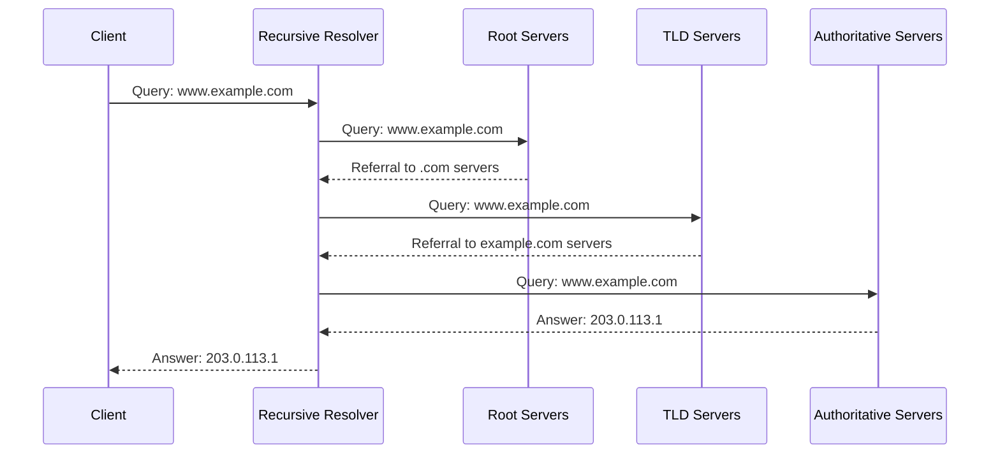

# DNS Fundamentals Guide
**File Path:** 📄 `/docs/dns/fundamentals/README.md`
**Version:** 1.0.0
**Last Updated:** 2025-02-18
**Authored By:** Jurie Smit
**Assisted By:** Claude-3 Sonnet, ChatGPT O3-mini
**Status:** 🟢 Active
**Tags:** `#dns` `#fundamentals` `#azure` `#infrastructure`

| [⬅️ Previous](../reference/technical.md) | [📋 Guide](./guide.md) | [⬆️ Parent](..) | [➡️ Next](../operations/README.md) |
|------------------------------------------|------------------------|-----------------|----------------------|

---

## Overview

DNS (Domain Name System) is the critical internet service that translates human-friendly domain names into IP addresses. This guide covers the essential concepts behind DNS, common record types, and best practices—particularly for deployments on Azure Static Web Apps. It is designed to provide a solid foundation in DNS fundamentals for new users and serve as a reference for experienced administrators.

---

## Key Topics

### DNS Resolution Process

DNS resolution follows a hierarchical process:
- **User Query:** A client initiates a query.
- **Local Cache:** The resolver checks its cache.
- **Recursive Resolution:** If not cached, the query is forwarded to a recursive resolver.
- **Root and TLD Servers:** The recursive resolver contacts the root servers, then the TLD servers.
- **Authoritative Answer:** Finally, the authoritative nameserver provides the IP address.



### Essential DNS Record Types

- **A Records:** Map a domain to an IPv4 address.
  - *Example:* `@ IN A 4.153.215.143`
- **AAAA Records:** Map a domain to an IPv6 address.
  - *Example:* `@ IN AAAA 2001:db8::1`
- **CNAME Records:** Create an alias for another domain.
  - *Example:* `www IN CNAME prod-euw-swa-phoenixvc-website.azurestaticapps.net`
- **MX Records:** Direct email traffic to mail servers.
  - *Example:* `@ IN MX 0 phoenixvc-tech.mail.protection.outlook.com`
- **TXT Records:** Provide text information, used for SPF, DKIM, and DMARC.
  - *Example:* `@ IN TXT "v=spf1 include:spf.protection.outlook.com -all"`
- **NS Records:** Identify authoritative nameservers.
  - *Example:* `@ IN NS ns1-01.azure-dns.com.`
- **SOA Record:** Contains administrative information about the zone.
  - *Example:* `@ IN SOA ns1-01.azure-dns.com. hostmaster.phoenixvc.tech. ( ... )`

### DNS Best Practices
- **Security:** Implement DNSSEC to secure responses and prevent spoofing.
- **Performance:** Use optimal TTL settings to balance between propagation speed and caching efficiency.
- **Operational Management:** Maintain regular backups, document changes, and monitor performance consistently.

---

## Implementation Guidelines

### Record Configuration

DNS records are typically defined in YAML or JSON configuration files. Below is an example configuration for a production zone:

```yaml
zone:
  name: phoenixvc.tech
  environment: prod

records:
  - name: "@"
    type: A
    ttl: 3600
    value: 4.153.215.143

  - name: www
    type: CNAME
    ttl: 3600
    value: prod-euw-swa-phoenixvc-website.azurestaticapps.net
```

### Key Considerations
- **Redundancy:** Use multiple record entries for load balancing (e.g., multiple A records).
- **TTL Management:** Set TTL values based on the criticality of the service. Lower TTLs allow for faster propagation of changes but may increase DNS query load.
- **DNSSEC:** Ensure DNSSEC is properly implemented to maintain record integrity.

---

## Additional Resources

- **[Azure DNS Documentation](https://docs.microsoft.com/azure/dns/)** – Official documentation for Azure DNS services.
- **[DNS Protocol RFC 1035](https://tools.ietf.org/html/rfc1035)** – Specifications for DNS message formats and protocols.
- **[DNSSEC Implementation Guide](https://docs.microsoft.com/azure/dns/dns-dnssec)** – Guidelines for implementing DNSSEC.

---

## Summary

The DNS Fundamentals Guide provides a foundational understanding of DNS operations, record types, and best practices essential for managing DNS in an Azure environment. This guide is a starting point for new users and a quick reference for experienced administrators.

---
