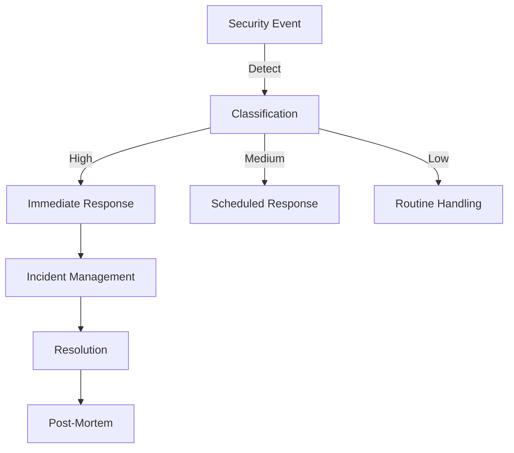

# DNS Security Guidelines
**File Path:** 📄 /docs/dns/reference/security.md
**Version:** 3.2.0
**Last Updated:** 2025-02-18
**Authored By:** Jurie Smit (assisted by Claude-3 Sonnet)
**Status:** 🟢 Active
**Tags:** #dns #security #best-practices #compliance

**Quick Links**
| 📚 Documentation | 🛠️ Implementation | 🔍 Resources |
|-----------------|-------------------|--------------|
| [Technical Guide](./technical.md) | [DNSSEC Setup](../security/dnssec.md) | [Azure Security](https://docs.microsoft.com/azure/security/) |
| [Best Practices](../best-practices/README.md) | [Monitoring](../monitoring/README.md) | [RFC Standards](https://www.ietf.org/standards/rfcs/) |
| [Troubleshooting](./troubleshooting.md) | [Access Control](../security/access-control.md) | [Security Policies](../security/policies.md) |

## Overview

This document outlines comprehensive security guidelines for DNS infrastructure management within PhoenixVC's environment.

## Security Architecture

### Core Security Components

````artifact
id: security-architecture
name: DNS Security Architecture
type: mermaid
content: |-
  graph TD
    A[DNS Security Layer] --> B[DNSSEC]
    A --> C[Access Control]
    A --> D[Monitoring]
    A --> E[Encryption]
    B --> F[Key Management]
    C --> G[RBAC]
    D --> H[Audit Logs]
    E --> I[TLS]
````

### Security Layers
```yaml
security_layers:
  infrastructure:
    - Azure DNS security
    - Network segmentation
    - DDoS protection

  protocol:
    - DNSSEC implementation
    - Query rate limiting
    - Response validation

  application:
    - Access control
    - Audit logging
    - Change management
```

## DNSSEC Configuration

### Key Management
```yaml
key_configuration:
  zone_signing_key:
    algorithm: "RSASHA256"
    length: 2048
    rotation: "90 days"

  key_signing_key:
    algorithm: "RSASHA512"
    length: 4096
    rotation: "365 days"
```

### Implementation Steps
```bash
# 1. Generate DNSSEC keys
./dns-security.sh --generate-keys \
  --zone phoenixvc.tech \
  --ksk-algorithm RSASHA512 \
  --zsk-algorithm RSASHA256

# 2. Enable DNSSEC
./dns-security.sh --enable-dnssec \
  --zone phoenixvc.tech \
  --auto-rollover

# 3. Verify DNSSEC chain
./dns-security.sh --verify-chain \
  --zone phoenixvc.tech \
  --thorough
```

## Access Control

### RBAC Configuration
```yaml
role_definitions:
  dns_admin:
    permissions:
      - manage_records
      - manage_security
      - manage_access
    scope: "all_zones"

  dns_operator:
    permissions:
      - manage_records
      - view_security
    scope: "assigned_zones"

  dns_viewer:
    permissions:
      - view_records
    scope: "assigned_zones"
```

### Implementation
```bash
# Assign roles
az role assignment create \
  --role "DNS Zone Contributor" \
  --assignee "user@phoenixvc.tech" \
  --scope "/subscriptions/${SUB_ID}/resourceGroups/${RG}/providers/Microsoft.Network/dnszones/${ZONE_NAME}"
```

## Monitoring and Auditing

### Security Monitoring
```yaml
monitoring_config:
  metrics:
    - query_volume
    - response_latency
    - security_events
    - access_attempts

  alerts:
    high_query_volume:
      threshold: 10000
      window: "5m"
      action: "notify_security_team"

    suspicious_access:
      conditions:
        - multiple_failed_attempts
        - unusual_source_ip
      action: "block_source"
```

### Audit Logging
```bash
# Enable audit logging
./dns-security.sh --enable-audit \
  --log-level detailed \
  --retention 90d

# Configure log exports
./dns-security.sh --configure-log-export \
  --destination "security-logs" \
  --format json
```

## Email Security

### SPF Configuration
```yaml
spf_record:
  version: "v=spf1"
  includes:
    - "spf.protection.outlook.com"
    - "spf.phoenixvc.tech"
  policy: "-all"

implementation:
  type: TXT
  name: "@"
  value: "v=spf1 include:spf.protection.outlook.com include:spf.phoenixvc.tech -all"
  ttl: 3600
```

### DKIM Setup
```yaml
dkim_configuration:
  selectors:
    - selector1
    - selector2
  key_size: 2048
  rotation: "180 days"
```

### DMARC Policy
```yaml
dmarc_policy:
  version: "DMARC1"
  policy: "reject"
  subdomainPolicy: "reject"
  reporting:
    aggregate: "mailto:dmarc-reports@phoenixvc.tech"
    forensic: "mailto:dmarc-forensic@phoenixvc.tech"
  percentage: 100
```

## Incident Response

### Security Event Categories
```yaml
security_events:
  high_severity:
    - unauthorized_zone_changes
    - dnssec_validation_failures
    - multiple_authentication_failures

  medium_severity:
    - unusual_query_patterns
    - zone_transfer_attempts
    - configuration_warnings

  low_severity:
    - failed_queries
    - ttl_misconfigurations
    - minor_validation_issues
```

### Response Procedures


## Compliance Requirements

### Standards Compliance
```yaml
compliance_requirements:
  iso27001:
    - Access control implementation
    - Security monitoring
    - Incident management
    - Audit logging

  gdpr:
    - Data protection measures
    - Audit trails
    - Access controls
    - Incident reporting
```

### Compliance Monitoring
```bash
# Run compliance check
./dns-security.sh --compliance-check \
  --standards "iso27001,gdpr" \
  --generate-report

# Validate security controls
./dns-security.sh --validate-controls \
  --scope "all" \
  --detailed-report
```

## Security Best Practices

### Record Security
```yaml
record_security:
  - Use DNSSEC for all zones
  - Implement CAA records
  - Regular key rotation
  - Strict access control
  - Comprehensive logging
```

### Zone Transfer Security
```yaml
zone_transfer:
  allow_transfer:
    - "192.168.1.100"    # Primary DNS
    - "192.168.1.101"    # Secondary DNS
  notify:
    - "192.168.1.101"
  also_notify:
    - "192.168.1.102"    # Monitoring system
```

## Reference Documentation

### Security Standards
- [DNS Security Extensions (DNSSEC)](https://tools.ietf.org/html/rfc4033)
- [Email Security (SPF)](https://tools.ietf.org/html/rfc7208)
- [DKIM Signatures](https://tools.ietf.org/html/rfc6376)
- [DMARC Protocol](https://tools.ietf.org/html/rfc7489)

### Internal Documentation
- [Security Policies](../security/policies.md)
- [Incident Response Plan](../security/incident-response.md)
- [Access Control Guide](../security/access-control.md)

### Emergency Contacts
- Security Team: security@phoenixvc.tech
- DNS Emergency: dns-emergency@phoenixvc.tech
- Compliance: compliance@phoenixvc.tech

