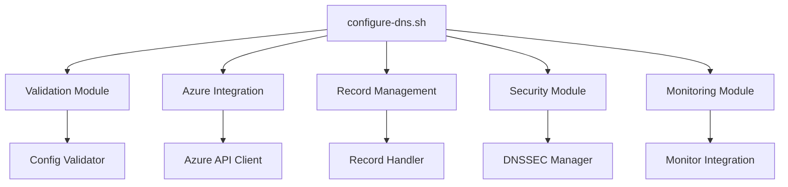

# DNS Configuration Script Documentation
📄 `/docs/dns/configure-dns.md`
**Version:** 3.2.2
**Last Updated:** 2025-02-18

## Overview

The `configure-dns.sh` script provides automated DNS configuration management for the PhoenixVC Azure infrastructure. It handles record creation, updates, validation, and security configurations with a focus on reliability and security.

### Key Features
- Automated DNS record management
- Security-first configuration
- Comprehensive validation
- Integrated monitoring
- Backup and recovery
- CI/CD integration

## Quick Start

### Installation
```bash
curl -O https://phoenixvc.tech/scripts/deployment/configure-dns.sh
chmod +x configure-dns.sh
```

### Basic Usage
```bash
./configure-dns.sh [--apply|--verify|--plan] [--components COMPONENTS] [--environment ENV]

# Common examples
./configure-dns.sh --apply --all                        # Apply all configurations
./configure-dns.sh --verify                            # Verify current setup
./configure-dns.sh --plan --components "apex,www"      # Plan changes
```

## Configuration Structure

### Environment Setup
```ini
# .env.example
LOCATION_CODE=za
SWA_NAME=phoenixvc-prod
AZURE_SUBSCRIPTION_ID=xxxxxxxx-xxxx-xxxx-xxxx-xxxxxxxxxxxx
RESOURCE_GROUP=prod-${LOCATION_CODE}-rg-phoenixvc-website
DNS_ZONE_NAME=phoenixvc.tech
ENVIRONMENT=prod
```

### DNS Records Template
```yaml
# config/templates/dns-records.yaml
zone:
  name: ${DNS_ZONE_NAME}
  environment: ${ENVIRONMENT}

records:
  - name: "@"
    type: A
    ttl: 3600
    value: ${SWA_IP_ADDRESS}

  - name: www
    type: CNAME
    ttl: 3600
    value: ${SWA_HOSTNAME}

  - name: _dmarc
    type: TXT
    ttl: 3600
    value: "v=DMARC1; p=reject; rua=mailto:admin@${DNS_ZONE_NAME}"
```

## Command Options

### Primary Commands
```yaml
commands:
  --apply:
    description: "Apply DNS configuration changes"
    requires_confirmation: true
    example: "--apply --components apex"

  --verify:
    description: "Verify current DNS configuration"
    requires_confirmation: false
    example: "--verify"

  --plan:
    description: "Show planned changes without applying"
    requires_confirmation: false
    example: "--plan --all"
```

### Component Options
```yaml
components:
  all:
    description: "All DNS components"
    includes: ["apex", "www", "email", "security"]

  apex:
    description: "Apex domain configuration"
    records: ["A", "CAA"]

  www:
    description: "WWW subdomain configuration"
    records: ["CNAME"]

  email:
    description: "Email-related records"
    records: ["MX", "TXT", "SPF", "DKIM"]

  security:
    description: "Security-related configurations"
    records: ["CAA", "DNSSEC"]
```

## Implementation Guide

### Basic Configuration
```bash
# Initial setup
cp .env.example .env
vim .env
./configure-dns.sh --verify-env

# Apply base configuration
./configure-dns.sh --apply --components apex --environment prod
./configure-dns.sh --verify --components apex
```

### Email Configuration
```bash
# Configure email records
./configure-dns.sh --apply --components email \
  --mx-priority 10 \
  --mx-server "phoenixvc-tech.mail.protection.outlook.com"

# Verify email setup
./configure-dns.sh --verify --components email
```

### Security Setup
```bash
# Enable DNSSEC
./configure-dns.sh --apply --components security \
  --enable-dnssec \
  --signing-algorithm "RSASHA256"

# Configure CAA records
./configure-dns.sh --apply --components security \
  --caa-issuer "letsencrypt.org"
```

## Validation and Testing

### Pre-deployment Checks
```bash
# Full validation
./configure-dns.sh --validate --all

# Run test suite
./configure-dns.sh --test --components all
```

### Post-deployment Verification
```bash
# Verify all records
./configure-dns.sh --verify --all

# Check propagation
./configure-dns.sh --check-propagation --wait
```

## Error Handling and Troubleshooting

### Common Errors
```yaml
error_codes:
  DNS001:
    description: "Invalid record configuration"
    resolution: "Verify record format in config file"

  DNS002:
    description: "Azure authentication failed"
    resolution: "Check Azure credentials and permissions"

  DNS003:
    description: "Record conflict detected"
    resolution: "Review existing records and resolve conflicts"
```

### Troubleshooting Steps
```bash
# View logs
./configure-dns.sh --show-logs --last 50

# Check Azure connection
./configure-dns.sh --check-azure-connection

# Verify permissions
./configure-dns.sh --check-permissions
```

## Backup and Recovery

### Backup Management
```bash
# Create backup
./configure-dns.sh --backup --tag "pre-change"

# List backups
./configure-dns.sh --list-backups

# Restore from backup
./configure-dns.sh --restore --backup-tag "pre-change"
```

## Security Considerations

### Best Practices
```yaml
security_practices:
  - Use DNSSEC for zone signing
  - Implement CAA records
  - Set appropriate TTL values
  - Regular backup creation
  - Audit logging enabled
```

### Required Permissions
```json
{
  "required_roles": [
    "DNS Zone Contributor",
    "Network Contributor"
  ],
  "scope": "/subscriptions/${SUBSCRIPTION_ID}/resourceGroups/${RESOURCE_GROUP}"
}
```

## Monitoring Integration

### Azure Monitor Setup
```bash
# Enable monitoring
./configure-dns.sh --enable-monitoring \
  --metrics "all" \
  --alert-email "dns-admin@phoenixvc.tech"

# Set up alerts
./configure-dns.sh --configure-alerts \
  --threshold "response_time=100ms" \
  --threshold "availability=99.9%"
```

## Script Architecture

### Component Structure


### Directory Structure
```
scripts/
├── configure-dns.sh
├── modules/
│   ├── validation.sh
│   ├── azure.sh
│   ├── records.sh
│   ├── security.sh
│   └── monitoring.sh
├── config/
│   ├── templates/
│   └── environments/
└── tests/
```

## CI/CD Integration

### GitHub Actions Example
```yaml
name: DNS Configuration
on:
  workflow_dispatch:
  push:
    branches: [main]
    paths: ['dns/**']

jobs:
  configure_dns:
    runs-on: ubuntu-latest
    steps:
      - uses: actions/checkout@v4
      - name: Configure DNS
        run: ./configure-dns.sh --apply --components "cname,apex"
        env:
          AZURE_SUBSCRIPTION_ID: ${{ secrets.AZURE_SUBSCRIPTION_ID }}
          SWA_NAME: phoenixvc-prod
```

## Version History

| Version | Date       | Changes                                    |
|---------|------------|--------------------------------------------|
| 3.2.2   | 2025-02-18 | Added automated recovery procedures        |
| 3.2.1   | 2025-01-15 | Enhanced monitoring integration            |
| 3.2.0   | 2024-12-20 | Added security audit features              |

## Reference

### Documentation
- [Azure DNS Documentation](https://docs.microsoft.com/azure/dns/)
- [DNS Configuration Best Practices](../best-practices/dns.md)
- [Security Guidelines](../security/dns-security.md)

### Support
For issues and support:
- GitHub Issues: [PhoenixVC DNS Configuration](https://github.com/phoenixvc/dns-config/issues)
- Email: dns-support@phoenixvc.tech
