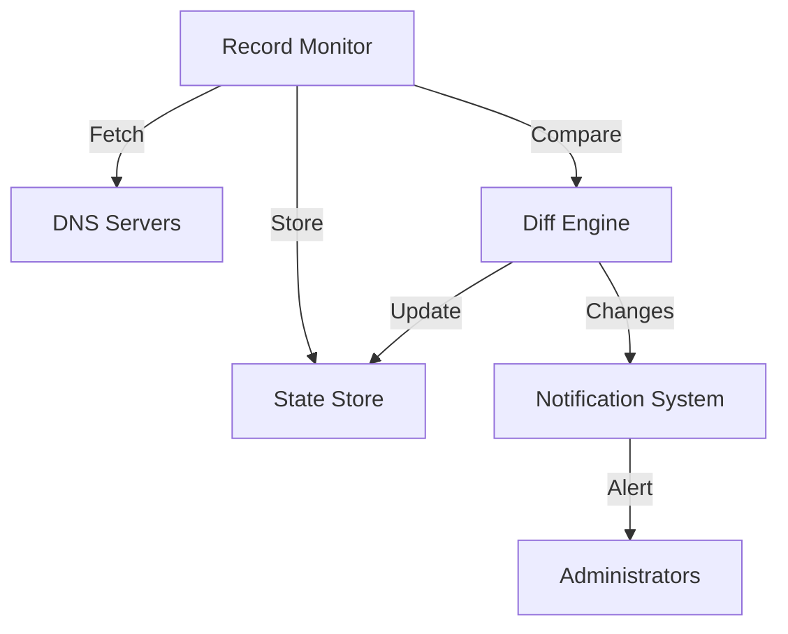

# DNS Record Fetcher Documentation {: #dns-record-fetcher}
📄 `/docs/dns/record-fetcher.md`
**Version:** 3.2.2
**Last Updated:** 2025-02-18

## Overview

The DNS Record Fetcher is a utility for retrieving, analyzing, and monitoring DNS records across multiple providers. It supports bulk operations, continuous monitoring, and automated validation of DNS configurations.

## Quick Start

```bash
# Basic record fetch
./record-fetcher.sh --domain phoenixvc.tech --type ALL

# Monitor specific records
./record-fetcher.sh --watch --domain phoenixvc.tech --type "A,CNAME" --interval 300

# Export current configuration
./record-fetcher.sh --export --format json --output dns-config.json
```

## Command Line Interface

### Basic Commands
```yaml
commands:
  fetch:
    description: "Fetch DNS records"
    syntax: "--domain DOMAIN [--type TYPE] [--resolver RESOLVER]"
    example: "--domain phoenixvc.tech --type A"

  watch:
    description: "Monitor DNS records for changes"
    syntax: "--watch --domain DOMAIN [--interval SECONDS]"
    example: "--watch --domain phoenixvc.tech --interval 300"

  export:
    description: "Export DNS configuration"
    syntax: "--export [--format FORMAT] [--output FILE]"
    example: "--export --format json --output config.json"
```

### Advanced Options
```yaml
options:
  resolvers:
    - cloudflare: "1.1.1.1"
    - google: "8.8.8.8"
    - custom: "--resolver IP"

  formats:
    - json: "Detailed JSON output"
    - yaml: "YAML configuration format"
    - bind: "BIND zone file format"
    - csv: "CSV format for spreadsheets"

  filters:
    - ttl: "--min-ttl VALUE --max-ttl VALUE"
    - age: "--max-age HOURS"
    - type: "--type A,AAAA,MX,TXT"
```

## Implementation Details

### Record Fetching Logic
```typescript
interface DNSQuery {
  domain: string;
  recordType: string;
  resolver: string;
  timeout: number;
}

interface DNSRecord {
  name: string;
  type: string;
  ttl: number;
  value: string;
  timestamp: Date;
}

interface FetchOptions {
  parallel: boolean;
  retries: number;
  validateResponse: boolean;
}
```

### Monitoring Implementation


## Usage Examples

### Basic Record Fetching

#### Single Record Type
```bash
# Fetch A records
./record-fetcher.sh --domain phoenixvc.tech --type A

# Fetch MX records with custom resolver
./record-fetcher.sh --domain phoenixvc.tech --type MX --resolver 1.1.1.1
```

#### Multiple Record Types
```bash
# Fetch multiple record types
./record-fetcher.sh --domain phoenixvc.tech --type "A,AAAA,MX,TXT,CNAME" --format json

# Fetch all records
./record-fetcher.sh --domain phoenixvc.tech --type ALL
```

### Continuous Monitoring

#### Basic Monitoring
```bash
# Monitor with default settings
./record-fetcher.sh --watch --domain phoenixvc.tech --interval 300

# Monitor with notifications
./record-fetcher.sh --watch --domain phoenixvc.tech --notify "email@phoenixvc.tech" --changes-only
```

#### Advanced Monitoring
```bash
# Monitor with custom conditions
./record-fetcher.sh --watch --domain phoenixvc.tech --type "A,CNAME" \
  --min-ttl 300 --max-ttl 86400 --alert-on-change --log-file "/var/log/dns-monitor.log"
```

### Bulk Operations

#### Multiple Domains
```bash
# Fetch records from a list of domains
./record-fetcher.sh --domain-file domains.txt --type ALL --parallel 5

# Export multiple configurations
./record-fetcher.sh --domain-file domains.txt --export --format bind --output-dir "/etc/bind/zones"
```

#### Batch Processing
```bash
# Process a batch of domains
./record-fetcher.sh --batch-process --input batch.json --parallel 10 --retry-failed --output results.json
```

## Configuration

### Environment Variables
```ini
# .env configuration
RECORD_FETCHER_DEFAULT_RESOLVER=1.1.1.1
RECORD_FETCHER_TIMEOUT=30
RECORD_FETCHER_MAX_RETRIES=3
RECORD_FETCHER_LOG_LEVEL=INFO
RECORD_FETCHER_OUTPUT_FORMAT=json
```

### Configuration File
```yaml
# config.yaml
defaults:
  resolver: 1.1.1.1
  timeout: 30
  retries: 3
  format: json

monitoring:
  interval: 300
  alert_threshold: 3
  notification:
    email: dns-admin@phoenixvc.tech
    slack: "#dns-alerts"

resolvers:
  primary: 1.1.1.1
  secondary: 8.8.8.8
  fallback: 9.9.9.9
```

## Output Formats

### JSON Format
```json
{
  "domain": "phoenixvc.tech",
  "timestamp": "2025-02-18T14:52:00Z",
  "records": [
    {
      "name": "@",
      "type": "A",
      "ttl": 3600,
      "value": "20.20.20.20"
    }
  ]
}
```

### BIND Format
```bind
; Zone file for phoenixvc.tech
$TTL 3600
@       IN      SOA     ns1.phoenixvc.tech. admin.phoenixvc.tech. (
                        2025021801      ; Serial
                        7200            ; Refresh
                        3600            ; Retry
                        1209600         ; Expire
                        3600            ; Minimum TTL
)
```

## Error Handling

### Error Types
```yaml
error_types:
  network:
    - timeout
    - connection_refused
    - dns_server_failure

  validation:
    - invalid_record
    - malformed_response
    - ttl_violation

  configuration:
    - invalid_domain
    - unsupported_record_type
    - invalid_resolver
```

### Recovery Procedures
```bash
# Retry failed queries
./record-fetcher.sh --retry-failed --log-file failed_queries.log --max-retries 3

# Validate record integrity
./record-fetcher.sh --validate --domain phoenixvc.tech --repair-mode
```

## Monitoring and Logging

### Log Format
```yaml
log_entry:
  timestamp: "2025-02-18T14:52:00Z"
  level: "INFO"
  component: "record-fetcher"
  action: "fetch"
  domain: "phoenixvc.tech"
  status: "success"
  details: "Retrieved 5 records"
```

### Metrics Collection
```bash
# Generate metrics report
./record-fetcher.sh --metrics --period "24h" --format prometheus

# Export monitoring data
./record-fetcher.sh --export-metrics --start "2025-02-17" --end "2025-02-18" --format csv
```

## Security Considerations

### Best Practices
```yaml
security:
  - Use DNSSEC validation
  - Implement rate limiting
  - Rotate resolvers
  - Validate responses
  - Log access attempts
```

### Access Control
```json
{
  "permissions": {
    "fetch": ["dns_reader"],
    "monitor": ["dns_monitor"],
    "export": ["dns_admin"],
    "configure": ["dns_admin"]
  }
}
```

## Integration Examples

### API Integration
```python
from dns_fetcher import RecordFetcher

fetcher = RecordFetcher(
    domain="phoenixvc.tech",
    resolver="1.1.1.1",
    timeout=30
)

records = fetcher.fetch_all()
```

### Automation Scripts
```bash
#!/bin/bash
# Daily DNS audit script
./record-fetcher.sh --audit --domain phoenixvc.tech --compare-with baseline.json --report-format html --notify-on-change
```

## Reference

### Documentation
- [DNS Protocol RFC](https://tools.ietf.org/html/rfc1035)
- [DNSSEC Implementation](../reference/technical.md)
- [Monitoring Guide](../reference/technical.md#moningtori/)

### Support
For issues and support:
- GitHub Issues: [PhoenixVC Record Fetcher](https://github.com/phoenixvc/record-fetcher/issues)
- Email: dns-support@phoenixvc.tech
