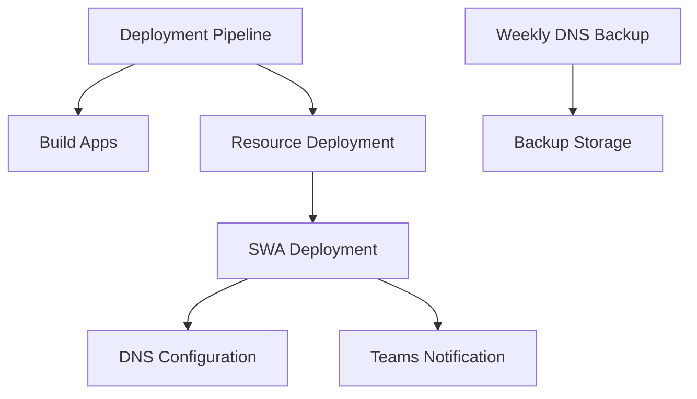

# GitHub Workflows Documentation

This repository contains several GitHub Workflows that handle the automated deployment and maintenance of the Phoenix VC website infrastructure.

## Core Workflows

### 1. Phoenix VC Deployment Pipeline
**File:** `deploy.yml`

The main deployment pipeline that handles both staging and production deployments.

#### Key Features:
- Dual-environment deployment (staging/production)
- Automated builds of Vite applications
- Azure Static Web Apps deployment
- Teams notification integration
- DNS configuration triggers
- Documentation deployment

#### Workflow Inputs:
- `APPROVAL_STATE`: Controls production deployment approval
- `INCLUDE_DNS_UPDATE`: Toggles DNS update inclusion
- `SEND_STAGING_FAILED`: Controls staging failure notifications

#### Usage:
```yaml
# Manual trigger with production approval
name: Deploy to Production
on:
workflow_dispatch:
  inputs:
    APPROVAL_STATE: true
    INCLUDE_DNS_UPDATE: true
```

### 2. DNS Configuration
**File:** `configure_dns.yml`

Handles DNS configuration for both staging and production environments.

#### Key Features:
- Environment-specific DNS configuration
- Azure DNS zone management
- Backup functionality

#### Usage:
```yaml
# Manual trigger for production DNS configuration
name: Configure Production DNS
on:
workflow_dispatch:
  inputs:
    ENVIRONMENT: prod
```

### 3. Weekly DNS Backup
**File:** `weekly_dns_backup.yml`

Automated weekly backup of DNS configurations.

#### Features:
- Scheduled weekly backups
- Manual trigger option
- 90-day retention policy

## Environment Variables

Common environment variables used across workflows:

```yaml
env:
LOCATION_CODE: 'euw'  # Europe West location code
```

## Required Secrets

The following secrets must be configured in your GitHub repository:

- `AZURE_CREDENTIALS`: Azure service principal credentials
- `AZURE_SUBSCRIPTION_ID`: Azure subscription identifier
- `AZURE_STATIC_WEB_APPS_API_TOKEN`: Static Web Apps deployment token
- `GITHUB_TOKEN`: GitHub authentication token
- `TEAMS_TOKEN`: Microsoft Teams webhook token

## Workflow Dependencies



## Best Practices

1. **Concurrency Management**
 - Workflows use concurrency groups to prevent parallel deployments
 - Production deployments take precedence

2. **Error Handling**
 - Comprehensive error checking in deployment scripts
 - Automatic notifications for failures

3. **Security**
 - Minimal permission scope for tokens
 - Secure secret handling

## Troubleshooting

Common issues and solutions:

1. **DNS Configuration Failures**
 ```bash
 # Verify DNS configuration
 ./scripts/deployment/configure-dns.sh --verify --ENVIRONMENT prod
 ```

2. **Deployment Token Issues**
 - Ensure SWA tokens are properly configured
 - Verify token permissions in Azure

3. **Build Failures**
 - Check Node.js version compatibility
 - Verify package-lock.json integrity

## Additional Resources

- [Azure Static Web Apps Documentation](https://docs.microsoft.com/azure/static-web-apps)
- [GitHub Actions Documentation](https://docs.github.com/actions)
- [Teams Webhook Integration Guide](https://docs.microsoft.com/microsoftteams/platform/webhooks-and-connectors/how-to/add-incoming-webhook)
