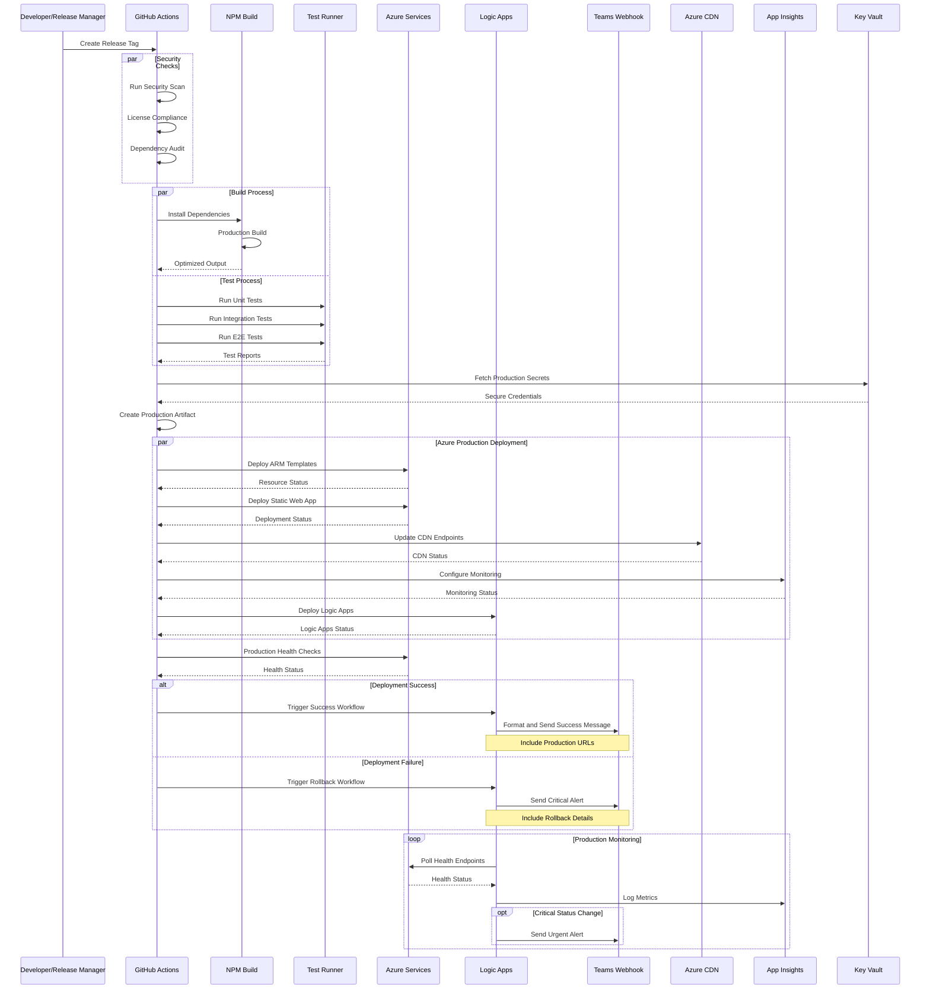

# Production Deployment Workflow Documentation

## Overview
This document outlines the production deployment process for the PhoenixVC-Modernized application, emphasizing high availability, security, and reliability.

## Components and Interactions

### Sequence Diagram


### Component Descriptions

#### 1. Release Management Environment
- **Purpose**: Production release orchestration
- **Components**:
  - Release workflow runner
  - Production action executors
  - Secret rotation management
  - Release artifact versioning
- **Key Functions**:
  - Release tag validation
  - Production environment isolation
  - Release coordination
  - Compliance reporting
- **Security Features**:
  - Role-based access control
  - Audit logging
  - Secret rotation
  - Compliance checks

#### 2. Production Build System
- **Technology Stack**:
  - Node.js LTS
  - NPM/Yarn Enterprise
  - TypeScript compiler (strict mode)
  - Webpack/Vite (production config)
- **Build Features**:
  - Dead code elimination
  - Tree shaking
  - Code splitting
  - Asset optimization
  - Source map generation
- **Security Measures**:
  - Dependency vulnerability scanning
  - License compliance checking
  - Code signing
  - Artifact verification

#### 3. Test Infrastructure
- **Testing Layers**:
  - Unit tests (Jest)
  - Integration tests
  - E2E tests (Cypress)
  - Load tests (k6)
  - Security tests
- **Test Requirements**:
  - 100% critical path coverage
  - Performance benchmarks
  - Security compliance
  - Accessibility standards
- **Monitoring**:
  - Test execution metrics
  - Coverage trending
  - Performance baselines
  - Error rate tracking

#### 4. Azure Production Services

##### a. Resource Management
- **Resource Group**: `prod-za-rg-phoenixvc-website`
- **Features**:
  - Geographic redundancy
  - Backup management
  - Disaster recovery
  - Resource locking
- **Configurations**:
```yaml
resourceGroup:
  name: prod-za-rg-phoenixvc-website
  location: southafricanorth
  tags:
    environment: production
    criticality: high
    backup: enabled
    dr: enabled
  locks:
    - name: production-lock
      level: CanNotDelete
```

##### b. Static Web App
- **Production Features**:
  - Enterprise CDN integration
  - Custom domain with SSL
  - IP restrictions
  - WAF policies
- **Configuration**:
```json
{
  "staticWebApp": {
    "sku": "Standard",
    "allowedIpRanges": ["xxx.xxx.xxx.xxx/24"],
    "customDomains": ["www.phoenixvc.co.za"],
    "stagingEnvironments": true,
    "authentication": {
      "provider": "aad",
      "roles": ["admin", "contributor"]
    }
  }
}
```

##### c. Logic Apps
- **Purpose**: Production workflow automation
- **Components**:
  - Deployment orchestration
  - Health monitoring
  - Alert management
  - Backup coordination
- **Production Workflows**:
```yaml
workflows:
  deployment:
    name: prod-deployment-workflow
    triggers:
      - type: httpWebhook
        authentication: managed
    actions:
      - name: validateDeployment
        type: custom
      - name: updateDNS
        type: azure-dns
      - name: invalidateCache
        type: cdn
      - name: notifyStakeholders
        type: teams

  monitoring:
    name: prod-health-workflow
    schedule: "*/2 * * * *"
    actions:
      - name: checkEndpoints
        type: http
        timeout: 30
      - name: processMetrics
        type: custom
      - name: alertConditions
        type: conditional

  backup:
    name: prod-backup-workflow
    schedule: "0 0 * * *"
    actions:
      - name: initiateBackup
        type: azure-backup
      - name: validateBackup
        type: custom
      - name: notifyStatus
        type: teams
```

##### d. Application Insights
- **Production Monitoring**:
  - SLA tracking
  - Performance profiling
  - User analytics
  - Error tracking
  - Custom metrics
- **Alert Configuration**:
```json
{
  "alerts": [
    {
      "name": "HighErrorRate",
      "metric": "requests/failed",
      "threshold": 5,
      "window": "PT5M",
      "severity": 0
    },
    {
      "name": "HighLatency",
      "metric": "requests/duration",
      "threshold": 1000,
      "window": "PT5M",
      "severity": 1
    }
  ]
}
```

#### 5. Security Infrastructure
- **Azure Key Vault**:
  - Secret management
  - Certificate storage
  - Key rotation
  - Access policies
- **WAF Policies**:
  - OWASP rules
  - Custom rules
  - Rate limiting
  - Geo-blocking

#### 6. CDN Configuration
- **Azure CDN Profile**:
  - Global distribution
  - Custom rules
  - Cache optimization
  - SSL management
- **Rules Engine**:
```json
{
  "cdn": {
    "profile": "Premium_Verizon",
    "rules": [
      {
        "name": "SecurityHeaders",
        "order": 1,
        "conditions": ["RequestScheme", "HTTPS"],
        "actions": [
          {
            "name": "ModifyResponseHeader",
            "parameters": {
              "headerName": "Strict-Transport-Security",
              "value": "max-age=31536000"
            }
          }
        ]
      }
    ]
  }
}
```

## Prerequisites
- Release approval from stakeholders
- Production secrets in Key Vault:
  - `AZURE_PROD_CREDENTIALS`
  - `AZURE_SUBSCRIPTION_ID`
  - `AZURE_STATIC_WEB_APPS_API_TOKEN_PROD`
  - `PROD_GITHUB_TOKEN`
  - `PROD_TEAMS_WEBHOOK_URL`
  - `SSL_CERTIFICATE`
  - `API_KEYS`

## Release Process

### 1. Release Preparation
```yaml
release_prep:
  steps:
    - name: Version Validation
      run: |
        validate_semver
        check_changelog
        verify_dependencies

    - name: Security Scan
      run: |
        run_dependency_audit
        scan_vulnerabilities
        check_licenses

    - name: Documentation Update
      run: |
        update_release_notes
        generate_deployment_docs
```

### 2. Production Build
```yaml
production_build:
  environment: production
  runs-on: ubuntu-latest
  steps:
    - name: Configure Build
      run: |
        set_production_flags
        enable_optimizations
        configure_cache

    - name: Build Application
      run: |
        npm ci --production
        npm run build:prod

    - name: Optimize Assets
      run: |
        compress_assets
        generate_sourcemaps
        create_integrity_hashes
```

### 3. Deployment Verification
- **Health Checks**:
  - Endpoint availability
  - SSL verification
  - DNS propagation
  - Cache validation
- **Performance Tests**:
  - Load testing
  - Response times
  - Error rates
  - Resource utilization

### 4. Rollback Procedure
```yaml
rollback_procedure:
  steps:
    - name: Immediate Actions
      run: |
        disable_traffic
        restore_previous_version
        verify_health
        notify_stakeholders

    - name: Recovery Steps
      run: |
        analyze_failure
        document_incident
        update_monitoring
        adjust_alerts

    - name: Verification
      run: |
        validate_services
        check_data_integrity
        verify_connections
        test_functionality
```

## Monitoring and Alerts

### 1. Health Monitoring
```json
{
  "monitoring": {
    "endpoints": [
      {
        "name": "production-health",
        "url": "https://www.phoenixvc.co.za/health",
        "interval": "60",
        "timeout": "30",
        "conditions": [
          {
            "type": "status",
            "value": 200
          }
        ]
      }
    ]
  }
}
```

### 2. Alert Configuration
```yaml
alert_config:
  critical:
    - type: availability
      threshold: 99.9
      window: 5m
    - type: error_rate
      threshold: 1%
      window: 5m
    - type: response_time
      threshold: 1000ms
      window: 5m

  warning:
    - type: cpu_usage
      threshold: 80%
      window: 15m
    - type: memory_usage
      threshold: 85%
      window: 15m
```

## Disaster Recovery

### 1. Backup Configuration
```json
{
  "backup": {
    "frequency": "daily",
    "retention": "90",
    "type": "geo-redundant",
    "encryption": true,
    "validation": true
  }
}
```

### 2. Recovery Procedures
- **RTO**: 1 hour
- **RPO**: 15 minutes
- **Recovery Steps**:
  1. Activate DR site
  2. Switch DNS
  3. Verify services
  4. Notify stakeholders

## Compliance and Reporting

### 1. Audit Logs
- Deployment history
- Access logs
- Change tracking
- Security events

### 2. Performance Reports
- Availability metrics
- Response times
- Error rates
- Resource utilization

### 3. Security Reports
- Vulnerability scans
- Compliance checks
- Access reviews
- Incident reports
