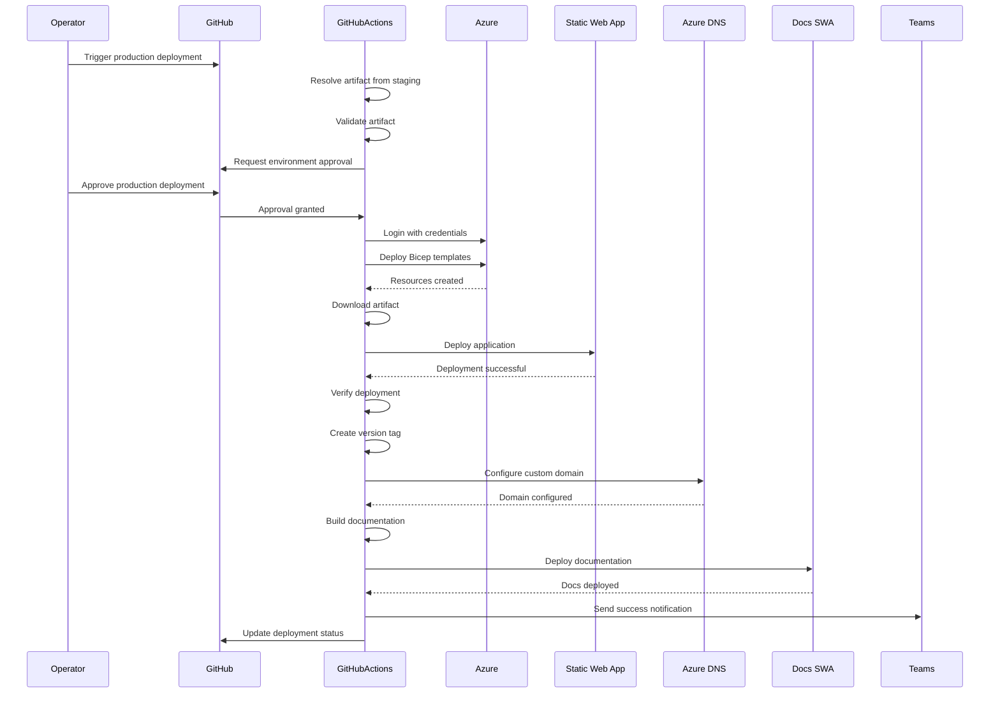

# Production Deployment Workflow

This document describes the components and sequence of a production deployment in the Phoenix VC deployment pipeline.

## Overview

The production deployment workflow is triggered manually via workflow dispatch or automatically after a successful staging deployment. It deploys verified artifacts from staging to the production environment with additional approval gates and verification steps.

## Workflow Components

### 1. Artifact Resolution
- **Latest Artifact Finder**: Searches for the most recent successful staging artifact
- **Artifact Validation**: Verifies artifact format and availability
- **Deployment ID Generation**: Creates unique deployment identifier

### 2. Production Resource Deployment
- **Environment Protection**: Requires manual approval via GitHub Environments
- **Azure Login**: Authenticates with production credentials
- **Bicep Deployment**: Deploys production infrastructure
- **Resource Configuration**: Configures Static Web App, Logic Apps, and storage

### 3. Static Web App Deployment
- **Artifact Download**: Retrieves verified staging artifact
- **SWA Deploy**: Deploys to production Static Web App
- **Deployment Verification**: Health checks and accessibility validation
- **Version Tagging**: Creates Git tag for production release

### 4. DNS Configuration
- **Custom Domain Setup**: Configures phoenixvc.tech domain
- **TXT Record Validation**: Sets up domain verification
- **CNAME Configuration**: Points domain to SWA endpoint

### 5. Documentation Deployment
- **MkDocs Build**: Generates documentation site
- **Docs SWA Deployment**: Deploys to docs.phoenixvc.tech
- **Custom Domain Setup**: Configures docs subdomain

### 6. Notification
- **Teams Notification**: Sends detailed deployment status
- **Deployment Summary**: Includes artifact ID, URLs, and metadata

## Sequence Diagram

## Configuration Settings

### Environment Variables
- `LOCATION_CODE`: Azure region code (default: 'euw' for West Europe)
- `RESOURCE_GROUP`: `prod-{LOCATION_CODE}-rg-phoenixvc-website`
- `STATIC_WEB_APP_NAME`: `prod-{LOCATION_CODE}-swa-phoenixvc-website`
- `DOCS_SWA_NAME`: `prod-{LOCATION_CODE}-swa-phoenixvc-docs`

### Required Secrets
- `AZURE_SUBSCRIPTION_ID`: Azure subscription identifier
- `AZURE_CREDENTIALS`: Azure service principal credentials
- `AZURE_STATIC_WEB_APPS_API_TOKEN_PROD`: Deployment token for production SWA
- `DOCS_DEPLOYMENT_TOKEN`: Deployment token for documentation SWA
- `TEAMS_WEBHOOK_URL`: Microsoft Teams webhook for notifications

### Workflow Inputs
- `artifactSource`: Source of artifact ('latest' or 'specific')
- `artifactId`: Specific artifact ID (format: web-dist-YYYYMMDD_HHMMSS)
- `runID`: Source workflow run ID
- `includeDnsUpdate`: Include DNS configuration update (default: false)

## Deployment Steps

1. **Trigger**: Manual workflow dispatch or staging workflow call
2. **Resolve**: Find and validate staging artifact
3. **Approve**: Manual approval via GitHub Environment protection
4. **Infrastructure**: Deploy/update production Azure resources
5. **Deploy**: Upload verified artifact to production SWA
6. **Verify**: Comprehensive health checks and validation
7. **Tag**: Create version tag for release tracking
8. **DNS**: Configure custom domain and DNS records
9. **Docs**: Build and deploy documentation site
10. **Notify**: Send detailed deployment report

## Approval Gates

Production deployments require manual approval through GitHub Environment protection rules:

1. Designated approvers receive notification
2. Review deployment details and staging test results
3. Approve or reject deployment
4. Workflow continues only after approval

## Custom Domain Configuration

### Main Domain (phoenixvc.tech)
- **Validation**: TXT record for domain verification
- **CNAME**: Points to production SWA default hostname
- **SSL**: Automatic certificate provisioning

### Docs Domain (docs.phoenixvc.tech)
- **Validation**: TXT record for subdomain verification
- **CNAME**: Points to docs SWA default hostname
- **SSL**: Automatic certificate provisioning

## Rollback Procedures

If deployment issues are detected:

1. Identify previous successful deployment artifact
2. Trigger production deployment with specific artifact ID
3. Verify rollback deployment
4. Update DNS if needed
5. Notify stakeholders

## Related Documentation

- [Deployment Guide](./deployment-guide.md)
- [Staging Deployment Workflow](./staging-deployment-workflow.md)
- [GitHub Workflows](./github-workflows.md)
- [DNS Configuration](./dns-configuration.md)
- [Operations](./operations.md)
