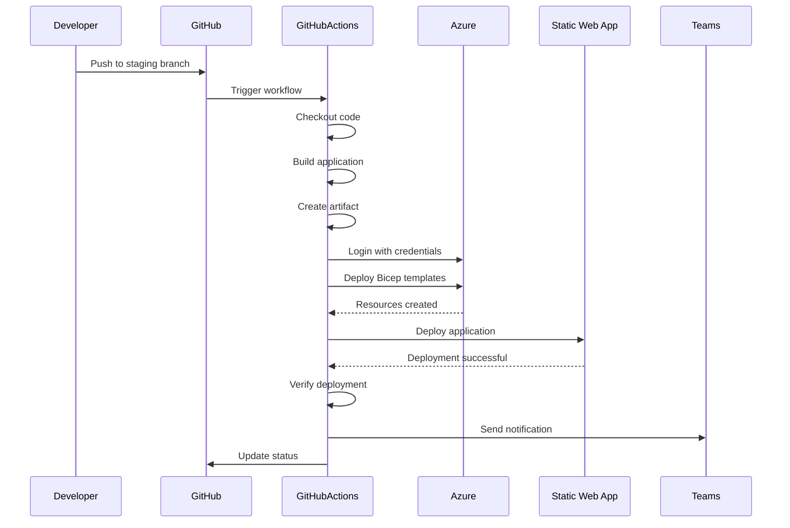

# Staging Deployment Workflow

This document describes the components and sequence of a staging deployment in the Phoenix VC deployment pipeline.

## Overview

The staging deployment workflow is triggered on pushes and pull requests to the `main`, `release/*`, and `staging/*` branches. It builds and deploys the application to the staging environment for testing before production deployment.

## Workflow Components

### 1. Build Stage
- **Repository Checkout**: Clones the repository code
- **Node.js Setup**: Configures Node.js environment
- **Dependency Installation**: Installs npm packages
- **Application Build**: Builds the web application
- **Artifact Upload**: Stores built artifacts for deployment

### 2. Resource Deployment
- **Azure CLI Login**: Authenticates with Azure
- **Bicep Deployment**: Deploys Azure infrastructure using Bicep templates
- **Resource Configuration**: Configures Static Web App, Storage, and other resources

### 3. Static Web App Deployment
- **Artifact Download**: Retrieves built application artifacts
- **SWA Deploy**: Deploys to Azure Static Web Apps using SWA CLI
- **Deployment Verification**: Validates successful deployment

### 4. Notification
- **Teams Notification**: Sends deployment status to Microsoft Teams
- **GitHub Status**: Updates deployment status on GitHub

## Sequence Diagram

## Configuration Settings

### Environment Variables
- `LOCATION_CODE`: Azure region code (default: 'euw' for West Europe)
- `RESOURCE_GROUP`: `stg-{LOCATION_CODE}-rg-phoenixvc-website`
- `STATIC_WEB_APP_NAME`: `stg-{LOCATION_CODE}-swa-phoenixvc-website`

### Required Secrets
- `AZURE_SUBSCRIPTION_ID`: Azure subscription identifier
- `AZURE_CREDENTIALS`: Azure service principal credentials
- `AZURE_STATIC_WEB_APPS_API_TOKEN_STAGING`: Deployment token for staging SWA
- `TEAMS_WEBHOOK_URL`: Microsoft Teams webhook for notifications

### Workflow Inputs
- `notifyOnFailure`: Send Teams notification on deployment failure (default: true)
- `deployToProd`: Trigger production deployment after staging success (default: false)

## Deployment Steps

1. **Trigger**: Push to staging branch or manual workflow dispatch
2. **Build**: Compile and bundle the application
3. **Infrastructure**: Deploy/update Azure resources
4. **Deploy**: Upload application to Static Web App
5. **Verify**: Check deployment health and accessibility
6. **Notify**: Send status updates to Teams and GitHub

## Related Documentation

- [Deployment Guide](./deployment-guide.md)
- [Production Deployment Workflow](./production-deployment-workflow.md)
- [GitHub Workflows](./github-workflows.md)
- [Azure Environment Setup](./azure-environment-setup.md)
