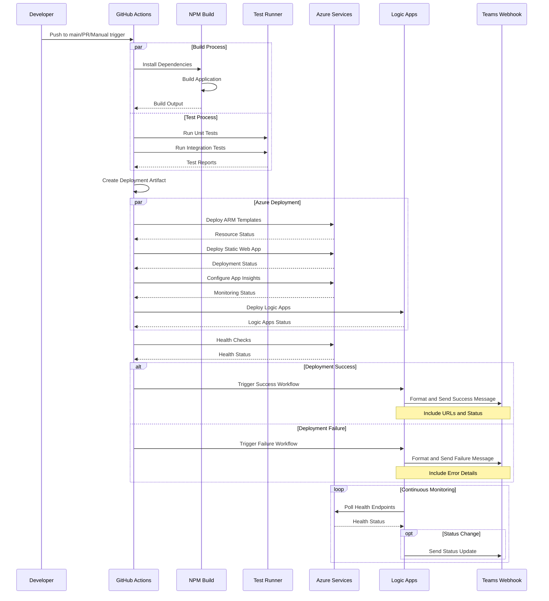

# Staging Deployment Workflow Documentation

## Overview
This document describes the automated deployment process to the staging environment for the PhoenixVC-Modernized application.

## Components and Interactions

### Sequence Diagram


### Component Descriptions

#### 1. GitHub Actions Environment
- **Purpose**: CI/CD orchestration
- **Components**:
  - Workflow runner
  - Action executors
  - Secret management
  - Artifact storage
- **Key Functions**:
  - Trigger management
  - Environment setup
  - Process coordination
  - Status reporting

#### 2. Build System
- **Technology Stack**:
  - Node.js
  - NPM/Yarn
  - TypeScript compiler
  - Webpack/Vite
- **Responsibilities**:
  - Dependency resolution
  - Code compilation
  - Asset bundling
  - Output optimization

#### 3. Test Infrastructure
- **Testing Layers**:
  - Unit tests (Jest)
  - Integration tests
  - E2E tests (if applicable)
- **Features**:
  - Parallel test execution
  - Coverage reporting
  - Snapshot testing
  - Error reporting

#### 4. Azure Services

##### a. Resource Management
- Resource Group: `staging-za-rg-phoenixvc-website`
- ARM template deployment
- Resource provisioning
- Configuration management

##### b. Static Web App
- **Features**:
  - Built-in CDN
  - SSL management
  - Route configuration
  - API integration

##### c. Logic Apps
- **Purpose**: Workflow automation and integration
- **Components**:
  - Teams notification workflow
  - GitHub integration workflow
  - Health monitoring workflow
  - Status management workflow
- **Key Functions**:
  - Message formatting and routing
  - Status tracking and updates
  - Error handling and retries
  - Health check orchestration
- **Workflows**:
```yaml
- staging-notification-workflow:
    - Input: Deployment status, URLs, metadata
    - Processing: Message formatting
    - Output: Teams adaptive card

- staging-health-workflow:
    - Schedule: Every 5 minutes
    - Actions: Health endpoint checks
    - Alerts: Status changes

- staging-github-workflow:
    - Trigger: GitHub webhook
    - Actions: Status updates
    - Output: Deployment tracking
```

##### d. Application Insights
- **Monitoring**:
  - Performance metrics
  - Error tracking
  - User analytics
  - Availability tests

#### 5. Notification System
- **Platform**: Microsoft Teams via Logic Apps
- **Notifications**:
  - Build status
  - Test results
  - Deployment status
  - Resource URLs
  - Health alerts
- **Integration**:
  - Logic App webhook endpoints
  - Adaptive cards with dynamic content
  - Action buttons
  - Status tracking

## Prerequisites
- GitHub repository access
- Required secrets configured in GitHub:
  - `AZURE_CREDENTIALS`
  - `AZURE_SUBSCRIPTION_ID`
  - `AZURE_STATIC_WEB_APPS_API_TOKEN_STAGING`
  - `GITHUB_TOKEN`
  - `TEAMS_WEBHOOK_URL`

## Workflow Trigger
The staging deployment is triggered by:
- Push to main branch
- Manual workflow dispatch
- Pull request to main branch

## Deployment Process

### 1. Build and Test
```yaml
build_and_test:
  runs-on: ubuntu-latest
  steps:
    - Build application
    - Run unit tests
    - Run integration tests
    - Generate test reports
```

### 2. Create Deployment Artifact
- Generates unique artifact ID: `phoenixvc_YYYYMMDD_commit_runid`
- Packages build output
- Uploads artifact to GitHub

### 3. Azure Resource Deployment
- Deploys Azure resources using ARM templates
- Creates/updates:
  - Resource Group
  - Static Web App
  - Logic Apps
  - Application Insights
- Location: South Africa North (za)

### 4. Logic App Configuration

#### a. Notification Workflow
```json
{
  "triggers": {
    "github_webhook": {
      "type": "Request",
      "kind": "Http"
    }
  },
  "actions": {
    "Parse_Deployment_Data": {
      "type": "ParseJson"
    },
    "Format_Teams_Message": {
      "type": "Compose"
    },
    "Send_Teams_Notification": {
      "type": "ApiConnection"
    }
  }
}
```

#### b. Health Monitoring Workflow
```json
{
  "triggers": {
    "recurrence": {
      "type": "Recurrence",
      "frequency": "Minute",
      "interval": 5
    }
  },
  "actions": {
    "Check_Health_Endpoints": {
      "type": "Http"
    },
    "Process_Health_Status": {
      "type": "ParseJson"
    },
    "Conditional_Alert": {
      "type": "If"
    }
  }
}
```

### 5. Static Web App Deployment
- Deploys built artifact to Azure Static Web App
- Verifies deployment with health checks
- Maximum retry attempts: 10
- Timeout: 30 minutes

### 6. Notification System
Teams notification includes:
- Deployment ID
- Artifact ID
- Environment URLs
- Status (Success/Failure)
- Resource Group information

## Outputs
The workflow produces:
- `staticSiteUrl`: Staging site URL
- `teamsLogicAppUrl`: Teams integration endpoint
- `githubLogicAppUrl`: GitHub integration endpoint

## Monitoring and Verification
- Application Insights monitoring
- Automated health checks
- Teams notifications for status updates

## Troubleshooting
Common issues and solutions:

### 1. Build Failures
- Check build logs
- Verify dependencies
- Check Node.js version

### 2. Deployment Failures
- Verify Azure credentials
- Check resource quotas
- Verify network connectivity

### 3. Logic App Failures
- Check workflow run history
- Verify connection strings
- Check trigger history
- Monitor action failures

### 4. Health Check Failures
- Check application logs
- Verify configuration
- Check Azure status
