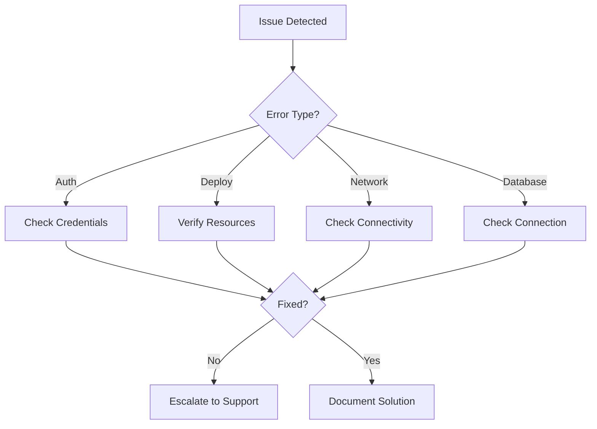

# Phoenix VC - Comprehensive Troubleshooting Guide {: #phoenix-vc---comprehensive-troubleshooting-guide}
📄 `/docs/deployment/TROUBLESHOOTING.md`  
**Version:** 1.4.0 | Last Updated: 2025-02-14

> A comprehensive guide for resolving common issues in development and deployment, organized by issue type with quick solutions and detailed explanations.

## 📋 Quick Reference {: #-quick-reference}
### Error Code Index {: #error-code-index}
| Code    | Severity | Description             | Quick Solution                       |
|---------|----------|-------------------------|--------------------------------------|
| AUTH001 | High     | Authentication Failed   | [Check credentials](#authentication-issues) |
| DEP001  | High     | Deployment Failed       | [Verify parameters](#deployment-issues)     |
| NET001  | Medium   | Network Connectivity    | [Check NSG rules](#network-configuration)   |
| PERM001 | High     | Insufficient Permissions| [Verify RBAC](#permissions)                |
| DB001   | High     | Database Connection     | [Check firewall](#database-issues)         |
| CI001   | Medium   | Pipeline Failure        | [Check workflow](#cicd-pipeline-issues)    |

## 🔧 Environment Setup {: #-environment-setup}
### Linux Environment (Default) {: #linux-environment-default}
```bash
# One-line prerequisites check/install {: #one-line-prerequisites-checkinstall}
for cmd in node git az python3; do 
  command -v $cmd >/dev/null 2>&1 || { 
    echo "Installing $cmd...";
    case $cmd in
      node) curl -fsSL https://deb.nodesource.com/setup_18.x | sudo -E bash - && sudo apt-get install -y nodejs;;
      git) sudo apt-get install -y git;;
      az) curl -sL https://aka.ms/InstallAzureCLIDeb | sudo bash;;
      python3) sudo apt-get install -y python3;;
    esac
  }
done
```

### Windows Environment {: #windows-environment}
```powershell
# Check/Install Chocolatey {: #checkinstall-chocolatey}
if (!(Get-Command choco -ErrorAction SilentlyContinue)) {
  Set-ExecutionPolicy Bypass -Scope Process -Force
  [System.Net.ServicePointManager]::SecurityProtocol = [System.Net.ServicePointManager]::SecurityProtocol -bor 3072
  iex ((New-Object System.Net.WebClient).DownloadString('https://community.chocolatey.org/install.ps1'))
}

# Install prerequisites {: #install-prerequisites}
choco install nodejs git azure-cli python -y
```

## 🔐 Authentication Issues {: #-authentication-issues}
### Quick Solutions {: #quick-solutions}
1. **No subscriptions found:**  
   ```bash
   az account set --subscription $SUBSCRIPTION_ID
   ```
2. **Invalid credentials:**  
   Regenerate the service principal.
3. **Token expired:**  
   Re-authenticate using `az login`.

### Detailed Troubleshooting {: #detailed-troubleshooting}
#### Service Principal Setup {: #service-principal-setup}
```bash
# Create new service principal {: #create-new-service-principal}
az ad sp create-for-rbac \
  --name "github-actions-deploy" \
  --role contributor \
  --scopes /subscriptions/$SUBSCRIPTION_ID \
  --sdk-auth

# Verify setup {: #verify-setup}
az login --service-principal \
  -u $CLIENT_ID \
  -p $CLIENT_SECRET \
  --tenant $TENANT_ID
```

#### Credential Reset {: #credential-reset}
```bash
# Reset credentials {: #reset-credentials}
az ad sp credential reset \
  --name $SP_NAME \
  --append

# Update GitHub Secrets {: #update-github-secrets}
# (Go to Settings > Secrets > Actions > AZURE_CREDENTIALS) {: #go-to-settings--secrets--actions--azure_credentials}
```

## 🚀 Deployment Issues {: #-deployment-issues}
### Quick Solutions {: #quick-solutions}
1. **Resource group missing:**  
   Create the resource group in the correct location.
2. **Quota exceeded:**  
   Request an increase from Azure support.
3. **Network issues:**  
   Check the NSG rules for any misconfigurations.

### Detailed Commands {: #detailed-commands}
#### Resource Management {: #resource-management}
```bash
# Create a resource group {: #create-a-resource-group}
az group create \
  --name $RESOURCE_GROUP \
  --location "South Africa North"

# Check deployment status for failed deployments {: #check-deployment-status-for-failed-deployments}
az deployment group list \
  --resource-group $RESOURCE_GROUP \
  --query "[?provisioningState=='Failed']"
```

## 💾 Database Issues {: #-database-issues}
### Quick Solutions {: #quick-solutions}
1. **Connection timeout:**  
   Verify and adjust firewall rules.
2. **Performance issues:**  
   Update statistics on your database.
3. **Deadlocks:**  
   Investigate blocking queries and optimize them.

### Detailed Diagnostics {: #detailed-diagnostics}
```bash
# List firewall rules for the SQL server {: #list-firewall-rules-for-the-sql-server}
az sql server firewall-rule list \
  --server $SERVER_NAME \
  --resource-group $RESOURCE_GROUP

# Analyze database query performance {: #analyze-database-query-performance}
az sql db query-performance list \
  --name $DB_NAME \
  --resource-group $RESOURCE_GROUP \
  --server $SERVER_NAME
```

## 📊 Monitoring & Performance {: #-monitoring--performance}
### CPU & Memory {: #cpu--memory}
```bash
# Retrieve CPU and Memory metrics {: #retrieve-cpu-and-memory-metrics}
az monitor metrics list \
  --resource $RESOURCE_ID \
  --interval PT5M \
  --metrics "CpuPercentage,MemoryPercentage"

# List auto-scale settings {: #list-auto-scale-settings}
az monitor autoscale-settings list \
  --resource-group $RESOURCE_GROUP
```

### Log Analysis {: #log-analysis}
```bash
# Download web app logs {: #download-web-app-logs}
az webapp log download \
  --name $APP_NAME \
  --resource-group $RESOURCE_GROUP

# Stream live logs {: #stream-live-logs}
az webapp log tail \
  --name $APP_NAME \
  --resource-group $RESOURCE_GROUP
```

## 🔄 Recovery Procedures {: #-recovery-procedures}
### Quick Recovery Steps {: #quick-recovery-steps}
1. **Application issue:**  
   Restart the service.
2. **Deployment failure:**  
   Rollback to a previous deployment.
3. **Data corruption:**  
   Restore from backup.

### Detailed Procedures {: #detailed-procedures}
```bash
# Rollback to the last known good deployment {: #rollback-to-the-last-known-good-deployment}
az webapp deployment source rollback \
  --name $APP_NAME \
  --resource-group $RESOURCE_GROUP \
  --slot production

# Restore resources from a backup {: #restore-resources-from-a-backup}
az backup restore restore-disks \
  --vault-name $VAULT_NAME \
  --resource-group $RESOURCE_GROUP \
  --recovery-point-id $RECOVERY_POINT
```

## 🔍 Troubleshooting Flowchart {: #-troubleshooting-flowchart}


## 📝 Version History {: #-version-history}
| Version | Date       | Changes                         |
|---------|------------|---------------------------------|
| 1.4.0   | 2025-02-14 | Added flowchart, improved organization |
| 1.3.0   | 2025-02-14 | Added CI/CD troubleshooting     |
| 1.2.0   | 2025-01-20 | Updated recovery procedures     |
| 1.1.0   | 2024-12-15 | Added database section          |

## 📚 Additional Resources {: #-additional-resources}
- [Azure CLI Documentation](https://docs.microsoft.com/en-us/cli/azure/)
- [GitHub Actions Guide](https://docs.github.com/en/actions)
- [Internal Wiki](https://wiki.phoenixvc.za)
- [Monitoring Best Practices](https://docs.microsoft.com/en-us/azure/azure-monitor/best-practices)

---
Need immediate assistance?  
Contact: support@phoenixvc.za  
Slack: [PhoenixVC Troubleshooting Channel](https://phoenixvc.slack.com/troubleshooting)
