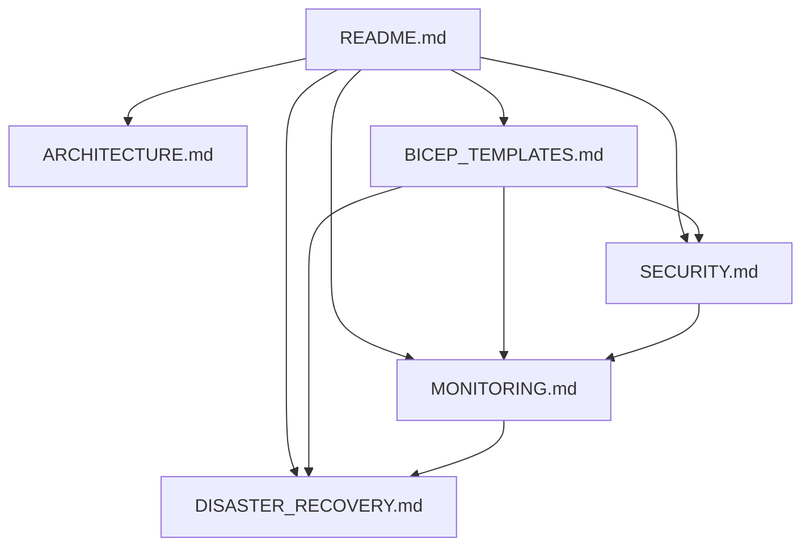
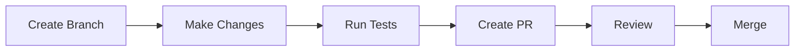

📄 /docs/infrastructure/README.md

# Phoenix VC Infrastructure Documentation {: #phoenix-vc-infrastructure-documentation}
## Overview {: #overview}
This repository contains comprehensive documentation for Phoenix VC's cloud infrastructure, implemented using Infrastructure as Code (IaC) with Azure Bicep and following Azure Well-Architected Framework principles. It covers architecture, deployment templates, security configurations, monitoring setup, and disaster recovery procedures.

## Table of Contents {: #table-of-contents}
- [Documentation Structure](#documentation-structure)
- [Quick Start](#quick-start)
- [Environment Management](#environment-management)
- [Resource Organization](#resource-organization)
- [Contributing](#contributing)
- [Support and Maintenance](#support-and-maintenance)
- [Cost Management](#cost-management)
- [Version History](#version-history)

## Documentation Structure {: #documentation-structure}


### Core Documents {: #core-documents}
| Document | Purpose | Primary Audience | Content |
|----------|---------|-----------------|---------|
| 📐 [ARCHITECTURE.md](/src/main/guides/infrastructure/ARCHITECTURE.md) | System design and components | Architects, Engineers | System architecture, Component relationships, Network design |
| 🏗️ [BICEP_TEMPLATES.md](/src/main/guides/infrastructure/BICEP_TEMPLATES.md) | IaC deployment templates | DevOps Team | Infrastructure code, Deployment procedures, Configurations |
| 🔒 [SECURITY.md](/src/main/guides/infrastructure/SECURITY.md) | Security configurations | Security Team | Access control, Network security, Key management |
| 📊 [MONITORING.md](/src/main/guides/infrastructure/MONITORING.md) | Monitoring setup | Operations Team | Logging, Alerts, Performance metrics |
| 🔄 [DISASTER_RECOVERY.md](/src/main/guides/infrastructure/DISASTER_RECOVERY.md) | DR procedures | Platform Team | Backup, Recovery, Business continuity |

## Quick Start {: #quick-start}
### Prerequisites {: #prerequisites}
- Azure CLI (latest version)
- Azure subscription with Owner rights
- Git
- Visual Studio Code with Azure extensions

```bash
# Install required tools {: #install-required-tools}
az extension add --name azure-devops
az bicep install
az monitor extension add

# Clone the repository {: #clone-the-repository}
git clone https://github.com/phoenixvc/infrastructure.git
```

### Environment Setup {: #environment-setup}
```bash
# Login to Azure {: #login-to-azure}
az login

# Set subscription {: #set-subscription}
az account set --subscription "Phoenix VC Production"

# Create resource group {: #create-resource-group}
az group create \
  --name "rg-phoenixvc-prod" \
  --location "eastus2"

# Deploy development environment {: #deploy-development-environment}
./scripts/deploy.ps1 -Environment dev -Location westeurope

# Validate deployment {: #validate-deployment}
./scripts/validate.ps1 -Environment dev
```

## Environment Management {: #environment-management}
| Environment | Purpose | Branch | Deployment Frequency | Access Level |
|-------------|---------|--------|---------------------|--------------|
| Development | Feature testing | dev | On commit | Team |
| UAT | Integration testing | release | On release | Limited |
| Production | Live system | main | Scheduled | Restricted |

### Resource Naming Convention {: #resource-naming-convention}
Pattern: `{env}-{loc}-{resourceType}-phoenixvc[-identifier]`

| Component | Description | Examples |
|-----------|-------------|----------|
| env | Environment identifier | dev, uat, prod |
| loc | Location code | euw (West Europe) |
| resourceType | Azure resource type | swa, func, psql |
| identifier | Optional component identifier | -api, -worker |

### Code Standards {: #code-standards}
```bicep
// Example of standard Bicep naming convention
resource storageAccount 'Microsoft.Storage/storageAccounts@2021-06-01' = {
  name: '${environment}stphoenixvc${uniqueString(resourceGroup().id)}'
  location: location
  sku: {
    name: 'Standard_LRS'
  }
  kind: 'StorageV2'
}
```

## Contributing {: #contributing}
### Documentation Standards {: #documentation-standards}
- Use markdown for all documentation
- Include diagrams using Mermaid
- Follow [Conventional Commits](https://www.conventionalcommits.org/)
- Keep code examples up to date
- Test all procedures before documenting

### Review Process {: #review-process}


## Support and Maintenance {: #support-and-maintenance}
### Contact Information {: #contact-information}
| Team | Contact | Channel | Response Time |
|------|---------|---------|---------------|
| Platform | platform@phoenixvc.com | #platform-support | 30 min |
| DevOps | devops@phoenixvc.com | #devops-support | 1 hour |
| Security | security@phoenixvc.com | #security-alerts | 15 min |

### Escalation Path {: #escalation-path}
1. Team Lead
2. Department Manager
3. CTO
4. CEO

### Emergency Procedures {: #emergency-procedures}
- Production issues: Call +1-555-0123
- Security incidents: Call +1-555-0124
- DR activation: Call +1-555-0125

### Useful Links {: #useful-links}
- [Azure Portal](https://portal.azure.com)
- [Azure DevOps](https://dev.azure.com/phoenixvc)
- [Monitoring Dashboard](https://portal.azure.com/#@phoenixvc.com/dashboard)
- [Azure Status](https://status.azure.com)
- [Azure Updates](https://azure.microsoft.com/updates/)
- [Service Level Agreements](https://azure.microsoft.com/support/legal/sla/)

## Cost Management {: #cost-management}
### Monitoring and Controls {: #monitoring-and-controls}
- [Cost Management Portal](https://portal.azure.com/#blade/Microsoft_Azure_CostManagement)
- [Budget Alerts Configuration](/src/main/guides/infrastructure/MONITORING.md#budget-alerts)
- [Resource Optimization Guidelines](/src/main/guides/infrastructure/ARCHITECTURE.md#optimization)

### Cost Optimization Best Practices {: #cost-optimization-best-practices}
- Use auto-scaling for dynamic workloads
- Implement resource scheduling for non-production environments
- Regular review of unused resources
- Monitor reserved instance coverage

## Version History {: #version-history}
| Version | Date | Description | Author |
|---------|------|-------------|---------|
| 1.0.0 | 2025-02-14 | Initial documentation | Platform Team |
| 1.0.1 | 2025-02-14 | Added cost management section | DevOps Team |

## Documentation Resources {: #documentation-resources}
- [Azure Architecture Center](https://learn.microsoft.com/azure/architecture/)
- [Bicep Documentation](https://learn.microsoft.com/azure/azure-resource-manager/bicep/)
- [Azure Best Practices](https://learn.microsoft.com/azure/architecture/best-practices/)