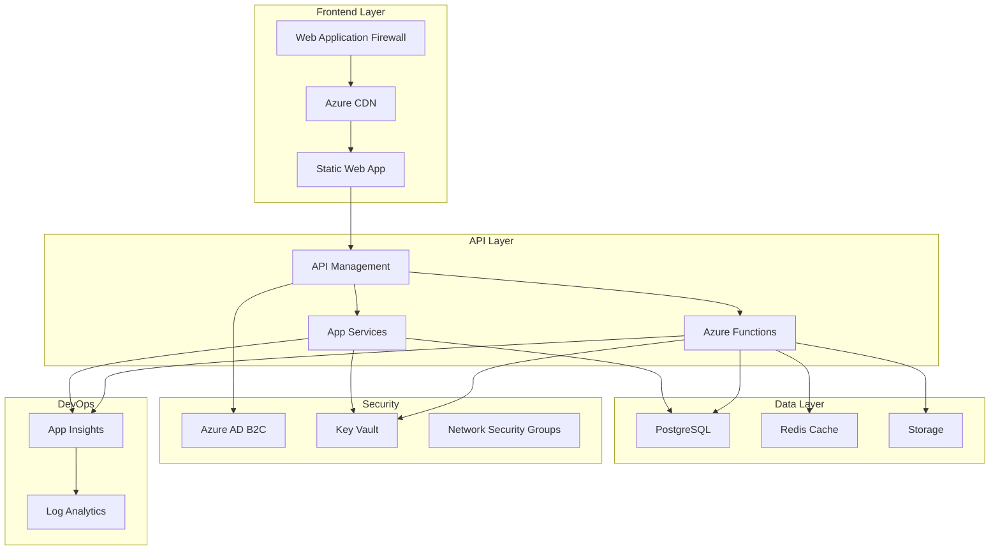
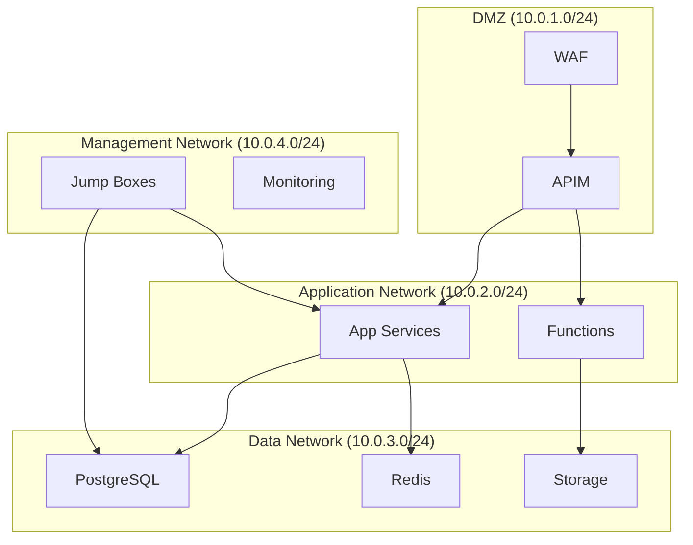
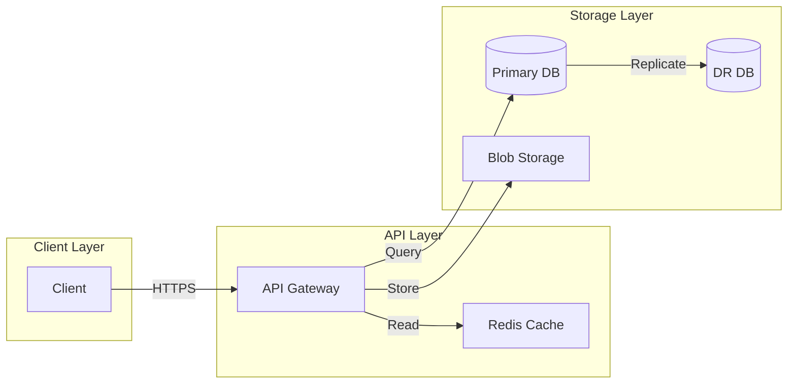
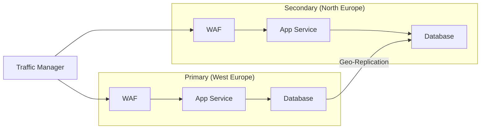
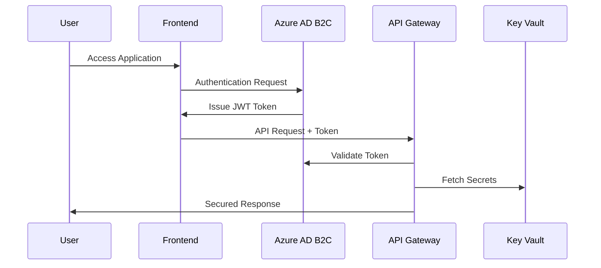
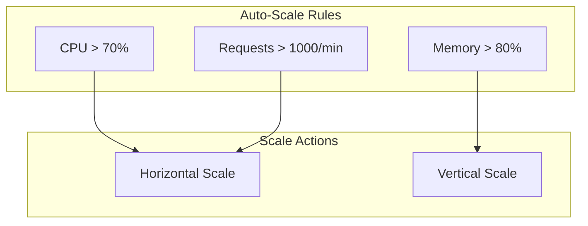
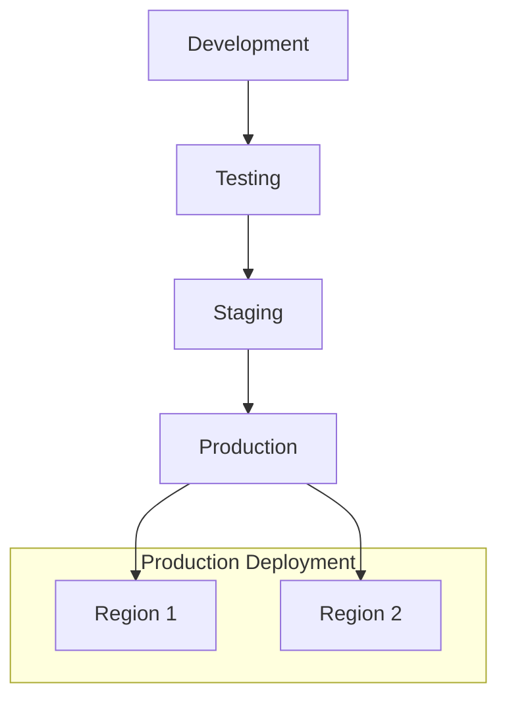

📄 /docs/infrastructure/ARCHITECTURE.md

# Phoenix VC System Architecture {: #phoenix-vc-system-architecture}
## Overview {: #overview}
Phoenix VC's platform utilizes a modern cloud-native architecture on Azure, designed for high availability, scalability, and security. This document details the comprehensive architectural design, implementation patterns, and operational strategies.

## Table of Contents {: #table-of-contents}
- [System Components](#system-components)
- [Architecture Layers](#architecture-layers)
- [High Availability](#high-availability)
- [Security Architecture](#security-architecture)
- [Operational Strategy](#operational-strategy)
- [Resource Management](#resource-management)
- [Performance Optimization](#performance-optimization)
- [Maintenance and Updates](#maintenance-and-updates)
- [Future Roadmap](#future-roadmap)

## System Components {: #system-components}
### High-Level Architecture {: #high-level-architecture}


### Component Specifications {: #component-specifications}
| Component | Purpose | Scale Tier | Region | SLA Target |
|-----------|---------|------------|---------|------------|
| WAF | Traffic filtering | Standard_v2 | Multi-region | 99.95% |
| CDN | Content delivery | Standard | Global | 99.99% |
| Static Web App | Frontend hosting | Premium | Multi-region | 99.95% |
| API Management | API gateway | Premium | Primary + DR | 99.95% |
| App Service | API hosting | P2v3 | Primary + DR | 99.95% |
| Functions | Background processing | EP2 | Primary + DR | 99.9% |
| PostgreSQL | Primary database | GP_Gen5_8 | Primary + DR | 99.99% |
| Redis | Caching | Premium P1 | Primary | 99.9% |

## Architecture Layers {: #architecture-layers}
### Network Architecture {: #network-architecture}
#### Network Topology {: #network-topology}


#### Network Security {: #network-security}
- Private endpoints for all PaaS services
- Network Security Groups with least-privilege access
- Service endpoints for Azure services
- WAF policies for L7 protection

### Data Architecture {: #data-architecture}
#### Data Flow {: #data-flow}


## High Availability {: #high-availability}
### Regional Deployment {: #regional-deployment}


## Security Architecture {: #security-architecture}
### Authentication Flow {: #authentication-flow}


### Security Controls {: #security-controls}
- Azure AD B2C for identity management
- Key Vault for secret management
- Encryption at rest and in transit
- Regular security audits and penetration testing

## Operational Strategy {: #operational-strategy}
### Scaling Strategy {: #scaling-strategy}


### Performance Targets {: #performance-targets}
| Component | Metric | Target | Alert Threshold |
|-----------|--------|--------|----------------|
| API | Response Time | <200ms | >500ms |
| Database | Query Time | <50ms | >100ms |
| Frontend | Page Load | <2s | >3s |
| Cache | Hit Rate | >80% | <70% |

## Resource Management {: #resource-management}
### Resource Organization {: #resource-organization}
```
subscription/
├── rg-phoenixvc-shared/
│   ├── Key Vault
│   ├── Log Analytics
│   └── Monitoring
├── rg-phoenixvc-{env}/
│   ├── Static Web App
│   ├── API Management
│   └── Functions
└── rg-phoenixvc-data-{env}/
    ├── PostgreSQL
    └── Redis Cache
```

### Resource Tagging {: #resource-tagging}
```json
{
  "Environment": "dev|uat|prod",
  "Project": "PhoenixVC",
  "CostCenter": "IT-2024",
  "Owner": "platform@phoenixvc.com",
  "BusinessCriticality": "high|medium|low",
  "DataClassification": "public|internal|confidential",
  "LastDeployed": "yyyy-MM-dd"
}
```

## Maintenance and Updates {: #maintenance-and-updates}
### Update Strategy {: #update-strategy}


### Maintenance Schedule {: #maintenance-schedule}
| Component | Window | Frequency | Duration |
|-----------|---------|-----------|-----------|
| Database | Sun 02:00-04:00 | Weekly | 2 hours |
| App Service | Sat 22:00-23:00 | Bi-weekly | 1 hour |
| Security Updates | Sun 01:00-03:00 | Monthly | 2 hours |

## Future Roadmap {: #future-roadmap}
### Planned Improvements {: #planned-improvements}
1. **Q2 2025**
   - GraphQL API Layer implementation
   - Enhanced monitoring with Azure Monitor
   - Container support via AKS

2. **Q3 2025**
   - Event Hub integration
   - Enhanced security features
   - Performance optimization

3. **Q4 2025**
   - ML Pipeline implementation
   - Advanced analytics
   - Global expansion

## References {: #references}
- [Azure Architecture Center](https://learn.microsoft.com/azure/architecture/)
- [Azure Well-Architected Framework](https://learn.microsoft.com/azure/architecture/framework/)
- [Cloud Adoption Framework](https://learn.microsoft.com/azure/cloud-adoption-framework/)