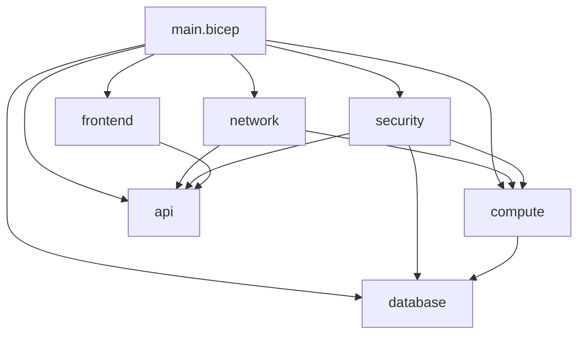
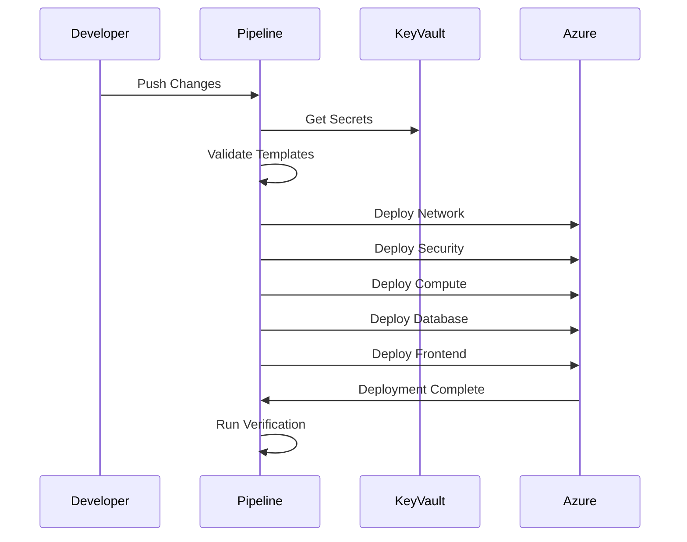

📄 /docs/infrastructure/BICEP_TEMPLATES.md

# Infrastructure as Code - Bicep Templates {: #infrastructure-as-code---bicep-templates}
## Overview {: #overview}
This document details the Bicep templates used to deploy and manage the Phoenix VC infrastructure in Azure, following Infrastructure as Code (IaC) best practices and Azure Well-Architected Framework principles.

## Table of Contents {: #table-of-contents}
- [Template Structure](#template-structure)
- [Core Components](#core-components)
- [Module Dependencies](#module-dependencies)
- [Deployment Process](#deployment-process)
- [Parameter Management](#parameter-management)
- [Best Practices](#best-practices)
- [Validation and Testing](#validation-and-testing)
- [Monitoring and Logging](#monitoring-and-logging)
- [Troubleshooting](#troubleshooting)
- [References](#references)

## Template Structure {: #template-structure}
### Directory Layout {: #directory-layout}
```
infrastructure/
├── bicep/
│   ├── main.bicep                 # Main deployment template
│   ├── modules/
│   │   ├── network/              # Network components
│   │   │   ├── vnet.bicep
│   │   │   └── nsg.bicep
│   │   ├── compute/              # Compute resources
│   │   │   ├── app-service.bicep
│   │   │   └── functions.bicep
│   │   ├── frontend/             # Frontend components
│   │   │   ├── static-web.bicep
│   │   │   └── cdn.bicep
│   │   ├── database/             # Data storage
│   │   │   ├── postgresql.bicep
│   │   │   └── redis.bicep
│   │   ├── api/                  # API components
│   │   │   ├── apim.bicep
│   │   │   └── functions.bicep
│   │   └── security/             # Security components
│   │       ├── keyvault.bicep
│   │       └── aad.bicep
│   └── parameters/
│       ├── dev.parameters.json
│       ├── uat.parameters.json
│       └── prod.parameters.json
└── scripts/
    ├── deploy.ps1
    ├── validate.ps1
    └── verify-deployment.ps1
```

### Module Dependencies {: #module-dependencies}


## Core Components {: #core-components}
### Network Module (network/vnet.bicep) {: #network-module-networkvnetbicep}
```bicep
@description('Virtual Network configuration')
param vnetConfig object = {
  addressPrefix: '10.0.0.0/16'
  subnets: [
    {
      name: 'frontend'
      addressPrefix: '10.0.1.0/24'
    }
    {
      name: 'backend'
      addressPrefix: '10.0.2.0/24'
    }
  ]
}

resource vnet 'Microsoft.Network/virtualNetworks@2021-02-01' = {
  name: naming.vnet
  location: location
  properties: {
    addressSpace: {
      addressPrefixes: [
        vnetConfig.addressPrefix
      ]
    }
    subnets: [for subnet in vnetConfig.subnets: {
      name: subnet.name
      properties: {
        addressPrefix: subnet.addressPrefix
        serviceEndpoints: [
          {
            service: 'Microsoft.Sql'
          }
        ]
      }
    }]
  }
}
```

### Frontend Module (frontend/static-web.bicep) {: #frontend-module-frontendstatic-webbicep}
```bicep
resource staticWebApp 'Microsoft.Web/staticSites@2021-02-01' = {
  name: naming.staticWebApp
  location: location
  tags: tags
  sku: {
    name: environment == 'prod' ? 'Standard' : 'Free'
    tier: environment == 'prod' ? 'Standard' : 'Free'
  }
  properties: {
    stagingEnvironmentPolicy: 'Enabled'
    allowConfigFileUpdates: true
    enterpriseGradeCdnStatus: 'Enabled'
  }
}
```

### Database Module (database/postgresql.bicep) {: #database-module-databasepostgresqlbicep}
```bicep
resource postgresql 'Microsoft.DBforPostgreSQL/flexibleServers@2021-06-01' = {
  name: naming.postgresql
  location: location
  sku: {
    name: environment == 'prod' ? 'Standard_D4s_v3' : 'Standard_B2s'
    tier: environment == 'prod' ? 'GeneralPurpose' : 'Burstable'
  }
  properties: {
    version: '13'
    storage: {
      storageSizeGB: environment == 'prod' ? 256 : 32
    }
    backup: {
      backupRetentionDays: environment == 'prod' ? 30 : 7
      geoRedundantBackup: environment == 'prod' ? 'Enabled' : 'Disabled'
    }
  }
}
```

## Deployment Process {: #deployment-process}
### Deployment Flow {: #deployment-flow}


### Prerequisites {: #prerequisites}
```bash
# Install required tools {: #install-required-tools}
az extension add --name azure-devops
az bicep install
az monitor extension add

# Login to Azure {: #login-to-azure}
az login
az account set --subscription "<subscription-id>"
```

### Deployment Script (deploy.ps1) {: #deployment-script-deployps1}
```powershell
param(
  [Parameter(Mandatory=$true)]
  [ValidateSet('dev', 'uat', 'prod')]
  [string]$Environment,
  
  [Parameter(Mandatory=$true)]
  [string]$Location
)

$deploymentName = "phoenixvc-$Environment-$(Get-Date -Format 'yyyyMMdd-HHmmss')"
$templateFile = "./bicep/main.bicep"
$parameterFile = "./bicep/parameters/$Environment.parameters.json"

# Validate template {: #validate-template}
Write-Host "Validating template..."
$validation = az deployment sub validate `
  --location $Location `
  --template-file $templateFile `
  --parameters @$parameterFile

if ($LASTEXITCODE -ne 0) {
  Write-Error "Template validation failed"
  exit 1
}

# Deploy {: #deploy}
Write-Host "Starting deployment..."
az deployment sub create `
  --name $deploymentName `
  --location $Location `
  --template-file $templateFile `
  --parameters @$parameterFile
```

## Parameter Management {: #parameter-management}
### Environment Configuration {: #environment-configuration}
```bicep
var environmentConfig = {
  dev: {
    sku: {
      compute: 'B1',
      database: 'Standard_B2s'
    },
    capacity: 1,
    backup: {
      retentionDays: 7,
      geoRedundant: false
    }
  },
  prod: {
    sku: {
      compute: 'P2v3',
      database: 'Standard_D4s_v3'
    },
    capacity: 3,
    backup: {
      retentionDays: 30,
      geoRedundant: true
    }
  }
}
```

### Naming Convention {: #naming-convention}
```bicep
var naming = {
  vnet: '${environment}-vnet-${location}-phoenixvc'
  staticWebApp: '${environment}-swa-${location}-phoenixvc'
  postgresql: '${environment}-psql-${location}-phoenixvc'
  keyVault: '${environment}-kv-${location}-phoenixvc'
}
```

## Best Practices {: #best-practices}
### Resource Tagging {: #resource-tagging}
```bicep
var requiredTags = {
  environment: environment
  project: 'Phoenix VC'
  costCenter: '12345'
  owner: 'platform@phoenixvc.com'
  department: 'Technology'
  lastDeployed: utcNow('yyyy-MM-dd')
}
```

### Resource Locks {: #resource-locks}
```bicep
resource databaseLock 'Microsoft.Authorization/locks@2016-09-01' = if (environment == 'prod') {
  name: '${database.name}-lock'
  scope: database
  properties: {
    level: 'CanNotDelete'
    notes: 'Production database cannot be deleted'
  }
}
```

### Diagnostic Settings {: #diagnostic-settings}
```bicep
resource diagnosticSettings 'Microsoft.Insights/diagnosticSettings@2021-05-01-preview' = {
  name: '${resource.name}-diagnostics'
  scope: resource
  properties: {
    workspaceId: logAnalyticsWorkspace.id
    metrics: [
      {
        category: 'AllMetrics'
        enabled: true
        retentionPolicy: {
          days: 30
          enabled: true
        }
      }
    ]
  }
}
```

## Validation and Testing {: #validation-and-testing}
### Pre-deployment Validation {: #pre-deployment-validation}
```powershell
# Validate template {: #validate-template}
az deployment sub what-if `
  --location $Location `
  --template-file $templateFile `
  --parameters @$parameterFile
```

### Post-deployment Verification {: #post-deployment-verification}
```powershell
# Verify resource health {: #verify-resource-health}
./scripts/verify-deployment.ps1 -Environment $Environment
```

## Troubleshooting {: #troubleshooting}
### Common Issues {: #common-issues}
```powershell
# Get deployment errors {: #get-deployment-errors}
az deployment operation group list `
  --resource-group $resourceGroupName `
  --name $deploymentName `
  --query "[?properties.provisioningState=='Failed']"
```

### Deployment Rollback {: #deployment-rollback}
```powershell
# Rollback to previous deployment {: #rollback-to-previous-deployment}
az deployment group create `
  --resource-group $resourceGroupName `
  --name "rollback-$deploymentName" `
  --template-file $previousTemplateFile `
  --parameters @$previousParameterFile
```

## References {: #references}
- [Bicep Documentation](https://learn.microsoft.com/azure/azure-resource-manager/bicep/)
- [Azure Naming Convention](https://learn.microsoft.com/azure/cloud-adoption-framework/ready/azure-best-practices/resource-naming)
- [Azure Well-Architected Framework](https://learn.microsoft.com/azure/architecture/framework/)
- [Azure Resource Providers](https://learn.microsoft.com/azure/azure-resource-manager/management/resource-providers-and-types)