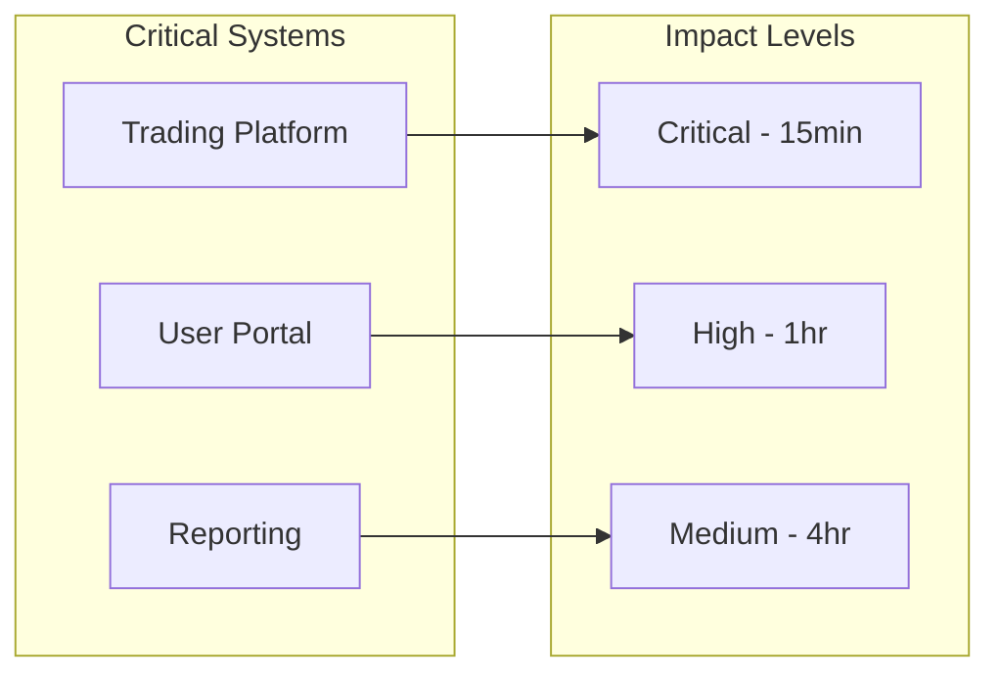
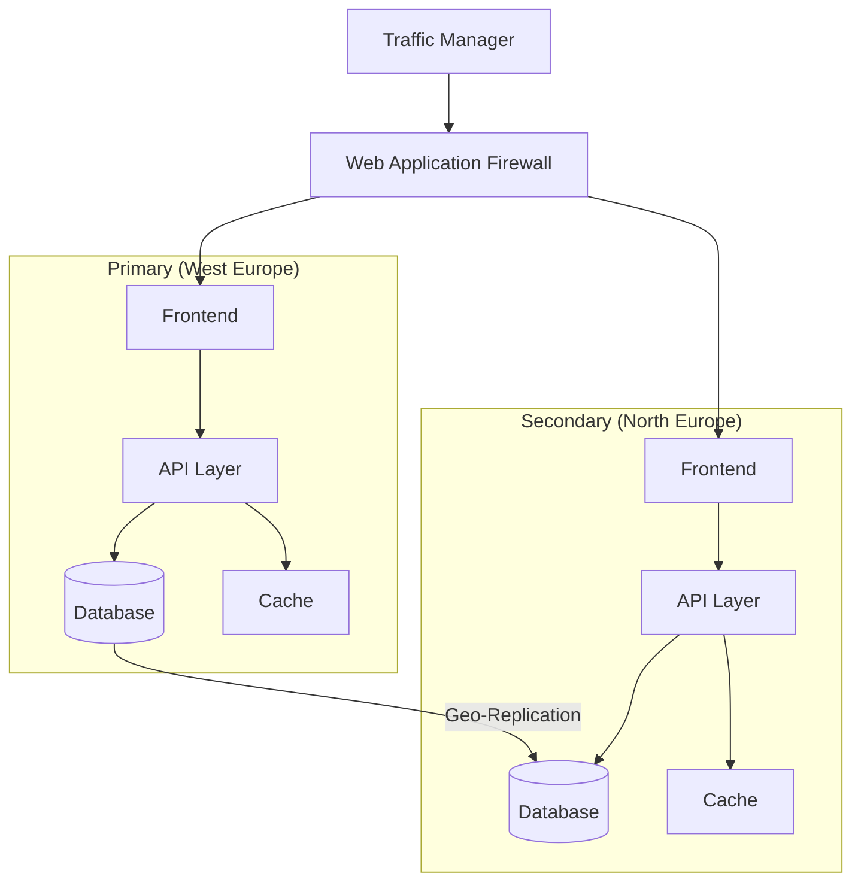
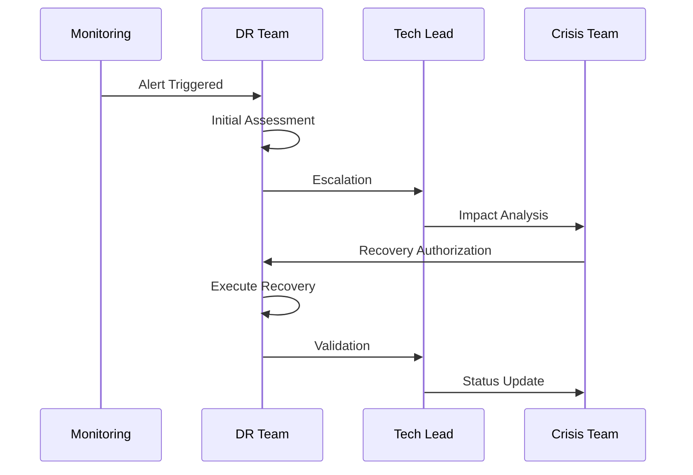
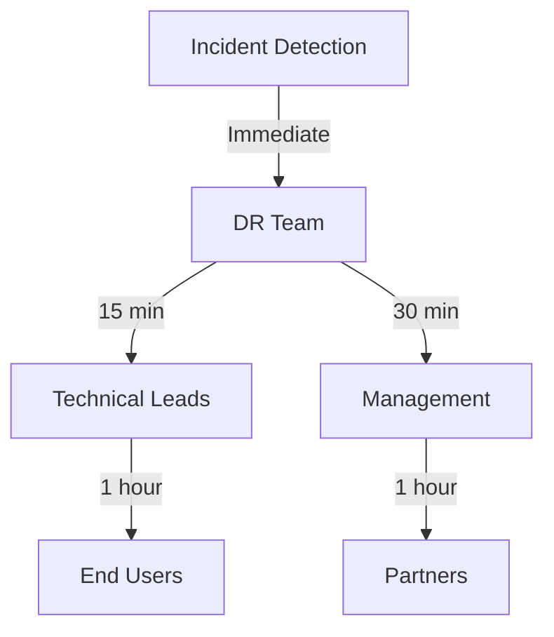

# Disaster Recovery and Business Continuity Plan {: #disaster-recovery-and-business-continuity-plan}
📄 /docs/infrastructure/DISASTER_RECOVERY.md

## Overview {: #overview}
This document outlines Phoenix VC's comprehensive disaster recovery (DR) and business continuity plan. It provides detailed procedures for system backup, recovery operations, and maintaining business continuity during various failure scenarios.

## Table of Contents {: #table-of-contents}
- [Recovery Objectives](#recovery-objectives)
- [Risk Assessment](#risk-assessment)
- [Backup Strategy](#backup-strategy)
- [Failover Architecture](#failover-architecture)
- [Recovery Procedures](#recovery-procedures)
- [Communication Plan](#communication-plan)
- [Testing and Validation](#testing-and-validation)
- [Recovery Runbooks](#recovery-runbooks)

## Recovery Objectives {: #recovery-objectives}
### Business Impact Analysis {: #business-impact-analysis}


### Target Metrics {: #target-metrics}
| Metric | Target | Description | Monitoring |
|--------|--------|-------------|------------|
| RTO (Recovery Time Objective) | 4 hours | Maximum acceptable downtime | Azure Monitor |
| RPO (Recovery Point Objective) | 15 minutes | Maximum acceptable data loss | Backup Reports |
| MTTR (Mean Time to Recovery) | 2 hours | Average recovery time | Incident Metrics |
| Availability SLA | 99.95% | System uptime target | SLA Dashboard |

## Risk Assessment {: #risk-assessment}
### Threat Matrix {: #threat-matrix}
| Threat | Likelihood | Impact | Mitigation |
|--------|------------|--------|------------|
| Region Failure | Medium | Critical | Multi-region deployment |
| Data Corruption | Low | Critical | Point-in-time recovery |
| Cyber Attack | High | Critical | Security controls, WAF |
| Network Outage | Medium | High | Redundant connectivity |

## Backup Strategy {: #backup-strategy}
### Backup Configuration {: #backup-configuration}
```bicep
resource backupPolicy 'Microsoft.RecoveryServices/vaults/backupPolicies@2021-06-01' = {
  name: '${environment}-backup-policy'
  parent: recoveryServicesVault
  properties: {
    backupManagementType: 'AzureWorkload'
    schedulePolicy: {
      schedulePolicyType: 'SimpleSchedulePolicy'
      scheduleRunFrequency: 'Hourly'
      scheduleRunTimes: ['2025-02-14T00:00:00Z']
      scheduleWeeklyFrequency: 7
    }
    retentionPolicy: {
      retentionPolicyType: 'LongTermRetentionPolicy'
      dailySchedule: {
        retentionTimes: ['2025-02-14T00:00:00Z']
        retentionDuration: {
          count: 30
          durationType: 'Days'
        }
      }
    }
  }
}
```

### Backup Schedule {: #backup-schedule}
| Resource Type | Frequency | Retention | Storage Type | Validation |
|---------------|-----------|-----------|--------------|------------|
| Database | 15 min | 30 days | Geo-redundant | Daily |
| File Storage | Daily | 90 days | Zone-redundant | Weekly |
| Configuration | Weekly | 1 year | Cool storage | Monthly |
| User Data | Hourly | 45 days | Geo-redundant | Weekly |

## Failover Architecture {: #failover-architecture}
### High Availability Design {: #high-availability-design}


### Regional Failover Components {: #regional-failover-components}
```bicep
resource trafficManager 'Microsoft.Network/trafficManagerProfiles@2021-02-01' = {
  name: '${environment}-tm-phoenixvc'
  location: 'global'
  properties: {
    profileStatus: 'Enabled'
    trafficRoutingMethod: 'Priority'
    dnsConfig: {
      relativeName: '${environment}-phoenixvc'
      ttl: 30
    }
    monitorConfig: {
      protocol: 'HTTPS'
      port: 443
      path: '/health'
      intervalInSeconds: 30
      timeoutInSeconds: 10
      toleratedNumberOfFailures: 3
    }
  }
}
```

## Recovery Procedures {: #recovery-procedures}
### Incident Response Flow {: #incident-response-flow}


### Recovery Steps {: #recovery-steps}
1. **Initial Response**
   - Incident detection and classification
   - Team notification and escalation
   - Initial impact assessment

2. **Recovery Execution**
   - Activate DR procedures
   - Execute failover if required
   - Restore from backups if needed
   - Verify system integrity

3. **Service Restoration**
   - Validate functionality
   - Verify data consistency
   - Resume normal operations
   - Post-incident review

## Communication Plan {: #communication-plan}
### Notification Matrix {: #notification-matrix}


### Contact Information {: #contact-information}
| Role | Primary Contact | Secondary Contact | Response Time |
|------|----------------|-------------------|---------------|
| DR Coordinator | dr@phoenixvc.com | +1-555-0123 | 15 min |
| Technical Lead | tech@phoenixvc.com | +1-555-0124 | 30 min |
| Communications | comms@phoenixvc.com | +1-555-0125 | 1 hour |

## Testing and Validation {: #testing-and-validation}
### Test Schedule {: #test-schedule}
| Test Type | Frequency | Duration | Scope | Last Test |
|-----------|-----------|----------|-------|----------|
| Backup Restore | Monthly | 4 hours | Database | 2025-01-15 |
| Failover | Quarterly | 8 hours | Full System | 2025-01-01 |
| Table Top | Semi-annual | 2 hours | Procedures | 2024-12-15 |

### Test Scenarios {: #test-scenarios}
```yaml
test_scenarios:
  - name: Database Failover
    steps:
      - simulate_primary_failure
      - activate_secondary
      - verify_data_sync
      - validate_applications
  
  - name: Region Failover
    steps:
      - trigger_failover
      - verify_traffic_routing
      - check_data_consistency
      - validate_security_configs
```

## Recovery Runbooks {: #recovery-runbooks}
### Database Recovery {: #database-recovery}
```powershell
# Restore database from point-in-time backup {: #restore-database-from-point-in-time-backup}
$timestamp = (Get-Date).AddHours(-1)
Restore-AzSqlDatabase `
  -ResourceGroupName "rg-phoenixvc" `
  -ServerName "sql-phoenixvc" `
  -DatabaseName "db-phoenixvc" `
  -PointInTime $timestamp `
  -Edition "Standard" `
  -ServiceObjectiveName "S1"
```

### Application Recovery Checklist {: #application-recovery-checklist}
1. **Assessment Phase**
   - [ ] Identify failure scope
   - [ ] Validate backup integrity
   - [ ] Check dependencies

2. **Recovery Phase**
   - [ ] Activate secondary region
   - [ ] Restore data from backups
   - [ ] Update DNS/Traffic Manager
   - [ ] Verify application health

3. **Validation Phase**
   - [ ] Run health checks
   - [ ] Verify data consistency
   - [ ] Test critical functions
   - [ ] Confirm security controls

## Document History {: #document-history}
| Version | Date | Author | Changes |
|---------|------|--------|---------|
| 1.0 | 2025-02-14 | DR Team | Initial version |
| 1.1 | 2025-02-14 | DR Team | Added runbooks |