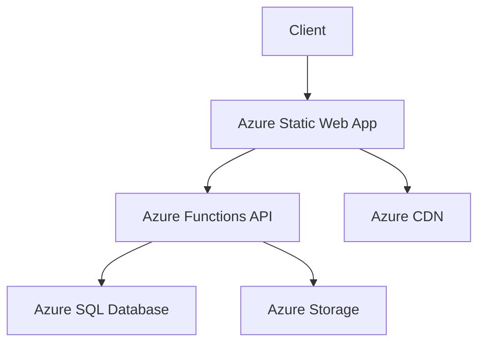

📄 /docs/INFRASTRUCTURE.md

# Infrastructure Documentation {: #infrastructure-documentation}
## Table of Contents {: #table-of-contents}
- [Architecture Overview](#architecture-overview)
- [Azure Resources](#azure-resources)
- [Infrastructure as Code](#infrastructure-as-code)
- [Environment Management](#environment-management)
- [Security and Compliance](#security-and-compliance)

## Architecture Overview {: #architecture-overview}
### System Architecture {: #system-architecture}


### Key Components {: #key-components}
- **Frontend**: React SPA hosted on Azure Static Web Apps
- **API**: Azure Functions with Node.js
- **Database**: Azure SQL Database
- **Storage**: Azure Blob Storage
- **CDN**: Azure CDN for static assets

## Azure Resources {: #azure-resources}
### Resource Naming Convention {: #resource-naming-convention}
Pattern: `env_loc_resourcetype_projname[optionalidentifier]`

#### Examples {: #examples}
```plaintext
# Static Web Apps {: #static-web-apps}
prod-euw-swa-phoenixvc
dev-saf-swa-phoenixvc

# Resource Groups {: #resource-groups}
prod-euw-rg-phoenixvc
dev-saf-rg-phoenixvc

# SQL Databases {: #sql-databases}
prod-euw-sql-phoenixvc
dev-saf-sql-phoenixvc
```

### Resource Configuration {: #resource-configuration}
#### Static Web App {: #static-web-app}
```bicep
resource staticWebApp 'Microsoft.Web/staticSites@2021-03-01' = {
  name: '${env}-${loc}-swa-${projName}'
  location: location
  sku: {
    name: 'Standard'
    tier: 'Standard'
  }
  properties: {
    // Configuration details
  }
}
```

#### SQL Database {: #sql-database}
```bicep
resource sqlServer 'Microsoft.Sql/servers@2021-11-01' = {
  name: '${env}-${loc}-sql-${projName}'
  location: location
  properties: {
    administratorLogin: administratorLogin
    administratorLoginPassword: administratorLoginPassword
  }
}
```

## Infrastructure as Code {: #infrastructure-as-code}
### Directory Structure {: #directory-structure}
```plaintext
infrastructure/
├── bicep/
│   ├── main.bicep
│   ├── modules/
│   │   ├── staticWebApp.bicep
│   │   ├── database.bicep
│   │   └── storage.bicep
│   └── parameters/
│       ├── prod.parameters.json
│       └── dev.parameters.json
├── scripts/
│   ├── deploy.sh
│   └── cleanup.sh
└── terraform/
    ├── main.tf
    └── variables.tf
```

### Deployment Scripts {: #deployment-scripts}
#### Azure CLI {: #azure-cli}
```bash
# Deploy infrastructure {: #deploy-infrastructure}
az deployment group create \
  --resource-group ${ENV}-${LOC}-rg-${PROJ_NAME} \
  --template-file ./bicep/main.bicep \
  --parameters @./bicep/parameters/${ENV}.parameters.json
```

#### Terraform {: #terraform}
```bash
# Initialize Terraform {: #initialize-terraform}
terraform init

# Plan deployment {: #plan-deployment}
terraform plan -var-file="environments/${ENV}.tfvars"

# Apply changes {: #apply-changes}
terraform apply -var-file="environments/${ENV}.tfvars"
```

## Environment Management {: #environment-management}
### Environment Types {: #environment-types}
- **Development (dev)**
  - For development and testing
  - Reduced resources and costs
  - More permissive security

- **User Acceptance Testing (uat)**
  - Mirror of production
  - For client testing
  - Temporary resources

- **Production (prod)**
  - Live environment
  - High availability
  - Strict security

### Configuration Management {: #configuration-management}
#### Environment Variables {: #environment-variables}
```json
{
  "dev": {
    "apiUrl": "https://dev-api.phoenixvc.com",
    "storageAccount": "devphoenixvcstorage",
    "allowedOrigins": ["http://localhost:3000"]
  },
  "prod": {
    "apiUrl": "https://api.phoenixvc.com",
    "storageAccount": "prodphoenixvcstorage",
    "allowedOrigins": ["https://phoenixvc.com"]
  }
}
```

## Security and Compliance {: #security-and-compliance}
### Network Security {: #network-security}
#### Virtual Network Configuration {: #virtual-network-configuration}
```bicep
resource vnet 'Microsoft.Network/virtualNetworks@2021-05-01' = {
  name: '${env}-${loc}-vnet-${projName}'
  location: location
  properties: {
    addressSpace: {
      addressPrefixes: ['10.0.0.0/16']
    }
    subnets: [
      {
        name: 'api-subnet'
        properties: {
          addressPrefix: '10.0.1.0/24'
          serviceEndpoints: [
            {
              service: 'Microsoft.Sql'
            }
          ]
        }
      }
    ]
  }
}
```

### Access Control {: #access-control}
#### Role Assignments {: #role-assignments}
```bicep
resource roleAssignment 'Microsoft.Authorization/roleAssignments@2020-04-01-preview' = {
  name: guid(resourceGroup().id, principalId, roleDefinitionId)
  properties: {
    roleDefinitionId: roleDefinitionId
    principalId: principalId
    principalType: 'ServicePrincipal'
  }
}
```

### Monitoring and Logging {: #monitoring-and-logging}
#### Application Insights {: #application-insights}
```bicep
resource appInsights 'Microsoft.Insights/components@2020-02-02' = {
  name: '${env}-${loc}-ai-${projName}'
  location: location
  kind: 'web'
  properties: {
    Application_Type: 'web'
    RetentionInDays: 90
    IngestionMode: 'ApplicationInsights'
  }
}
```

### Backup and Recovery {: #backup-and-recovery}
#### Database Backup {: #database-backup}
```bicep
resource sqlDatabase 'Microsoft.Sql/servers/databases@2021-11-01' = {
  name: '${sqlServer.name}/${databaseName}'
  location: location
  sku: {
    name: 'Standard'
    tier: 'Standard'
  }
  properties: {
    createMode: 'Default'
    backupStorageRedundancy: 'Geo'
  }
}
```

## Disaster Recovery {: #disaster-recovery}
### Recovery Procedures {: #recovery-procedures}
1. **Database Failure**
 ```bash
 # Restore from geo-redundant backup
 az sql db restore \
   --resource-group ${ENV}-${LOC}-rg-${PROJ_NAME} \
   --server ${ENV}-${LOC}-sql-${PROJ_NAME} \
   --name ${DATABASE_NAME} \
   --restore-point-in-time ${TIMESTAMP}
 ```

2. **Region Failure**
 ```bash
 # Failover to secondary region
 az network traffic-manager profile update \
   --resource-group ${ENV}-${LOC}-rg-${PROJ_NAME} \
   --name ${TRAFFIC_MANAGER_PROFILE} \
   --routing-method Priority
 ```

## Cost Management {: #cost-management}
### Resource Tags {: #resource-tags}
```json
{
  "Environment": "Production",
  "Project": "PhoenixVC",
  "CostCenter": "IT-001",
  "Owner": "team@phoenixvc.com"
}
```

### Budget Alerts {: #budget-alerts}
```bicep
resource budget 'Microsoft.Consumption/budgets@2021-10-01' = {
  name: '${env}-${loc}-budget-${projName}'
  properties: {
    amount: 1000
    category: 'Cost'
    timeGrain: 'Monthly'
    notifications: {
      actual_80_percent: {
        enabled: true
        operator: 'GreaterThan'
        threshold: 80
        contactEmails: ['team@phoenixvc.com']
      }
    }
  }
}
```