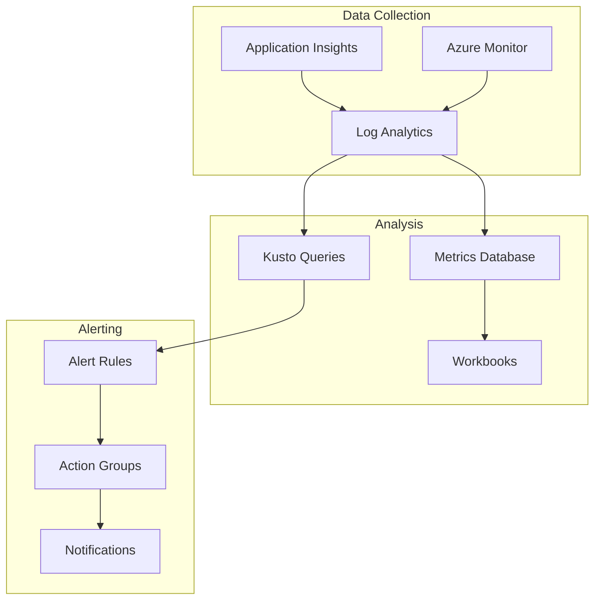

📄 /docs/infrastructure/MONITORING.md

# Monitoring and Logging Configuration {: #monitoring-and-logging-configuration}
## Overview {: #overview}
This document details the monitoring, logging, and alerting setup for the Phoenix VC infrastructure.

## Monitoring Architecture {: #monitoring-architecture}
### Component Overview {: #component-overview}


## Application Insights {: #application-insights}
### Configuration {: #configuration}
```bicep
resource appInsights 'Microsoft.Insights/components@2020-02-02' = {
  name: '${environment}-ai-phoenixvc'
  location: location
  kind: 'web'
  properties: {
    Application_Type: 'web'
    WorkspaceResourceId: logAnalytics.id
    IngestionMode: 'LogAnalytics'
    SamplingPercentage: 100
  }
}
```

### Key Metrics {: #key-metrics}
| Metric | Threshold | Period | Action |
|--------|-----------|---------|---------|
| Response Time | > 1s | 5min | Warning |
| Error Rate | > 1% | 5min | Critical |
| CPU Usage | > 80% | 10min | Warning |
| Memory | > 85% | 10min | Warning |

## Log Analytics {: #log-analytics}
### Workspace Configuration {: #workspace-configuration}
```bicep
resource logAnalytics 'Microsoft.OperationalInsights/workspaces@2021-06-01' = {
  name: '${environment}-law-phoenixvc'
  location: location
  properties: {
    retentionInDays: 30
    features: {
      enableLogAccessUsingOnlyResourcePermissions: true
    }
    sku: {
      name: 'PerGB2018'
    }
  }
}
```

### Common Queries {: #common-queries}
#### Performance Monitoring {: #performance-monitoring}
```kusto
requests
| where timestamp > ago(1h)
| summarize avg_duration=avg(duration)
    by bin(timestamp, 5m), name
| render timechart
```

#### Error Analysis {: #error-analysis}
```kusto
exceptions
| where timestamp > ago(24h)
| summarize error_count=count()
    by type, bin(timestamp, 1h)
| order by error_count desc
```

## Alert Configuration {: #alert-configuration}
### Action Groups {: #action-groups}
```bicep
resource actionGroup 'Microsoft.Insights/actionGroups@2021-09-01' = {
  name: '${environment}-ag-critical'
  location: 'global'
  properties: {
    groupShortName: 'critical'
    enabled: true
    emailReceivers: [
      {
        name: 'DevOps Team'
        emailAddress: 'devops@phoenixvc.com'
      }
    ]
  }
}
```

### Alert Rules {: #alert-rules}
```bicep
resource alertRule 'Microsoft.Insights/metricAlerts@2018-03-01' = {
  name: '${environment}-alert-highcpu'
  location: 'global'
  properties: {
    description: 'Alert when CPU exceeds 80%'
    severity: 2
    enabled: true
    evaluationFrequency: 'PT5M'
    windowSize: 'PT15M'
    criteria: {
      'odata.type': 'Microsoft.Azure.Monitor.SingleResourceMultipleMetricCriteria'
      allOf: [
        {
          criterionType: 'StaticThresholdCriterion'
          metricName: 'CpuPercentage'
          operator: 'GreaterThan'
          threshold: 80
        }
      ]
    }
    actions: [
      {
        actionGroupId: actionGroup.id
      }
    ]
  }
}
```

## Dashboard Configuration {: #dashboard-configuration}
### Azure Dashboard {: #azure-dashboard}
```json
{
  "properties": {
    "lenses": {
      "0": {
        "order": 0,
        "parts": {
          "0": {
            "position": {
              "x": 0,
              "y": 0,
              "colSpan": 6,
              "rowSpan": 4
            },
            "metadata": {
              "inputs": [],
              "type": "Extension/Microsoft_OperationsManagementSuite_Workspace/PartType/LogsDashboardPart"
            }
          }
        }
      }
    }
  }
}
```

## Cost Monitoring {: #cost-monitoring}
### Budget Alerts {: #budget-alerts}
```bicep
resource budget 'Microsoft.Consumption/budgets@2021-10-01' = {
  name: '${environment}-budget-monthly'
  properties: {
    timePeriod: {
      startDate: '2025-01-01T00:00:00Z'
      endDate: '2025-12-31T00:00:00Z'
    }
    amount: 1000
    category: 'Cost'
    notifications: {
      actual_80_percent: {
        enabled: true
        operator: 'GreaterThan'
        threshold: 80
        contactEmails: [
          'finance@phoenixvc.com'
        ]
      }
    }
  }
}
```

## Performance Monitoring {: #performance-monitoring}
### Application Performance {: #application-performance}
- Request duration
- Dependency calls
- Exception tracking
- Custom events

### Infrastructure Performance {: #infrastructure-performance}
- CPU utilization
- Memory usage
- Network throughput
- Disk I/O

## Security Monitoring {: #security-monitoring}
### Security Center Integration {: #security-center-integration}
```bicep
resource securityCenter 'Microsoft.Security/pricings@2018-06-01' = {
  name: 'default'
  properties: {
    pricingTier: 'Standard'
  }
}
```

### Security Alerts {: #security-alerts}
- Suspicious activities
- Policy violations
- Compliance issues

## Maintenance {: #maintenance}
### Log Retention {: #log-retention}
- Application Insights: 90 days
- Log Analytics: 30 days
- Activity Logs: 365 days

### Cleanup Tasks {: #cleanup-tasks}
```powershell
# Archive old logs {: #archive-old-logs}
$date = (Get-Date).AddDays(-90)
Export-AzLogAnalyticsSavedSearch