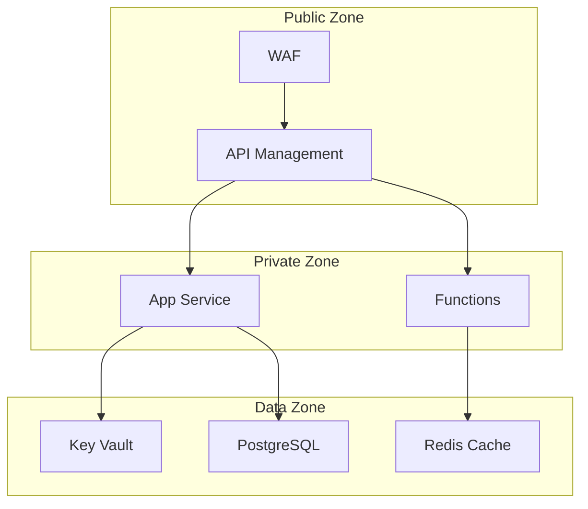

📄 /docs/infrastructure/SECURITY.md

# Security Configuration {: #security-configuration}
## Overview {: #overview}
This document outlines the security measures, configurations, and best practices implemented in the Phoenix VC infrastructure. It covers access control, network security, encryption, and compliance requirements.

## Table of Contents {: #table-of-contents}
- [Identity and Access Management](#identity-and-access-management)
- [Network Security](#network-security)
- [Data Protection](#data-protection)
- [Compliance](#compliance)
- [Security Monitoring](#security-monitoring)
- [Incident Response](#incident-response)

## Identity and Access Management {: #identity-and-access-management}
### Azure Active Directory Configuration {: #azure-active-directory-configuration}
```bicep
resource roleAssignment 'Microsoft.Authorization/roleAssignments@2020-04-01-preview' = {
  name: guid(resourceGroup().id, principalId, roleDefinitionId)
  properties: {
    roleDefinitionId: roleDefinitionId
    principalId: principalId
    principalType: 'ServicePrincipal'
  }
}
```

### RBAC Roles Matrix {: #rbac-roles-matrix}
| Role | Scope | Permissions | Use Case |
|------|-------|-------------|----------|
| Contributor | Resource Group | Create/Manage resources | DevOps Team |
| Reader | Subscription | View resources | Auditors |
| Key Vault Admin | Key Vault | Manage secrets | Security Team |
| Network Contributor | VNet | Manage network | Network Team |

## Network Security {: #network-security}
### Network Architecture {: #network-architecture}


### Network Security Groups {: #network-security-groups}
```bicep
resource nsg 'Microsoft.Network/networkSecurityGroups@2021-02-01' = {
  name: '${environment}-nsg-backend'
  location: location
  properties: {
    securityRules: [
      {
        name: 'AllowHttpsInbound'
        properties: {
          priority: 100
          direction: 'Inbound'
          access: 'Allow'
          protocol: 'Tcp'
          sourceAddressPrefix: 'Internet'
          sourcePortRange: '*'
          destinationAddressPrefix: 'VirtualNetwork'
          destinationPortRange: '443'
        }
      }
    ]
  }
}
```

## Data Protection {: #data-protection}
### Encryption Configuration {: #encryption-configuration}
```bicep
resource keyVault 'Microsoft.KeyVault/vaults@2021-06-01-preview' = {
  name: '${environment}-kv-phoenixvc'
  location: location
  properties: {
    enabledForDeployment: true
    enabledForTemplateDeployment: true
    enabledForDiskEncryption: true
    enableRbacAuthorization: true
    enableSoftDelete: true
    softDeleteRetentionInDays: 90
    networkAcls: {
      defaultAction: 'Deny'
      bypass: 'AzureServices'
      ipRules: []
      virtualNetworkRules: []
    }
    sku: {
      name: 'standard'
      family: 'A'
    }
  }
}
```

### Data Classification {: #data-classification}
| Data Type | Classification | Storage Location | Encryption |
|-----------|---------------|------------------|------------|
| User Data | Confidential | PostgreSQL | TDE |
| Logs | Internal | Log Analytics | Platform-managed |
| Secrets | Restricted | Key Vault | HSM-backed |
| Cache | Internal | Redis | In-transit |

## Compliance {: #compliance}
### Regulatory Requirements {: #regulatory-requirements}
- GDPR Compliance
- ISO 27001
- SOC 2
- PCI DSS (if applicable)

### Audit Configuration {: #audit-configuration}
```bicep
resource diagnosticSetting 'Microsoft.Insights/diagnosticSettings@2021-05-01-preview' = {
  name: '${environment}-diag-audit'
  scope: keyVault
  properties: {
    workspaceId: logAnalytics.id
    logs: [
      {
        category: 'AuditEvent'
        enabled: true
        retentionPolicy: {
          days: 365
          enabled: true
        }
      }
    ]
  }
}
```

## Security Monitoring {: #security-monitoring}
### Alert Rules {: #alert-rules}
```bicep
resource securityAlert 'Microsoft.Security/alerts@2021-01-01' = {
  name: '${environment}-alert-security'
  properties: {
    description: 'Security violation detected'
    severity: 'High'
    status: 'Active'
    notificationSettings: {
      emails: [
        'security@phoenixvc.com'
      ]
      phone: []
    }
  }
}
```

### Security Center Integration {: #security-center-integration}
- Threat Protection
- Vulnerability Assessment
- Security Posture Management

## Incident Response {: #incident-response}
### Response Procedures {: #response-procedures}
1. **Detection**
   - Automated alerts
   - Manual reports
   - Security Center findings

2. **Analysis**
   - Impact assessment
   - Scope determination
   - Root cause investigation

3. **Containment**
   - Resource isolation
   - Access revocation
   - Traffic blocking

4. **Remediation**
   - Patch application
   - Configuration updates
   - System hardening

### Emergency Contacts {: #emergency-contacts}
| Role | Contact Method | Response Time |
|------|----------------|---------------|
| Security Lead | security@phoenixvc.com | 15 min |
| DevOps Team | devops@phoenixvc.com | 30 min |
| Management | management@phoenixvc.com | 1 hour |

## Security Maintenance {: #security-maintenance}
### Regular Tasks {: #regular-tasks}
- Weekly security patches
- Monthly access reviews
- Quarterly penetration testing
- Annual disaster recovery testing

### Security Baselines {: #security-baselines}
```json
{
  "passwordPolicy": {
    "minimumLength": 12,
    "requireUppercase": true,
    "requireLowercase": true,
    "requireNumbers": true,
    "requireSpecialCharacters": true,
    "expirationDays": 90
  },
  "mfaPolicy": {
    "enforced": true,
    "gracePeriodsHours": 0,
    "allowedMethods": [
      "authenticator",
      "sms",
      "email"
    ]
  }
}
```