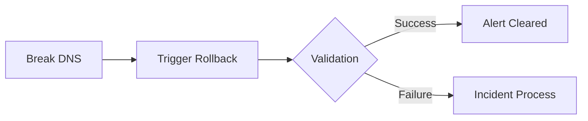

# DNS Policy Implementation Checklist {: #dns-policy-implementation-checklist}
**Project:** PhoenixVC DNS Compliance Framework  
**Reference Doc:** [Azure Policy Design Document](#azure-policy-design)

## Preparation Phase {: #preparation-phase}
```markdown
- [ ] Environment Setup
  - [ ] Create `policy-dev` resource group
  - [ ] Clone DNS zones to test environment
  - [ ] Allocate budget for Policy Insights ($180/mo estimated)

- [ ] Access Control
  - [ ] Configure RBAC for Policy Admins
  - [ ] Create Service Principal for CI/CD
  - [ ] Enable Managed Identity for DNS zones

- [ ] Tooling Configuration
  - [ ] Install Azure Policy Insights CLI extension
    ```bash
    az extension add --name policy-insights
    ```
  - [ ] Configure Log Analytics workspace
  - [ ] Connect Teams webhook for alerts
```

## Policy Implementation {: #policy-implementation}
```table
| Policy | CLI Command | Validation Test | Owner |
|---|---|---|---|
| Record Type Restriction | `az policy definition create --name dns-record-types --rules policy1.json` | `./validate.sh --test forbidden-records` | Security Team |
| TTL Enforcement | `az policy assignment create --name ttl-enforcement --policy dns-ttl-policy` | `./validate.sh --test ttl-overrides` | Network Ops |
| Naming Convention | `az policy assignment create --name dns-naming --policy naming-policy.json` | `./validate.sh --test invalid-names` | DevOps |
```

## Testing Protocol {: #testing-protocol}
1. **Pre-Deployment Tests**
```markdown
- [ ] Negative Testing
  - [ ] Attempt MX record creation
    ```bash
    ./configure-dns.sh -a -c mx --ttl 600
    ```
  - [ ] Verify: 
    - Policy violation error logged
    - Teams alert received
    - No DNS changes applied

- [ ] Positive Testing
  - [ ] Valid CNAME creation
    ```bash
    ./configure-dns.sh -a -c cname --force
    ```
  - [ ] Verify:
    - Compliance logged in App Insights
    - Backup created in `dns_backups/`
```

2. **Rollback Validation**


## Go-Live Steps {: #go-live-steps}
```markdown
- [ ] Production Deployment
  - [ ] Deploy policies with audit mode
    ```bash
    az policy assignment update --name dns-record-types --enforcement-mode Default
    ```
  - [ ] Monitor policy compliance for 72hrs
  - [ ] Enable deny mode
    ```bash
    az policy assignment update --params '{ "enforcement": "deny" }'
    ```

- [ ] Final Verification
  - [ ] Confirm backup/restore process
  - [ ] Validate alert thresholds
  - [ ] Test emergency override
    ```bash
    ./configure-dns.sh --emergency-override ${CODE_RED_KEY}
    ```
```

## Post-Implementation {: #post-implementation}
```markdown
- [ ] Documentation
  - [ ] Update runbook with policy references
  - [ ] Add compliance metrics to KPI dashboard

- [ ] Training
  - [ ] DevOps workshop
  - [ ] Security team deep-dive
  - [ ] NOC handoff session

- [ ] Review Cycle
  - [ ] Schedule quarterly policy review
  - [ ] Set up automated policy tests
    ```bash
    # Add to CI pipeline
    ./validate.sh --full-suite --environment ${ENV}
    ```
```

## Emergency Procedures {: #emergency-procedures}
```table
| Scenario | Action | Command | Approval Needed |
|---|---|---|---|
| False Positive Block | Policy Exemption | `az policy exemption create --name dns-emergency --policy-assignment dns-record-types` | CISO + DevOps Lead |
| Critical Patch | Emergency Override | `./configure-dns.sh --emergency-override <token>` | Change Advisory Board |
| Policy Failure | Rollback | `az policy assignment delete --name dns-record-types` | Security Architect |
```

**Checklist Version Control**  
`Git Tag: policy-checklist-1.0`  
`Maintainer: Cloud Architecture Team`