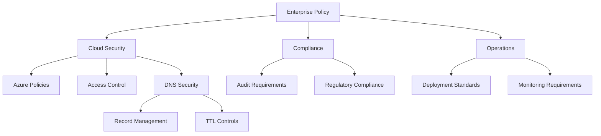
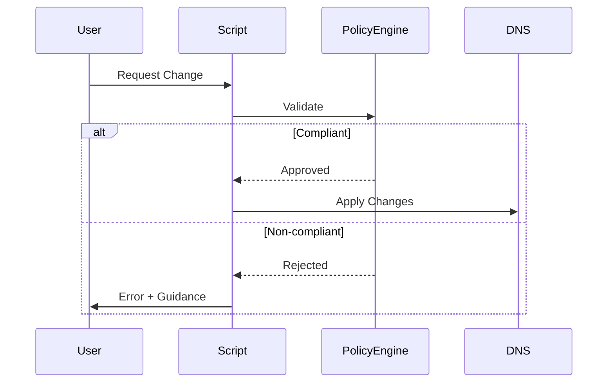

# Phoenix VC Enterprise Policy Framework {: #phoenix-vc-enterprise-policy-framework}
**Version:** 1.1.0 | Last Updated: 2025-02-14

## Overview {: #overview}
This framework defines the comprehensive policy structure for Phoenix VC's cloud infrastructure, covering enterprise policies, DNS management, and deployment standards.

## Policy Architecture {: #policy-architecture}


## Core Policy Components {: #core-policy-components}
### 1. Security Policies {: #1-security-policies}
| Policy ID | Name | Scope | Review Cycle | Owner |
|-----------|------|-------|--------------|-------|
| SEC-001 | Access Control | Enterprise | Quarterly | Security Team |
| SEC-002 | Data Protection | Enterprise | Quarterly | Security Team |
| SEC-003 | Network Security | Cloud Infrastructure | Monthly | Network Ops |
| SEC-004 | Identity Management | Enterprise | Quarterly | IAM Team |
| SEC-005 | DNS Security | Infrastructure | Monthly | Network Ops |

### 2. Compliance Framework {: #2-compliance-framework}
| Policy ID | Name | Standard | Review Cycle | Validation |
|-----------|------|----------|--------------|------------|
| CMP-001 | Data Retention | ISO 27001 | Annual | Automated |
| CMP-002 | Audit Logging | SOC 2 | Quarterly | Manual |
| CMP-003 | Access Reviews | ISO 27001 | Monthly | Automated |
| CMP-004 | DNS Compliance | Internal | Monthly | Automated |

## Implementation Guidelines {: #implementation-guidelines}
### Azure Policy Definitions {: #azure-policy-definitions}
```json
{
  "dnsSecurityPolicy": {
    "recordTypes": {
      "allowed": ["A", "CNAME", "TXT"],
      "denied": ["MX", "NS", "SOA"]
    },
    "ttl": {
      "minimum": 300,
      "maximum": 86400
    }
  }
}
```

### Policy Assignments {: #policy-assignments}
```bash
# Security baseline {: #security-baseline}
az policy assignment create \
  --name "security-baseline" \
  --policy-set-definition "Azure Security Benchmark" \
  --scope "/subscriptions/$SUBSCRIPTION_ID"

# DNS security {: #dns-security}
az policy assignment create \
  --name "dns-security" \
  --policy-definition "dns-security-policy" \
  --params @dns-params.json \
  --scope "/subscriptions/$SUBSCRIPTION_ID"
```

## Monitoring & Enforcement {: #monitoring--enforcement}
### Real-time Validation {: #real-time-validation}


### Compliance Monitoring {: #compliance-monitoring}
- Daily automated scans
- Real-time policy validation
- Weekly violation reports
- Monthly compliance reviews
- Quarterly effectiveness assessments

## Exception Management {: #exception-management}
### Process Flow {: #process-flow}
1. Submit exception request (ServiceNow)
2. Security review and risk assessment
3. CTO/CISO approval for high-risk exceptions
4. Implementation with audit logging
5. Maximum duration: 90 days

### Emergency Override {: #emergency-override}
```bash
# Emergency bypass for critical situations {: #emergency-bypass-for-critical-situations}
./dns-manager.sh --emergency-override \
  --ticket "INC2025001" \
  --approver "CTO" \
  --duration "24h"
```

## Cost Management {: #cost-management}
| Component | Cost Basis | Monthly Estimate |
|-----------|------------|------------------|
| Policy Evaluations | $2/1000 | $45 |
| Log Analytics | $2.76/GB | $120 |
| Alert Rules | $0.10/alert | $15 |
| Total Estimated | | $180 |

## Review Schedule {: #review-schedule}
| Component | Frequency | Team | Next Review |
|-----------|-----------|------|-------------|
| Security Policies | Quarterly | Security | 2025-Q2 |
| Compliance Framework | Annual | Compliance | 2025-Q4 |
| DNS Policies | Monthly | Network Ops | 2025-03 |
| Operational Standards | Monthly | DevOps | 2025-03 |

## Related Documentation {: #related-documentation}
- [Security Baseline](/src/main/policies/compliance/azure-security-baseline.md)
- [DNS Policy Checklist](/src/main/policies/compliance/dns-policy-checklist.md)
- [SPN Audit & Rotation](/src/main/policies/compliance/spn-audit-rotation.md)
- [Network Topology](/src/main/policies/compliance/network-topology.md)