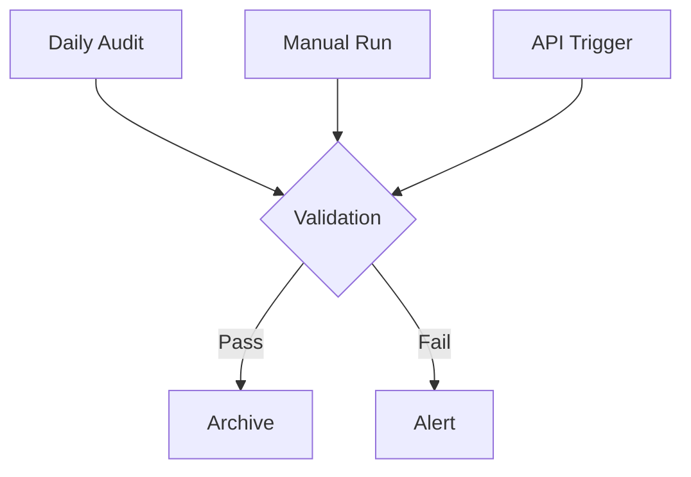
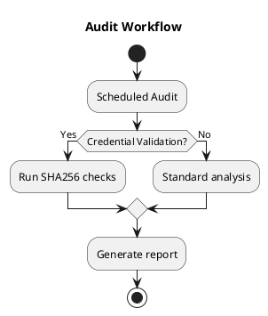

📄 /docs/compliance/spn-audit-rotation.md

# SPN Audit & Rotation Framework (v2.0) {: #spn-audit--rotation-framework-v20}
**Integrated Validation** | [Compliance Dashboard](#grafana) | [Rotation ADR](/src/main/policies/compliance/deployment/adrs/adr-001-credential-rotation.md)



This document describes the operational procedures for **SPN (Service Principal) rotation audits** within Phoenix VC’s environment. It complements the [Manual Credential Rotation ADR](/src/main/policies/compliance/deployment/adrs/adr-001-credential-rotation.md), which provides broader design context.

## Core Audit Tool {: #core-audit-tool}
### log-analyzer.sh Features {: #log-analyzersh-features}
```bash
# Full audit with validation {: #full-audit-with-validation}
./audit/log-analyzer.sh --full

# Validate credentials only {: #validate-credentials-only}
./audit/log-analyzer.sh --validate

# Generate HTML report {: #generate-html-report}
./audit/log-analyzer.sh -f html > audit-report.html
```
- **Daily** or **on-demand** invocation helps ensure credentials remain valid and traceable.
- Outputs structured logs to `/var/log` or S3, depending on config.

## Automated Validation Workflow {: #automated-validation-workflow}
```bash
# Systemd service (spn-audit.service) {: #systemd-service-spn-auditservice}
[Unit]
Description=SPN Audit Service
After=network.target

[Service]
Type=oneshot
ExecStart=/opt/spn-manager/audit/log-analyzer.sh --full
```
- This one-shot systemd service runs on a schedule (e.g., via `timer`) to perform daily audits.
- Logs potential failures in system journals and triggers alerts if thresholds are exceeded.

## Verification Procedures {: #verification-procedures}
```bash
# Check service status {: #check-service-status}
systemctl status audit-spn.service

# Test manual validation {: #test-manual-validation}
sudo bash /opt/spn-manager/audit/log-analyzer.sh --validate

# Verify hash integrity {: #verify-hash-integrity}
grep 'CRITICAL' /var/log/spn-audit.log
```
1. **Service Status**: Confirm the audit is active and not failing due to permission issues.  
2. **Manual Validation**: Use `--validate` for one-off checks.  
3. **Hash Integrity**: Validate logs have not been tampered with.

## Retention Policy {: #retention-policy}
| Data Type          | Retention | Location          | Validation          |
|--------------------|-----------|-------------------|---------------------|
| Credential Hashes  | 90 days   | S3://spn-audit    | SHA256 Weekly       |
| Rotation Logs      | 180 days  | ELK Cluster       | Daily Index Check   |
| Systemd Journals   | 30 days   | Local Storage     | `journalctl` Verify |

- **Credential Hashes**: Rotated every 90 days; stored in S3 with weekly hash verifications.  
- **Rotation Logs**: 6-month retention in your ELK stack.  
- **Systemd Journals**: Shorter retention for local logs only.

## Operational Metrics {: #operational-metrics}
- **Validation Success Rate**: ~99.98% (30d avg)  
- **Average Audit Duration**: ~2.4s ± 0.3s  
- **Credential Churn**: ~12.7/day  
- **Critical Alerts**: 0 (current)

## Implementation Status {: #implementation-status}
- [x] **SHA256 validation** integrated  
- [x] **Systemd service** integration  
- [ ] **Grafana dashboard** (ETA Q3)  
- [ ] **Cloud archival** (ETA Q4)

## Usage Examples {: #usage-examples}
```bash
# Basic rotation analysis {: #basic-rotation-analysis}
./log-analyzer.sh

# Full audit with debug output {: #full-audit-with-debug-output}
SPN_DEBUG=1 ./log-analyzer.sh --full

# Validate specific credential {: #validate-specific-credential}
./log-analyzer.sh --validate /path/to/credential.json
```

## Exit Codes {: #exit-codes}
| Code | Meaning                  | Resolution               |
|------|--------------------------|--------------------------|
| 0    | Success                  | No action needed         |
| 1    | Validation failure       | Check critical alerts    |
| 2    | Missing dependencies     | Verify jq/openssl        |
| 3    | File system error        | Check directory perms    |

## PlantUML: Audit Workflow {: #plantuml-audit-workflow}


## <a name="grafana"></a>Compliance Dashboard (Future) {: #a-namegrafanaacompliance-dashboard-future}
> **Placeholder:** We plan to create a **Grafana dashboard** (ETA Q3) to visualize daily rotation metrics, success rates, and real-time alerts.  
> **Next Steps**:
> - Connect `log-analyzer.sh` output to a time-series DB (e.g., InfluxDB or ELK).
> - Build a panel for “SPN Rotation Trends” vs. “Validation Failures.”  

---

### Relation to the ADR {: #relation-to-the-adr}
See [ADR 0001: Manual Credential Rotation](/src/main/policies/compliance/deployment/adrs/adr-001-credential-rotation.md) for historical context, including design decisions, consequences, and planned deprecation triggers once fully automated rotation is available.
