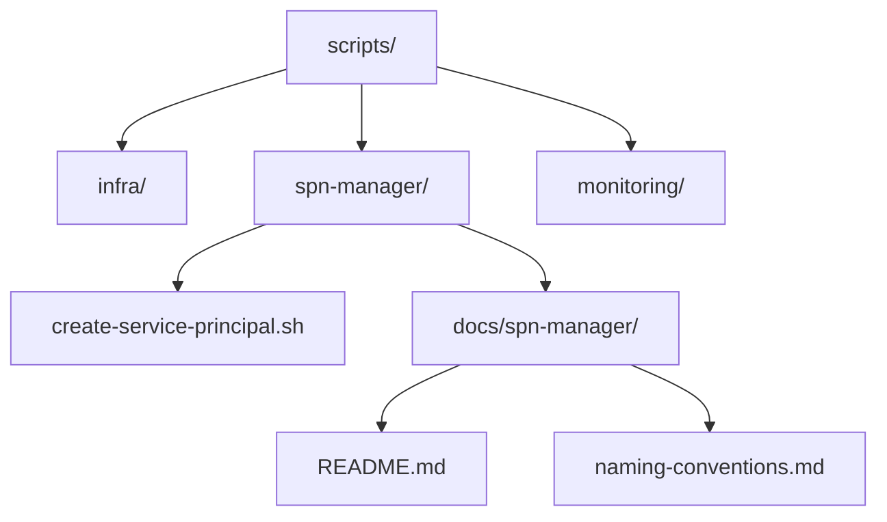
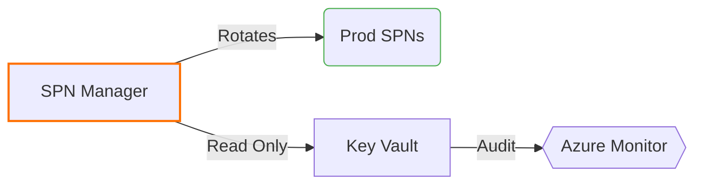

# Scripts Directory Overview





## Global Naming Standards
```markdown
| Component       | Convention     | Example                   | Enforcement |
|-----------------|----------------|---------------------------|-------------|
| Script Files    | kebab-case     | deploy-to-aks.sh          | Pre-commit  |
| Directories     | snake_case     | spn_manager               | Linter      |
| Variables       | UPPER_SNAKE    | AZURE_TENANT_ID           | ShellCheck  |
| Service Names   | reverse-dns    | com.phoenixvc.scripts     | Manual      |
```

## SPN Manager Documentation
Located at: `docs/spn-manager/README.md`

```bash
# Quick Access
code scripts/docs/spn-manager/README.md
```

## git_tree.py Usage Instructions

### **Description**
`git_tree.py` is a Python script that generates an ASCII tree representation of a directory structure based on input file paths.

### **Usage**
1. **Prepare Input:**
   - Create a text file containing file paths, one per line. Example:
     ```
     scripts/deployment/deploy.sh
     scripts/generate/config.json
     scripts/README.md
     ```

2. **Run the Script:**
   - Execute the script by passing the file paths via standard input:
     ```bash
     cat paths.txt | python3 git_tree.py
     ```

3. **Example Output:**
   ```
   ├── scripts
   │   ├── deployment
   │   │   └── deploy.sh
   │   ├── generate
   │   │   └── config.json
   │   └── README.md
   ```

## git_tree.py Usage Instructions (With Git Commands)

### **Description**
`git_tree.py` is a Python script that generates an ASCII tree representation of a directory structure based on file paths tracked by Git.

### **Usage**

1. **Extract File Paths from Git:**
   Use the following Git command to list all tracked files in the repository:
   ```bash
   git ls-files > paths.txt
   ```

2. **Run the Script:**
   Pass the output from `git ls-files` to `git_tree.py` to generate a tree structure:
   ```bash
   git ls-files | python3 git_tree.py
   ```

3. **Example Output:**
   ```
   ├── scripts
   │   ├── deployment
   │   │   └── deploy.sh
   │   ├── generate
   │   │   └── config.json
   │   └── README.md
   ```

### **Optional: Filter Specific Directories**
To focus on specific directories, use `grep` to filter the output:
```bash
git ls-files | grep '^scripts/' | python3 git_tree.py
```

### **Verify Against Git Diff**
To generate a tree for only modified files in your working directory:
```bash
git diff --name-only | python3 git_tree.py
```

### **Generate Tree for a Specific Commit**
To see the tree structure for files in a specific commit:
```bash
git show --pretty="" --name-only <commit-hash> | python3 git_tree.py
```

### **Generate Tree for a Branch**
To list files only in a specific branch:
```bash
git ls-tree -r --name-only <branch-name> | python3 git_tree.py
```
## git_tree.py Usage Instructions (Advanced Git Integration)

### **Description**
`git_tree.py` is a Python script that generates an ASCII tree representation of a directory structure based on file paths derived from Git commands. This section includes advanced filtering options.

---

### **1. Generate Tree for Files Not Gitignored**
To include only files that are tracked by Git and not ignored by `.gitignore`:
```bash
git ls-files > paths.txt
cat paths.txt | python3 git_tree.py
```

Alternatively, directly pipe the output:
```bash
git ls-files | python3 git_tree.py
```

---

### **2. Generate Tree for Staged Files**
To generate a tree for files that are staged for commit:
```bash
git diff --cached --name-only | python3 git_tree.py
```

Explanation:
- `git diff --cached` lists only files in the **staging area**.
- The output is piped to `git_tree.py` to create the tree.

---

### **3. Generate Tree for File Differences from `main`**
To generate a tree for files that differ from the `main` branch:
```bash
git diff --name-only main | python3 git_tree.py
```

Explanation:
- `git diff --name-only main` lists files that differ between the current branch and `main`.
- The output is piped to `git_tree.py`.

---

### **4. Generate Tree for Both Staged and Unstaged Files**
To include both staged and unstaged files in your working directory:
```bash
git diff --name-only HEAD | python3 git_tree.py
```

Explanation:
- `git diff --name-only HEAD` lists all changes (staged and unstaged) compared to the last commit.
- The output is piped to `git_tree.py`.

---

### **5. Combine Staged and Untracked Files**
To include staged files and untracked files:
```bash
git diff --cached --name-only && git ls-files --others --exclude-standard | python3 git_tree.py
```

Explanation:
- `git diff --cached --name-only` lists staged files.
- `git ls-files --others --exclude-standard` lists untracked files.
- Both outputs are combined and piped to `git_tree.py`.

---

### **Example Output**
For any of the above commands, the output will look like this:
```
├── scripts
│   ├── deployment
│   │   └── deploy.sh
│   ├── generate
│   │   └── config.json
│   └── README.md
```

## TODOs
```markdown
- [ ] #1 Create systemd service unit file
  - Owner: @hans
  - Branch: feature/spn-autorotation
  - Path: scripts/spn-manager/systemd/

- [ ] #2 ADR Template
  - Owner: @tech-lead
  - Branch: main
  - Path: docs/adr/0001-spn-rotation.md
  
- [ ] #3 Add pre-commit hook for naming conventions
  - Owner: @hans 
  - Branch: feature/naming-enforcement
  - Path: .pre-commit-config.yaml
  - Requirements:
    - Verify filename kebab-case: `^[a-z0-9]+(-[a-z0-9]+)*\.sh$`
    - Block uppercase letters in script paths
    - Enforce .sh extension consistency
```

### Hook Implementation Details
```yaml
# .pre-commit-config.yaml
- repo: local
  hooks:
    - id: script-naming
      name: Script naming convention
      entry: /bin/bash -c 'find scripts/ -name "*.sh" | grep -Eiv "[a-z0-9/-]+\.sh"'
      language: system
      stages: [commit]
      verbose: true
      exclude: |
        (?x)^(
            scripts/legacy/.*|  # Grandfathered exceptions
            vendor/.*           # Third-party code
        )$

# Test regex pattern: https://regex101.com/r/9VjCbK/1
```

## Verification Command
```bash
# Dry-run test
pre-commit try-repo . script-naming --files scripts/spn-manager/createServicePrincipal.sh

# Expected failure output:
# scripts/spn-manager/createServicePrincipal.sh:0: Script naming convention: Found invalid filename (camelCase)
```

<!-- DOCS VERSION 0.1.0 - 2025-02-14 -->
[](https://semver.org/)