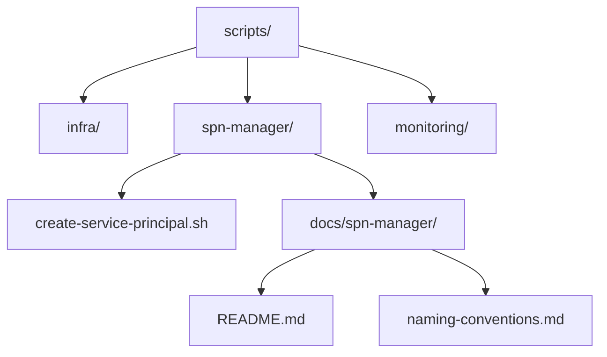
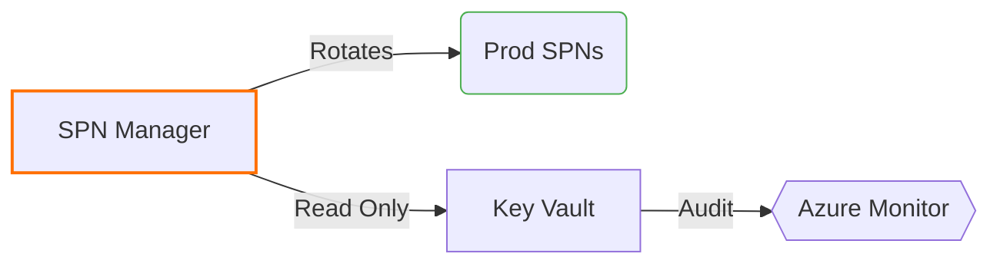

# Scripts Directory Overview





## Global Naming Standards
```markdown
| Component       | Convention     | Example                   | Enforcement |
|-----------------|----------------|---------------------------|-------------|
| Script Files    | kebab-case     | deploy-to-aks.sh          | Pre-commit  |
| Directories     | snake_case     | spn_manager               | Linter      |
| Variables       | UPPER_SNAKE    | AZURE_TENANT_ID           | ShellCheck  |
| Service Names   | reverse-dns    | com.phoenixvc.scripts     | Manual      |
```

## SPN Manager Documentation
Located at: `docs/spn-manager/README.md`

```bash
# Quick Access
code scripts/docs/spn-manager/README.md
```

## TODOs
```markdown
- [ ] #1 Create systemd service unit file
  - Owner: @hans
  - Branch: feature/spn-autorotation
  - Path: scripts/spn-manager/systemd/

- [ ] #2 ADR Template
  - Owner: @tech-lead
  - Branch: main
  - Path: docs/adr/0001-spn-rotation.md
  
- [ ] #3 Add pre-commit hook for naming conventions
  - Owner: @hans 
  - Branch: feature/naming-enforcement
  - Path: .pre-commit-config.yaml
  - Requirements:
    - Verify filename kebab-case: `^[a-z0-9]+(-[a-z0-9]+)*\.sh$`
    - Block uppercase letters in script paths
    - Enforce .sh extension consistency
```

### Hook Implementation Details
```yaml
# .pre-commit-config.yaml
- repo: local
  hooks:
    - id: script-naming
      name: Script naming convention
      entry: /bin/bash -c 'find scripts/ -name "*.sh" | grep -Eiv "[a-z0-9/-]+\.sh"'
      language: system
      stages: [commit]
      verbose: true
      exclude: |
        (?x)^(
            scripts/legacy/.*|  # Grandfathered exceptions
            vendor/.*           # Third-party code
        )$

# Test regex pattern: https://regex101.com/r/9VjCbK/1
```

## Verification Command
```bash
# Dry-run test
pre-commit try-repo . script-naming --files scripts/spn-manager/createServicePrincipal.sh

# Expected failure output:
# scripts/spn-manager/createServicePrincipal.sh:0: Script naming convention: Found invalid filename (camelCase)
```

<!-- DOCS VERSION 0.1.0 - 2025-02-14 -->
[](https://semver.org/)