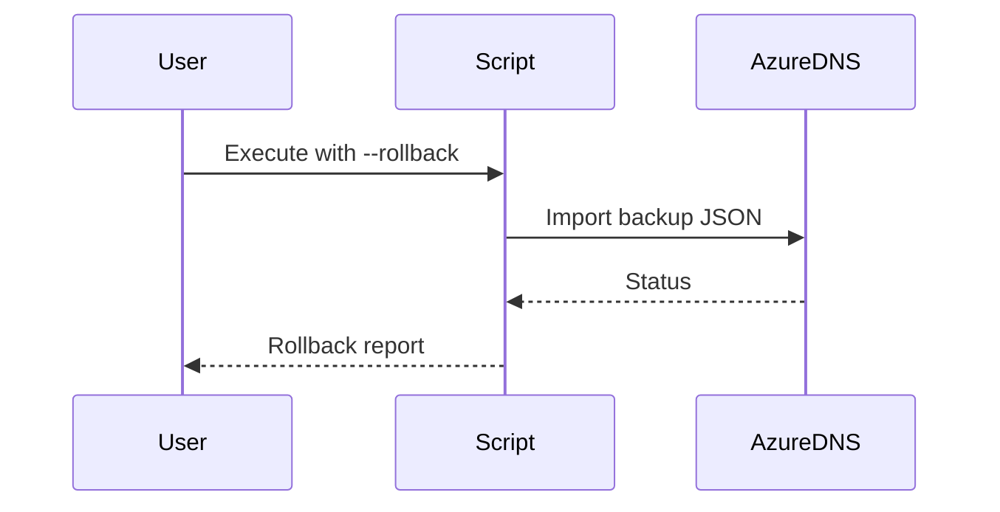

# **📖 PhoenixVC DNS Configuration Script Documentation**
**Version 3.1.0** | [View Script](#) | [Changelog](#version-history)

---

## **🌟 Purpose**
This script automates **DNS management for Azure Static Web Apps**, including:
- **Automated CI/CD integration** (GitHub Actions, Azure DevOps)
- **Rollback support** for DNS changes
- **Component-based isolation** (CNAME, TXT, APEX)
- **Auditable logs** for compliance tracking

---

## **🛠️ Prerequisites**
Ensure the following dependencies are installed:
```bash
Azure CLI 2.58.0+
jq 1.6+
Bash 5.0+
```

---

## **🚀 Running in CI/CD Mode**
### **✅ CI/CD Authentication**
If running inside a CI/CD pipeline (**GitHub Actions, Azure DevOps, GitLab CI**), **Azure authentication is already handled**.
- **Do not run `az login`** manually.
- **Ensure CI/CD secrets** include:
  ```bash
  AZURE_SUBSCRIPTION_ID  # Azure Subscription ID
  SWA_NAME               # Static Web App name
  RESOURCE_GROUP         # Resource Group name
  ```
- If the above variables are **not set**, the script **will exit with an error**.

---

## **📥 Installation (For Local Development)**
```bash
curl -O https://phoenixvc.tech/scripts/deployment/configure-dns.sh
chmod +x configure-dns.sh
mkdir -p .env dns_backups
```

---

## **⚙️ Configuration**
Create an `.env` file **(only required for local execution)**:
```ini
LOCATION_CODE=za  # Location code (e.g., euw for Europe West, saf for South Africa)
SWA_NAME=phoenixvc-prod  # Static Web App name
AZURE_SUBSCRIPTION_ID=xxxxxxxx-xxxx-xxxx-xxxx-xxxxxxxxxxxx
RESOURCE_GROUP=prod-${LOCATION_CODE}-rg-phoenixvc-website
```

---

## **🔄 Rollback Procedures**


---

## **📌 CI/CD Pipeline Example**
Here’s an example of how to integrate the script **into GitHub Actions**:
```yaml
jobs:
  configure_dns:
    runs-on: ubuntu-latest
    steps:
      - name: Checkout Repository
        uses: actions/checkout@v4
      - name: Login to Azure
        uses: azure/login@v1
        with:
          creds: ${{ secrets.AZURE_CREDENTIALS }}
      - name: Configure DNS
        run: ./scripts/deployment/configure-dns.sh --apply --components "cname,apex"
        env:
          AZURE_SUBSCRIPTION_ID: ${{ secrets.AZURE_SUBSCRIPTION_ID }}
          SWA_NAME: phoenixvc-prod
          RESOURCE_GROUP: prod-euw-rg-phoenixvc-website
```

---

## **🛡️ Safety Features**
1. **Pre-flight validation checks**
2. **Immutable backups** before every change
3. **Component-level isolation** for DNS records
4. **Forced overwrites require explicit `--force` flag**
5. **Automatic rollback on failure**

---

## **📌 TODO & Future Enhancements**
```markdown
- [ ] **Azure Policy Integration**
  - DNS naming conventions
  - TTL enforcement (max 300s)
  - Record type restrictions
  
- [ ] **Monitoring Hooks**
  - Azure Monitor alerts
  - Slack/Teams notifications
  
- [ ] **Cost Analysis**
  - DNS query volume estimates
  - Zone file size monitoring
  
- [ ] **Multi-Cloud Support**
  - AWS Route53 integration
  - GCP Cloud DNS adapters
  
- [ ] **Terraform State Integration**
  - Plan/drift detection
  - State locking
  
- [ ] **AI-assisted Troubleshooting**
  - Error pattern recognition
  - Auto-remediation suggestions
```

## **🛠️ Troubleshooting Guide**
| **Error** | **Solution** |
|-----------|-------------|
| `Missing .env file` | Ensure `.env` is correctly configured |
| `Record already exists` | Use `--force` or specify individual components |
| `Permission denied` | Run `az login` to authenticate |
| `Invalid hostname` | Check if SWA provisioning is complete |

---

## **📜 Version History**
| **Version** | **Changes** |
|------------|------------|
| 3.1.0 | Improved CI/CD compatibility, structured error handling |
| 3.0.0 | Initial rollback system, component isolation |
| 2.1.0 | Interactive & Auto modes |
| 1.1.0 | Initial release |
