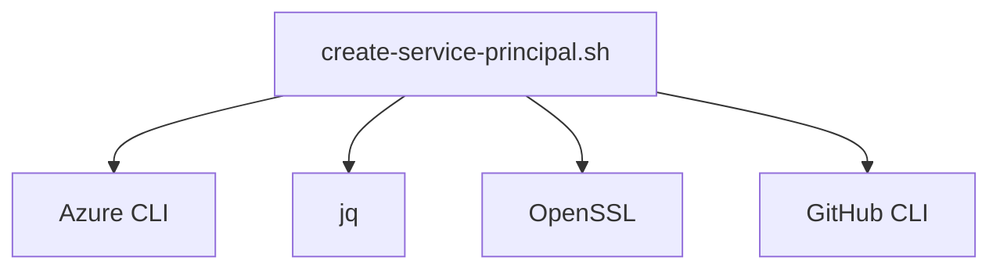

# SPN Manager Technical Documentation

## Core Components
```bash
.
├── create-service-principal.sh  # Main creation script
├── rotate-credentials.sh       # Credential rotation
└── verify-naming.sh            # Pre-commit hook
```

## Dependency Management


## Cron Schedule
```json
{
  "rotation": "0 3 * * 2",  // Tuesdays at 3AM
  "audit": "0 4 1 * *"      // Monthly audit
}
```

## Audit Logs
```bash
# Check recent rotations
journalctl -u spn-rotate --since "24 hours ago"
```

## Audit Log Structure
```bash
# Sample log entry
[2025-02-14T09:15:23+02:00] Rotated SPN: github-actions-phoenixvc
Client ID: e4a6a0b0-c798-4ae6-b4d5-2d8f2b5e0731
Expiration: 2026-02-12
SHA256: 9f86d081884c7d659a2feaa0c55ad015a3bf4f1b2b0b822cd15d6c15b0f00a08
```

## Validation Matrix
```markdown
| Check                | Command                                  |
|----------------------|------------------------------------------|
| Region Compliance    | `az account show --query location`       |
| Credential Hashing   | `openssl dgst -sha256 credentials.json`  |
| GitHub Secret Sync   | `gh secret list -R PhoenixVC-Modernized` |
```

## TODOs (Technical)
```markdown
- [ ] Implement systemd sandboxing
- [ ] Implement Azure Policy integration
- [ ] Add secret hashing
```