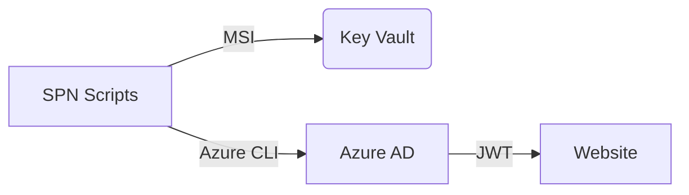

# Security Model

## Trust Zones


## Controls
```markdown
| Control          | Command                      |
|------------------|------------------------------|
| Access Review    | `az role assignment list`    |
| Secret Expiry    | `az keyvault secret show`    |
```

## TODOs (Security)
```markdown
- [ ] Penetration test plan
- [ ] Key Vault purge protection
```