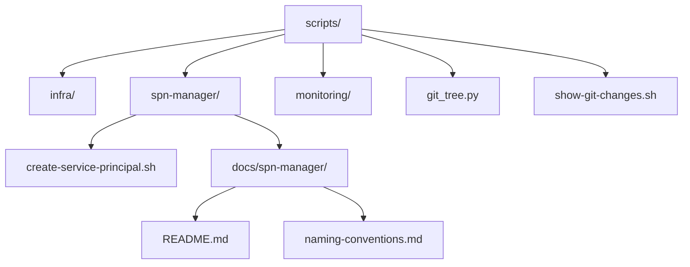
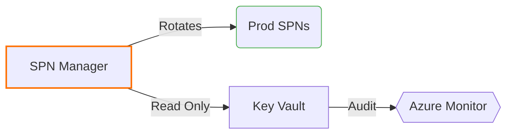

# Quick Guide

To view a comprehensive diff between your current working state and the `main` branch, simply run:

```bash
./show-git-changes.sh
```

This command will:
- Generate a summary of changes
- Create an ASCII file tree structure (using `git_tree.py`)
- Display detailed file differences with color highlights
- Show the current Git status
- Pipe all output to a timestamped text file and provide a link to it

---

# Scripts Directory Overview



---

## Architecture Overview



---

## Global Naming Standards

```markdown
| Component       | Convention     | Example                   | Enforcement |
|-----------------|----------------|---------------------------|-------------|
| Script Files    | kebab-case     | deploy-to-aks.sh          | Pre-commit  |
| Directories     | snake_case     | spn_manager               | Linter      |
| Variables       | UPPER_SNAKE    | AZURE_TENANT_ID           | ShellCheck  |
| Service Names   | reverse-dns    | com.phoenixvc.scripts     | Manual      |
```

---

## git_tree.py Usage Instructions

### **Description**

`git_tree.py` is a Python script that generates an ASCII tree representation of a directory structure based on input file paths. It can be combined with various Git commands to visualize changes in your repository.

---

### **Basic Usage**

```bash
# Basic directory listing
find . -type f | python3 scripts/git_tree.py

# List specific directory
find ./src -type f | python3 scripts/git_tree.py
```

**Example Output:**

```
├── scripts
│   ├── deployment
│   │   └── deploy.sh
│   ├── generate
│   │   └── config.json
│   └── README.md
```

---

### **Git Integration**

#### 1. View Changed Files Structure

```bash
# Show tree structure of staged changes
git diff --name-only --staged | python3 scripts/git_tree.py

# Show tree structure of uncommitted changes
git status --porcelain | sed 's/^...//g' | python3 scripts/git_tree.py

# Show tree structure of changes between branches
git diff --name-only main feature-branch | python3 scripts/git_tree.py
```

#### 2. Combined View Using show-git-changes.sh

The `show-git-changes.sh` script now provides a comprehensive view of your Git changes and pipes the output to a timestamped text file. The output includes:
- A summary of changes (with statistics)
- An ASCII file tree generated by `git_tree.py`
- Detailed colorized differences
- The current Git status

After execution, the script prints the location of the output file so you can review or share it.

Usage:

```bash
# Compare with main branch (default)
./show-git-changes.sh

# Compare with a specific branch
./show-git-changes.sh develop
```

_For implementation details, see `scripts/show-git-changes.sh`._

---

### **Advanced Git Integration**

#### 1. Generate Tree for Files Not Gitignored

```bash
git ls-files | python3 scripts/git_tree.py
```

#### 2. Generate Tree for Staged Files

```bash
git diff --cached --name-only | python3 scripts/git_tree.py
```

#### 3. Generate Tree for File Differences from `main`

```bash
git diff --name-only main | python3 scripts/git_tree.py
```

#### 4. Generate Tree for Both Staged and Unstaged Files

```bash
git diff --name-only HEAD | python3 scripts/git_tree.py
```

#### 5. Combine Staged and Untracked Files

```bash
git diff --cached --name-only && git ls-files --others --exclude-standard | python3 scripts/git_tree.py
```

---

## SPN Manager Documentation

Documentation for the SPN Manager is located at:  
`docs/spn-manager/README.md`

```bash
# Quick Access
code scripts/docs/spn-manager/README.md
```

---

## TODOs

```markdown
- [ ] #1 Create systemd service unit file
  - Owner: @hans
  - Branch: feature/spn-autorotation
  - Path: scripts/spn-manager/systemd/

- [ ] #2 ADR Template
  - Owner: @tech-lead
  - Branch: main
  - Path: docs/adr/0001-spn-rotation.md
  
- [ ] #3 Add pre-commit hook for naming conventions
  - Owner: @hans 
  - Branch: feature/naming-enforcement
  - Path: .pre-commit-config.yaml
  - Requirements:
    - Verify filename kebab-case: `^[a-z0-9]+(-[a-z0-9]+)*\.sh$`
    - Block uppercase letters in script paths
    - Enforce .sh extension consistency
```

---

### Pre-commit Hook Implementation Details

```yaml
# .pre-commit-config.yaml
- repo: local
  hooks:
    - id: script-naming
      name: Script naming convention
      entry: /bin/bash -c 'find scripts/ -name "*.sh" | grep -Eiv "[a-z0-9/-]+\.sh"'
      language: system
      stages: [commit]
      verbose: true
      exclude: |
        (?x)^(
            scripts/legacy/.*|  # Grandfathered exceptions
            vendor/.*           # Third-party code
        )$
```

_Test the regex pattern here: [regex101.com](https://regex101.com/r/9VjCbK/1)_

---

## Verification Command

```bash
# Dry-run test
pre-commit try-repo . script-naming --files scripts/spn-manager/createServicePrincipal.sh

# Expected failure output:
# scripts/spn-manager/createServicePrincipal.sh:0: Script naming convention: Found invalid filename (camelCase)
```

---